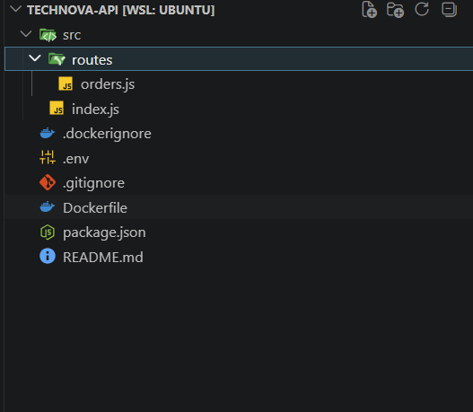
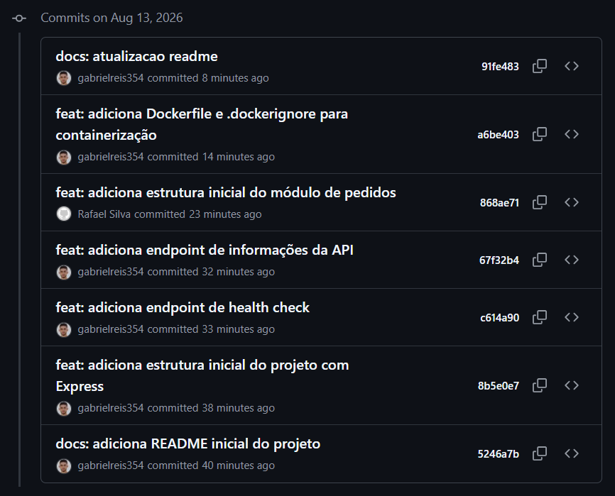
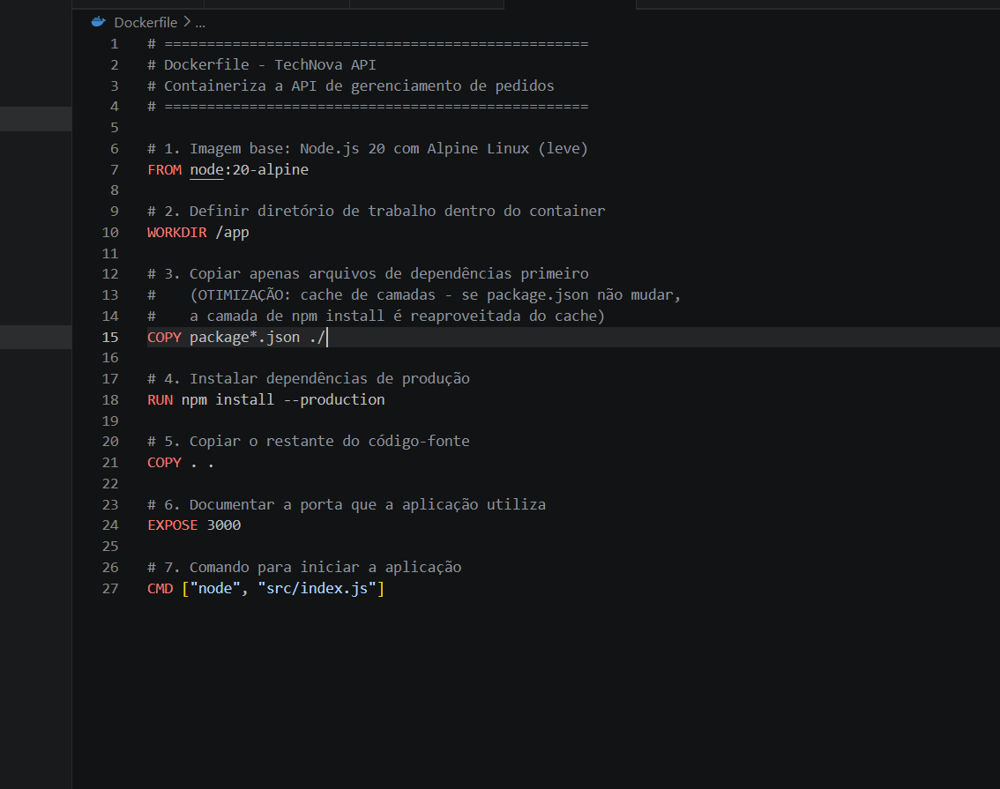
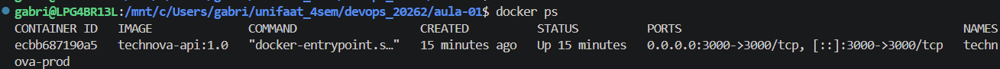

# Entrega — Aula 01: Fundamentos de Git e Docker

**Aluno:** Gabriel Reis Cunha
**RA:** 6325149
**Data:** 13/08/2026

## Repositório

- URL: https://github.com/gabrielreis354/technova-api/tree/main

## Evidências

- [x] Repositório público com estrutura completa
- [x] Mínimo de 5 commits demonstrando workflow Git
- [x] Dockerfile funcional
- [x] Container rodando (evidência abaixo)

## Estrutura do Repositório

## Histórico de Commits (Workflow Git)

## Dockerfile

## Evidência de Container Rodando

