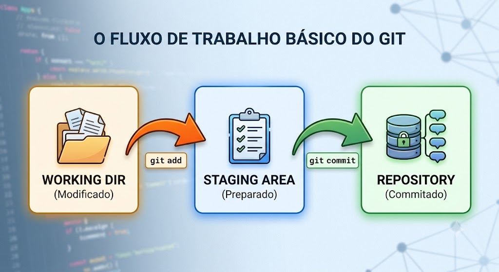
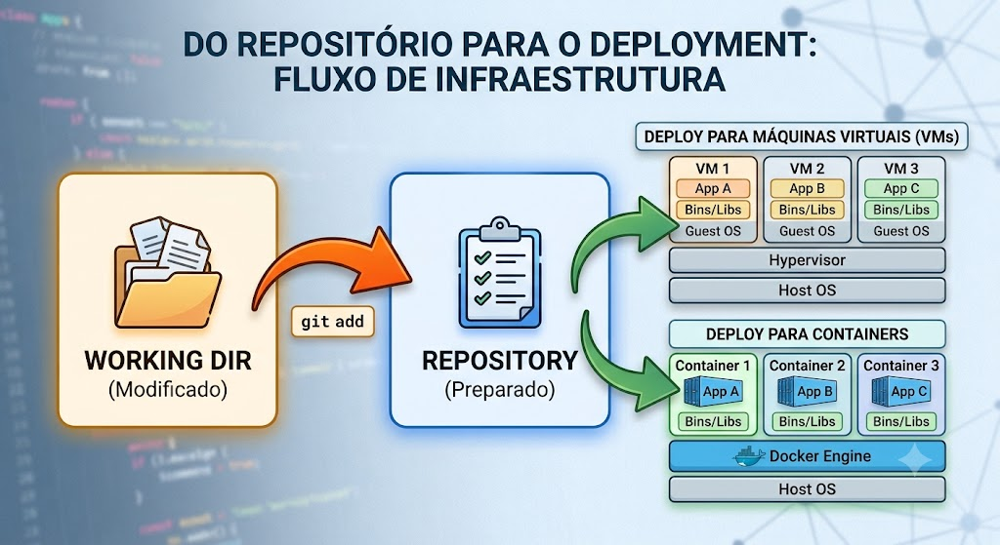
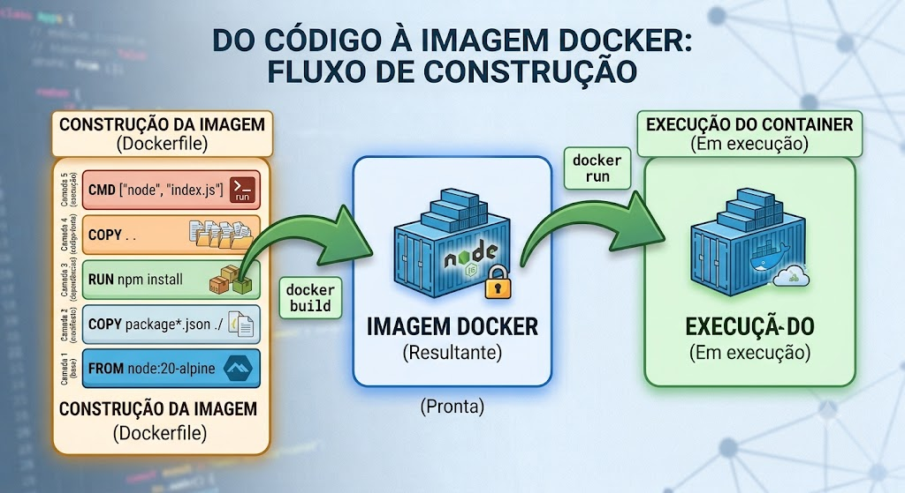

# Trabalho Anterior (TA) — Preparação Prévia

## Briefing do CTO da TechNova

> **De:** Carlos Mendes, CTO — TechNova  
> **Para:** Equipe de Platform Engineering (novos contratados)  
> **Assunto:** URGENTE — Dois Problemas Críticos que Precisam de Solução Imediata

Equipe,

Bem-vindos à TechNova. Sei que vocês acabaram de chegar, mas preciso ser direto: estamos em crise dupla.

**Problema 1 — Caos no Código:** Na última semana, perdemos **3 dias de trabalho** porque a Juliana sobrescreveu sem querer as alterações do Rafael no módulo de pagamentos. Antes disso, o Marcos fez um deploy com uma versão errada do arquivo de rotas porque ninguém sabia qual era a versão correta. E ontem descobrimos que o "backup" do servidor era de duas semanas atrás. Não temos nenhum sistema de controle de versão. O código fica em pastas compartilhadas, pen drives, e-mails com anexos tipo `api_final_v3_FINAL_REAL.zip`. Sim, isso é real.

**Problema 2 — "Funciona na Minha Máquina":** Quando finalmente alguém consegue pegar a versão "certa" do código, ele simplesmente não funciona em outra máquina. A Juliana usa Node.js 20, o Rafael tem Node.js 18, o servidor de staging tem versões de libs diferentes. O mesmo código se comporta de formas diferentes em cada ambiente.

**A missão de vocês é clara:** resolver os dois problemas em um único sprint. Primeiro, a fundação — **Git** para versionamento. Em seguida, **Docker** para garantir ambientes idênticos. Para a reunião de amanhã, preciso que vocês venham preparados com o conhecimento teórico de ambas as ferramentas.

## Leitura Prévia Obrigatória

**Tempo estimado de leitura:** ~60 minutos (30 min Git + 30 min Docker)

## Parte 1 — Fundamentos de Git

### 1.1 O que é um Sistema de Controle de Versão (VCS)?

Um Sistema de Controle de Versão rastreia todas as alterações feitas em arquivos ao longo do tempo. Ele permite:

- Voltar a qualquer versão anterior do código
- Saber quem alterou o quê e quando
- Trabalhar em paralelo sem conflitos destrutivos
- Manter um histórico completo e auditável do projeto

**Analogia:** Pense no Google Docs com histórico de versões — mas para código, muito mais poderoso e com controle total.

Sem um VCS, o cenário da TechNova é inevitável: perda de trabalho, versões conflitantes e incapacidade de rastrear problemas. Com um VCS, cada alteração é registrada com autor, data e descrição — existe uma fonte única de verdade.

### 1.2 Centralizado vs. Distribuído

| Característica | Centralizado (SVN, CVS) | Distribuído (Git, Mercurial) |
|---|---|---|
| Repositório | Um servidor central | Cada dev tem cópia completa |
| Trabalho offline | Não | Sim |
| Velocidade | Depende da rede | Operações locais são instantâneas |
| Ponto único de falha | Sim (servidor) | Não |
| Branching | Pesado e lento | Leve e rápido |
| Backup natural | Não (só no servidor) | Sim (cada clone é um backup) |

O **Git** é distribuído: cada desenvolvedor possui o histórico completo do projeto. Isso significa que você pode commitar, criar branches e navegar no histórico mesmo sem internet. Foi criado por Linus Torvalds em 2005 (o mesmo criador do Linux) e é hoje o padrão absoluto da indústria.

### 1.3 Conceitos Fundamentais do Git

#### Repositório (Repository)

Um repositório Git é uma pasta que contém o projeto e todo o seu histórico de alterações dentro de um diretório oculto `.git/`.

```bash
# Inicializar um novo repositório
git init

# Clonar um repositório existente
git clone https://github.com/usuario/repositorio.git
```

#### Os Três Estados do Git

Os arquivos no Git transitam entre três estados:



- **Working Directory**: onde você edita os arquivos no dia a dia
- **Staging Area (Index)**: área de preparação — você escolhe quais mudanças farão parte do próximo commit
- **Repository (.git/)**: histórico permanente de snapshots do projeto

#### O Fluxo add → commit

```bash
# Verificar status dos arquivos
git status

# Adicionar arquivo específico ao staging
git add arquivo.js

# Adicionar todos os arquivos modificados
git add .

# Criar um commit com mensagem descritiva
git commit -m "feat: adiciona endpoint de criação de pedidos"
```

O ciclo do dia a dia é: **Editar → git add → git commit → Repetir**.

### 1.4 Branches e Merge

#### Branches

Branches permitem desenvolver funcionalidades isoladamente sem afetar o código principal. Pense nelas como "linhas do tempo" paralelas.

```bash
# Criar uma nova branch
git branch feature/novo-endpoint

# Mudar para a branch criada
git checkout feature/novo-endpoint

# Atalho: criar e mudar em um comando
git checkout -b feature/novo-endpoint

# Listar branches existentes
git branch
```

Exemplos práticos de branches:
- `main` — código estável em produção
- `feature/login` — desenvolvimento da tela de login
- `fix/bug-pagamento` — correção de bug urgente

#### Merge

Unir o trabalho de uma branch de volta à branch principal:

```bash
# Voltar para a branch main
git checkout main

# Incorporar as mudanças da feature branch
git merge feature/novo-endpoint
```

**Tipos de merge:**
- **Fast-forward**: quando não há divergência entre as branches, o ponteiro simplesmente avança. Nenhum commit extra é criado.
- **Three-way merge**: quando há commits em ambas as branches, o Git cria um "merge commit" que une as duas linhas de desenvolvimento.
- **Conflito**: quando ambas as branches alteraram o mesmo trecho do mesmo arquivo, o Git pede que o desenvolvedor resolva manualmente.

### 1.5 Repositórios Remotos e GitHub

Um repositório remoto é uma cópia do seu projeto hospedada em um servidor (como GitHub, GitLab ou Bitbucket). Ele serve para:

- **Backup:** seu código está seguro na nuvem
- **Colaboração:** outros devs podem clonar, contribuir e sincronizar
- **Integração:** ferramentas de CI/CD se conectam ao repositório

```bash
# Adicionar um remoto
git remote add origin https://github.com/usuario/repo.git

# Enviar commits para o remoto
git push -u origin main

# Baixar atualizações do remoto
git pull origin main

# Verificar remotos configurados
git remote -v
```

### 1.6 O Arquivo .gitignore

Define quais arquivos o Git deve ignorar (não rastrear):

```gitignore
# Dependências
node_modules/

# Variáveis de ambiente (contêm segredos!)
.env

# Arquivos de build
dist/
build/

# Arquivos do sistema operacional
.DS_Store
Thumbs.db

# Logs
*.log
```

**Regra:** Nunca versione dependências instaladas (`node_modules/`), segredos (`.env`, chaves privadas) ou artefatos de build.

### 1.7 Boas Práticas de Commits (Conventional Commits)

- **Commits atômicos**: cada commit deve representar UMA mudança lógica
- **Commits frequentes**: melhor commitar demais do que de menos
- **Mensagens descritivas**: usar convenção Conventional Commits:

| Prefixo | Uso |
|---------|-----|
| `feat:` | Nova funcionalidade |
| `fix:` | Correção de bug |
| `docs:` | Alteração em documentação |
| `refactor:` | Refatoração sem mudança de comportamento |
| `chore:` | Tarefas de manutenção |
| `test:` | Adição/modificação de testes |

```bash
# Exemplos de boas mensagens
git commit -m "feat: implementa listagem de pedidos com paginação"
git commit -m "fix: corrige validação de CPF no cadastro"
git commit -m "docs: adiciona README com instruções de setup"
```

## Parte 2 — Fundamentos de Docker

### 2.1 O Problema: "Funciona na Minha Máquina!"

Quando desenvolvemos software, dependemos de:

- Versão específica do runtime (Node.js, Python, Java, etc.)
- Bibliotecas e dependências do sistema operacional
- Variáveis de ambiente e configurações
- Serviços auxiliares (banco de dados, cache, etc.)

Sem padronização, cada máquina é um "floco de neve" — única e imprevisível. Isso gera:

- Bugs que existem apenas em determinadas máquinas
- Deploys que falham por diferenças de ambiente
- Horas perdidas configurando ambiente de novos devs
- A famosa frase: **"Mas funciona na minha máquina!"**

A solução ideal precisa atender a estes requisitos:

1. **Isolamento:** a aplicação deve rodar em um ambiente isolado do sistema host
2. **Reprodutibilidade:** o ambiente deve ser exatamente o mesmo em qualquer máquina
3. **Portabilidade:** deve funcionar no laptop do dev, no servidor de CI e em produção
4. **Versionamento:** a definição do ambiente deve ser versionável no Git

### 2.2 Containers vs. Máquinas Virtuais

| Característica | Máquina Virtual (VM) | Container |
|---|---|---|
| Isolamento | Sistema operacional completo | Processo isolado |
| Tamanho | Gigabytes (SO + aplicação) | Megabytes (apenas aplicação + deps) |
| Inicialização | Minutos | Segundos |
| Overhead | Alto (hypervisor + SO guest) | Mínimo (compartilha kernel do host) |
| Portabilidade | Limitada (formatos de VM) | Alta (imagem padrão OCI) |
| Densidade | ~10-20 VMs por host | ~100-1000 containers por host |



**Resumo:** Containers compartilham o kernel do sistema operacional host, tornando-os muito mais leves e rápidos que VMs.

### 2.3 Conceitos Fundamentais do Docker

#### Imagem (Image)

Uma imagem é um **template imutável** que contém tudo necessário para rodar uma aplicação: sistema de arquivos base, runtime, código, dependências e configurações. Pense na imagem como uma "receita" — ela define o que o container terá, mas não está rodando.

#### Container

Um container é uma **instância em execução** de uma imagem.

- **Imagem** = Classe (definição)
- **Container** = Objeto (instância rodando)

Você pode criar múltiplos containers a partir da mesma imagem.

#### Dockerfile

O Dockerfile é um arquivo de texto com instruções para **construir uma imagem**:

```dockerfile
# Imagem base
FROM node:20-alpine

# Diretório de trabalho dentro do container
WORKDIR /app

# Copiar arquivos de dependências
COPY package*.json ./

# Instalar dependências
RUN npm install --production

# Copiar código-fonte
COPY . .

# Porta que a aplicação expõe
EXPOSE 3000

# Comando para iniciar a aplicação
CMD ["node", "src/index.js"]
```

#### Instruções Principais do Dockerfile

| Instrução | Função |
|-----------|--------|
| `FROM` | Define a imagem base (ex: `node:20-alpine`) |
| `WORKDIR` | Define o diretório de trabalho dentro do container |
| `COPY` | Copia arquivos do host para a imagem |
| `RUN` | Executa comandos durante o build (ex: instalar dependências) |
| `EXPOSE` | Documenta a porta que a aplicação utiliza |
| `CMD` | Comando padrão ao iniciar o container |
| `ENV` | Define variáveis de ambiente |

#### Layers (Camadas)

Cada instrução no Dockerfile cria uma **camada** na imagem. O Docker utiliza cache de camadas — se uma camada não mudou, ela é reaproveitada no próximo build.


**Dica de otimização:** Copie o `package.json` antes do código-fonte. Assim, a camada de `npm install` só é refeita quando as dependências mudam — não a cada alteração de código.

#### Registry e Docker Hub

Um **registry** é um repositório de imagens Docker. O [Docker Hub](https://hub.docker.com/) é o registry público padrão:

- **Imagens oficiais:** `node`, `nginx`, `postgres`, `redis`
- **Imagens da comunidade:** `usuario/nome-imagem`
- **Tags:** versionamento de imagens (ex: `node:20-alpine`, `node:18-slim`)

### 2.4 O Arquivo .dockerignore

Similar ao `.gitignore`, impede que arquivos desnecessários sejam copiados para a imagem:

```dockerignore
node_modules/
.git/
.env
*.log
README.md
.dockerignore
Dockerfile
```

**Por que ignorar `node_modules`?** Porque as dependências serão instaladas dentro do container via `RUN npm install`, garantindo compatibilidade com o SO do container (Alpine Linux).

### 2.5 Comandos Essenciais do Docker

```bash
# Baixar uma imagem do Docker Hub
docker pull node:20-alpine

# Listar imagens locais
docker images

# Construir imagem a partir de um Dockerfile
docker build -t technova-api:1.0 .

# Criar e iniciar um container
docker run -d --name minha-api -p 3000:3000 technova-api:1.0

# Listar containers em execução
docker ps

# Ver logs de um container
docker logs minha-api

# Parar um container
docker stop minha-api

# Remover um container
docker rm minha-api

# Acessar shell dentro do container
docker exec -it minha-api sh
```

### 2.6 A Conexão Git + Docker

Com Git e Docker juntos, a TechNova resolve ambos os problemas:

- O **código** está versionado no Git ✅
- O **ambiente** está definido no Dockerfile (que também é versionado no Git!) ✅

Qualquer pessoa com acesso ao repositório pode:
1. Clonar o código (`git clone`)
2. Construir o ambiente (`docker build`)
3. Rodar a aplicação (`docker run`)

O resultado será sempre o mesmo, independente da máquina.

## Questões de Verificação

Responda as questões abaixo **antes da aula**. As respostas serão discutidas no Bloco 1 (Revisão TA + Discussão).

### Questão 1

Qual é a principal diferença entre um sistema de controle de versão **centralizado** e um **distribuído**?

- [ ] A) No centralizado, apenas o líder técnico pode fazer commits
- [ ] B) No distribuído, cada desenvolvedor possui uma cópia completa do histórico do projeto
- [ ] C) No distribuído, não é possível trabalhar com branches
- [ ] D) No centralizado, o código é armazenado apenas localmente

### Questão 2

No fluxo básico do Git, qual é a ordem correta das operações para salvar alterações e enviá-las ao servidor?

- [ ] A) `git commit` → `git add` → `git push`
- [ ] B) `git add` → `git commit` → `git push`
- [ ] C) `git push` → `git add` → `git commit`
- [ ] D) `git commit` → `git push` → `git add`

### Questão 3

Qual é a principal diferença entre um Container e uma Máquina Virtual?

- [ ] A) Containers são mais seguros que Máquinas Virtuais em todos os cenários
- [ ] B) Máquinas Virtuais só funcionam em servidores, containers funcionam em laptops
- [ ] C) Containers compartilham o kernel do host e isolam apenas o processo, enquanto VMs virtualizam um SO completo
- [ ] D) Containers não permitem instalar dependências, VMs permitem

### Questão 4

Por que no Dockerfile copiamos o `package.json` ANTES de copiar o restante do código-fonte?

- [ ] A) Porque o `package.json` deve estar sempre no topo da imagem por convenção
- [ ] B) Porque assim a camada de `npm install` é reaproveitada do cache quando apenas o código muda, acelerando o build
- [ ] C) Porque o Docker exige que arquivos JSON sejam copiados primeiro
- [ ] D) Porque o `package.json` precisa ser validado antes de qualquer outra operação

<br>
<br>

---
*Traga suas dúvidas sobre a leitura para discussão no início da aula. Pense: "Como a TechNova pode sair do caos para ter código versionado E ambiente padronizado?"*
