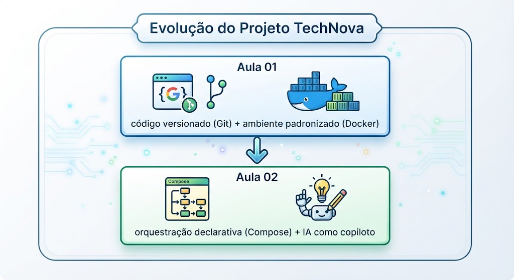
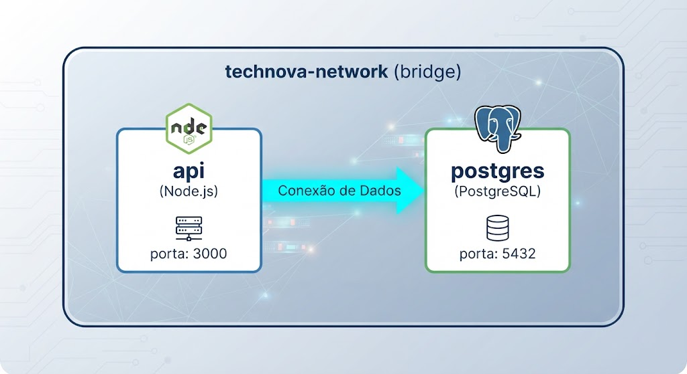

# Trabalho Anterior (TA) — Leitura Prévia Obrigatória

**Tempo estimado de leitura:** ~60 minutos

---

## Parte 1 — Docker Compose: Orquestração Multi-Container

### O Problema: A Solicitação do Rafael

> **De:** Rafael Oliveira, Desenvolvedor Backend — TechNova  
> **Para:** Equipe de Platform Engineering  
> **Assunto:** API precisa de PostgreSQL — ambiente local  
> **Cc:** Carlos Mendes (CTO), Juliana Santos (Dev Sênior)

Equipe,

Parabéns pelo trabalho da última semana. Com o Git e o Docker, nosso fluxo de desenvolvimento melhorou enormemente. Agora qualquer um clona o repo, faz `docker build` e tem a API rodando.

Porém, temos um problema urgente: **a API armazena pedidos em memória**. Toda vez que o container reinicia, perdemos todos os dados. O CTO quer migrar para PostgreSQL antes do próximo sprint.

Eu implementei a conexão com PostgreSQL no código, mas agora preciso que vocês resolvam a infraestrutura local. Atualmente, para rodar a API com banco de dados, preciso executar **manualmente**:

```bash
# 1. Criar rede para os containers se comunicarem
docker network create technova-net

# 2. Subir o PostgreSQL com configurações
docker run -d \
  --name technova-db \
  --network technova-net \
  -e POSTGRES_DB=technova \
  -e POSTGRES_USER=technova \
  -e POSTGRES_PASSWORD=secret123 \
  -v pgdata:/var/lib/postgresql/data \
  -p 5432:5432 \
  postgres:15-alpine

# 3. Esperar o banco estar pronto (como saber quando está pronto??)

# 4. Subir a API conectando ao banco
docker run -d \
  --name technova-api \
  --network technova-net \
  -e DB_HOST=technova-db \
  -e DB_PORT=5432 \
  -e DB_NAME=technova \
  -e DB_USER=technova \
  -e DB_PASSWORD=secret123 \
  -p 3000:3000 \
  technova-api:1.0
```

Os problemas que estou enfrentando:

1. **São 4 comandos complexos** — qualquer flag errada e nada funciona
2. **Ninguém lembra a ordem** — o banco precisa subir antes da API
3. **Senhas espalhadas** — cada dev coloca uma senha diferente
4. **Dados se perdem** — se eu usar `docker rm` sem querer, adeus dados do banco
5. **Novos devs sofrem** — o Marcos levou 2 horas para configurar tudo ontem

O que eu preciso:

- **Um único comando** para subir API + PostgreSQL
- **Configuração versionada** no Git (não pode depender de "pergunta pro Rafael")
- **Dados persistentes** entre reinicializações
- **Comunicação automática** entre API e banco de dados

Vocês sabem resolver isso?

---

### O Problema da Orquestração Manual

O cenário descrito pelo Rafael é comum em projetos reais. Quando a aplicação cresce além de um único container, a complexidade de gerenciamento explode:

| Containers | Comandos manuais | Pontos de falha |
|:---:|:---:|:---:|
| 1 | ~3 (build, run, verificar) | Poucos |
| 2 | ~8 (rede, volume, run ×2, vars) | Moderados |
| 3+ | ~15+ (rede, volumes, run ×N, ordem) | Muitos |

Cada container adicional não soma complexidade — **multiplica**.

---

### A Solução: Docker Compose

Docker Compose aplica o conceito de **Infraestrutura como Código (IaC)** ao ambiente de desenvolvimento local:

- **Antes:** Sequência de comandos que alguém lembra de cabeça
- **Depois:** Arquivo YAML versionado no Git que qualquer um pode executar




Docker Compose é uma ferramenta que permite definir e executar aplicações multi-container usando um arquivo YAML. Em vez de executar múltiplos `docker run` com dezenas de flags, você **declara** o estado desejado em um arquivo `docker-compose.yml` e o Compose cuida do resto.

Com esse arquivo no repositório, qualquer desenvolvedor executa:

```bash
docker compose up
```

E tem todo o ambiente funcionando em segundos.

---

### Anatomia do `docker-compose.yml`

```yaml
version: '3.8'                    # Versão do formato Compose

services:                          # Serviços (containers)
  api:                             # Nome do serviço
    build: .                       # Construir a partir do Dockerfile local
    ports:
      - "3000:3000"                # Mapeamento de portas
    environment:                   # Variáveis de ambiente
      - DB_HOST=postgres
      - DB_PORT=5432
    depends_on:                    # Ordem de inicialização
      - postgres
    networks:
      - technova-net               # Rede compartilhada

  postgres:                        # Serviço de banco de dados
    image: postgres:15-alpine      # Imagem do Docker Hub
    environment:
      - POSTGRES_DB=technova
      - POSTGRES_USER=technova
      - POSTGRES_PASSWORD=secret
    volumes:
      - pgdata:/var/lib/postgresql/data   # Persistência
    networks:
      - technova-net

networks:                          # Definição de redes
  technova-net:
    driver: bridge

volumes:                           # Definição de volumes
  pgdata:                          # Volume nomeado
```

---

### Comunicação entre Containers

Na rede do Docker Compose, cada serviço é acessível pelo **nome do serviço** como hostname:



A API se conecta ao banco usando `DB_HOST=postgres` (nome do serviço = hostname na rede interna). Não é necessário saber o IP do container.

---

### Volumes para Persistência

Sem volumes, dados de containers são **perdidos quando o container é removido**. Volumes persistem dados entre recriações:

| Tipo | Sintaxe | Uso |
|------|---------|-----|
| Named volume | `pgdata:/var/lib/...` | Dados persistentes (banco de dados) |
| Bind mount | `./local:/container` | Desenvolvimento (hot-reload do código) |
| Tmpfs | `tmpfs: /tmp` | Dados temporários em memória |

**Regra de ouro:** Use `docker compose down` no dia a dia. Use `docker compose down -v` **apenas** quando quiser apagar todos os dados (reset completo).

---

### Comandos Essenciais do Docker Compose

| Comando | Função |
|---------|--------|
| `docker compose up` | Cria e inicia todos os serviços |
| `docker compose up -d` | Inicia em background (detached) |
| `docker compose up --build` | Reconstrói imagens antes de iniciar |
| `docker compose down` | Para e remove containers e redes |
| `docker compose down -v` | Remove também os volumes (dados!) |
| `docker compose ps` | Lista status dos serviços |
| `docker compose logs` | Exibe logs de todos os serviços |
| `docker compose logs -f api` | Segue logs de um serviço específico |
| `docker compose exec api sh` | Executa shell em container rodando |
| `docker compose build` | Reconstrói imagens sem iniciar |
| `docker compose restart` | Reinicia serviços |

---

### Boas Práticas do Docker Compose

1. **Sempre use volumes nomeados** para dados de banco de dados
2. **Nunca coloque senhas reais** no `docker-compose.yml` — use `.env`
3. **Declare redes explicitamente** para controle fino de comunicação
4. **Use `depends_on`** para ordem de inicialização
5. **Versione o `docker-compose.yml`** no Git junto com o projeto
6. **Não versione o `.env`** — adicione ao `.gitignore` e forneça um `.env.example`
7. **Use `docker compose down -v`** com cuidado — remove dados persistentes

---

## Parte 2 — IA no DevOps: O Copiloto Inteligente

### O que é IA Generativa e por que importa para DevOps?

Inteligência Artificial generativa refere-se a modelos capazes de **criar conteúdo novo** — texto, código, configurações — a partir de instruções em linguagem natural. No contexto de DevOps, isso significa:

- Gerar um `docker-compose.yml` a partir de uma descrição do ambiente desejado
- Criar Dockerfiles otimizados explicando o cenário da aplicação
- Produzir scripts de CI/CD baseados nos requisitos do projeto
- Analisar logs e sugerir correções para incidentes

### IA como Copiloto, Não Substituto

O conceito fundamental é: **a IA é um copiloto, não o piloto**. Assim como um copiloto de avião auxilia nas decisões mas o piloto mantém a responsabilidade, a IA:

| IA faz bem | IA não substitui |
|-----------|-----------------|
| Gerar rascunhos de configuração | Decisões de arquitetura |
| Identificar padrões em logs | Entendimento do contexto do negócio |
| Sugerir otimizações | Julgamento sobre trade-offs |
| Acelerar tarefas repetitivas | Validação final de segurança |
| Documentar código existente | Responsabilidade sobre o resultado |

**Regra de ouro:** Sempre valide o output da IA antes de colocar em produção.

---

### Introdução ao Kiro

Kiro é um **ambiente de desenvolvimento inteligente (IDE)** que integra capacidades de IA diretamente no fluxo de trabalho do desenvolvedor. Para engenheiros DevOps, Kiro pode:

- **Gerar configurações** — `docker-compose.yml`, Dockerfiles, pipelines de CI/CD
- **Revisar código** — identificar problemas de segurança, performance ou boas práticas
- **Explicar código existente** — entender configurações complexas herdadas de projetos anteriores
- **Iterar sobre soluções** — refinar configurações com base em feedback (ex: "adicione healthchecks")
- **Sugerir melhorias** — otimizações de multi-stage builds, variáveis de ambiente, etc.

Kiro funciona como um assistente conversacional dentro da IDE — você descreve o que precisa em linguagem natural, e ele gera, revisa ou explica código.

---

### Casos de Uso de IA no Ciclo DevOps

A IA pode auxiliar em **todas as etapas** do ciclo DevOps:

| Etapa | Como a IA Ajuda | Exemplo |
|-------|-----------------|---------|
| **Desenvolvimento** | Geração de código, autocompletar, refatoração | Gerar Dockerfile para aplicação Node.js |
| **Build** | Otimização de Dockerfiles, multi-stage builds | Sugerir camadas de cache eficientes |
| **Teste** | Geração de testes, análise de cobertura | Criar testes para endpoints da API |
| **CI/CD** | Geração de pipelines, otimização de steps | Criar workflow do GitHub Actions |
| **Deploy** | Templates de IaC, configuração de ambientes | Gerar Terraform para infraestrutura AWS |
| **Monitoramento** | Análise de logs, detecção de anomalias | Interpretar padrões de erro em logs |
| **Incident Response** | Sugerir root cause, playbooks de resposta | Analisar stack traces e sugerir correções |

---

### AWS Bedrock: Visão Conceitual

AWS Bedrock é um serviço gerenciado da Amazon que fornece acesso a **modelos de fundação** (Foundation Models) de IA via API. Em termos simples:

- **O que é:** Uma plataforma que permite usar modelos de IA (como Claude, Llama, etc.) sem precisar hospedar ou treinar os modelos
- **Para que serve no DevOps:** Integrar capacidades de IA em pipelines automatizados, scripts e ferramentas internas
- **Quando usaremos:** A partir do Módulo 2, quando trabalharmos com infraestrutura AWS

> **Nota:** Nesta aula, usaremos Kiro como interface interativa com IA. AWS Bedrock será explorado em aulas futuras quando integrarmos IA diretamente em pipelines de automação.

---

### IA Responsável: Limitações e Cuidados

Toda ferramenta de IA generativa tem limitações que profissionais de DevOps precisam conhecer:

**Alucinações:** A IA pode gerar configurações que parecem corretas mas contêm erros sutis — portas erradas, imagens que não existem, sintaxe inválida.

**Desatualização:** Modelos de IA podem não conhecer versões mais recentes de ferramentas ou mudanças em APIs.

**Contexto limitado:** A IA não conhece as particularidades do seu projeto — requisitos de segurança, restrições de rede, políticas internas.

**Segurança:** Nunca compartilhe senhas, tokens ou informações sensíveis em prompts para IA.

**Checklist de validação para output de IA:**
1. A sintaxe está correta? (validadores YAML/JSON)
2. As imagens Docker referenciadas existem no Docker Hub?
3. As portas mapeadas fazem sentido para o serviço?
4. Variáveis de ambiente sensíveis estão em `.env`, não hardcoded?
5. O output segue as boas práticas do projeto?
6. Funciona quando você executa? (teste sempre!)

---

### Boas Práticas de Prompting para DevOps

A qualidade do output da IA depende diretamente da qualidade do seu prompt. Veja a diferença:

| Prompt Ruim | Prompt Bom |
|-------------|-----------|
| "cria docker compose" | "Crie um docker-compose.yml para uma aplicação Node.js 20 com Express conectando a um PostgreSQL 15. A API roda na porta 3000, precisa de variáveis DB_HOST, DB_PORT, DB_NAME. Use volume nomeado para persistência do banco e rede bridge customizada." |
| "faz dockerfile" | "Crie um Dockerfile com multi-stage build para uma aplicação Node.js. O stage de build deve instalar dependências e o stage final deve usar node:20-alpine, copiar apenas node_modules e o código, expor porta 3000." |
| "arruma esse erro" | "Meu docker compose up está falhando com o erro 'connection refused' na API ao tentar conectar no PostgreSQL. A API usa DB_HOST=postgres e DB_PORT=5432. O PostgreSQL demora ~5 segundos para iniciar. Como posso resolver?" |

**Princípios para bons prompts:**

1. **Seja específico** — mencione tecnologias, versões, portas
2. **Forneça contexto** — descreva a arquitetura, restrições, dependências
3. **Peça explicações** — "explique cada linha" ajuda a aprender
4. **Itere** — refine o resultado em múltiplas interações
5. **Valide sempre** — teste o output gerado antes de considerar pronto

---

## Questões de Verificação

Responda as questões abaixo para confirmar sua compreensão. As respostas serão discutidas no início da aula.

### Questão 1

No relato do Rafael, qual é a principal vantagem do Docker Compose sobre a abordagem de múltiplos comandos `docker run` manuais?

- A) Docker Compose é mais rápido que `docker run` em termos de performance
- B) Docker Compose permite declarar todos os serviços, redes e volumes em um único arquivo YAML versionável, substituindo dezenas de comandos manuais propensos a erro
- C) Docker Compose não precisa de Docker instalado na máquina
- D) Docker Compose cria máquinas virtuais em vez de containers

### Questão 2

Sobre volumes no Docker Compose, qual afirmação é verdadeira?

- A) Volumes são desnecessários porque o PostgreSQL salva dados automaticamente mesmo sem eles
- B) O comando `docker compose down` sempre apaga os volumes e seus dados
- C) Volumes nomeados persistem dados entre `docker compose down` e `up`, garantindo que dados do banco não sejam perdidos quando containers são recriados
- D) Bind mounts e named volumes são a mesma coisa, apenas com nomes diferentes

### Questão 3

Qual é o papel correto da IA generativa (como Kiro) no fluxo de trabalho DevOps?

- A) Substituir completamente o engenheiro DevOps, que não precisa mais validar configurações
- B) Atuar como copiloto — acelerar a geração de configurações e sugerir melhorias, mas o profissional mantém a responsabilidade de validar e decidir
- C) Apenas documentar código existente, sem capacidade de gerar novas configurações
- D) Funcionar apenas em ambientes de produção, não em desenvolvimento local

### Questão 4

Ao utilizar IA para gerar um arquivo `docker-compose.yml`, qual é a melhor prática?

- A) Aceitar o output diretamente sem verificação, pois a IA não comete erros
- B) Nunca usar IA para infraestrutura, apenas para código de aplicação
- C) Validar a sintaxe YAML, verificar se as imagens existem, testar localmente com `docker compose up`, e confirmar que segue as boas práticas do projeto
- D) Usar o output da IA apenas como documentação, reescrevendo tudo manualmente

---

*Traga suas dúvidas sobre a leitura para discussão no início da aula. Pense: "Como posso declarar todo o ambiente da TechNova em um único arquivo?" e "Em quais situações a IA pode me ajudar — e em quais devo confiar mais no meu conhecimento?"*

---

## Referências

### Docker Compose

- Docker Inc. **Overview of Docker Compose**. Docker Documentation. Disponível em: [https://docs.docker.com/compose/](https://docs.docker.com/compose/)
- Docker Inc. **Compose file reference**. Docker Documentation. Disponível em: [https://docs.docker.com/compose/compose-file/](https://docs.docker.com/compose/compose-file/)
- Docker Inc. **Use volumes**. Docker Documentation. Disponível em: [https://docs.docker.com/storage/volumes/](https://docs.docker.com/storage/volumes/)
- Docker Inc. **Networking in Compose**. Docker Documentation. Disponível em: [https://docs.docker.com/compose/networking/](https://docs.docker.com/compose/networking/)

### IA Generativa e DevOps

- GOOGLE. **AI-powered DevOps: how generative AI is transforming software delivery**. Google Cloud Blog. Disponível em: [https://cloud.google.com/blog/products/devops-sre/generative-ai-devops](https://cloud.google.com/blog/products/devops-sre/generative-ai-devops)
- DORA (DevOps Research and Assessment). **State of DevOps Report 2024**. Google. Disponível em: [https://dora.dev/research/2024/dora-report/](https://dora.dev/research/2024/dora-report/)

### Kiro

- Amazon Web Services. **Kiro — AI-powered development environment**. Disponível em: [https://kiro.dev/](https://kiro.dev/)
- Amazon Web Services. **Kiro Documentation**. Disponível em: [https://kiro.dev/docs/](https://kiro.dev/docs/)

### AWS Bedrock

- Amazon Web Services. **Amazon Bedrock — Foundation Models**. AWS Documentation. Disponível em: [https://docs.aws.amazon.com/bedrock/latest/userguide/what-is-bedrock.html](https://docs.aws.amazon.com/bedrock/latest/userguide/what-is-bedrock.html)

### Boas Práticas de Prompting

- ANTHROPIC. **Prompt engineering overview**. Anthropic Documentation. Disponível em: [https://docs.anthropic.com/en/docs/build-with-claude/prompt-engineering/overview](https://docs.anthropic.com/en/docs/build-with-claude/prompt-engineering/overview)
- OpenAI. **Prompt engineering guide**. OpenAI Documentation. Disponível em: [https://platform.openai.com/docs/guides/prompt-engineering](https://platform.openai.com/docs/guides/prompt-engineering)
