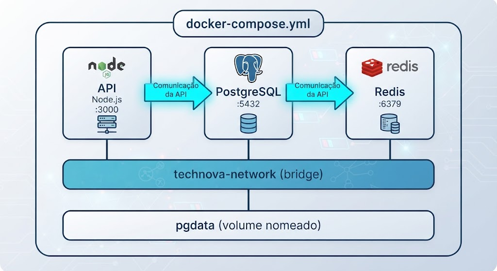

# Trabalho de Fixação (TF) — Aula 02: Docker Compose + IA como Copiloto

## Desafio

Crie um ambiente multi-container com **3 serviços** (API + PostgreSQL + Redis) usando Docker Compose, com auxílio do Kiro para gerar o rascunho inicial. Documente o que a IA gerou versus o que você ajustou manualmente. Entregue via Pull Request no repositório da disciplina.

---

## Cenário

O CTO da TechNova aprovou a adoção de Redis como cache para a API. Agora o ambiente local precisa de 3 serviços orquestrados:



---

## Informações de Entrega

| Item | Detalhe |
|------|---------|
| **Prazo** | 1 semana a partir da data da aula |
| **Forma de entrega** | Pull Request (PR) para o repositório da disciplina |
| **Pasta de entrega** | `entregas/aula-02/RA/` (substitua RA pelo seu número de matrícula) |
| **Conteúdo do PR** | Apenas o arquivo `entrega.md` com link do repositório + evidências |
| **Arquivos do projeto** | No repositório `unifaat-devops-portfolio`, pasta `aula-02/` |

### Como Entregar via Pull Request

1. Faça um **fork** do repositório da disciplina (se ainda não fez)
2. Clone o seu fork localmente
3. Crie a pasta `entregas/aula-02/SEU-RA/`
4. Adicione **apenas** o arquivo `entrega.md` (modelo abaixo) — os arquivos do projeto ficam no `unifaat-devops-portfolio`
5. Faça commit e push para o seu fork
6. Abra um **Pull Request** para o repositório original

**Modelo do arquivo `entrega.md`:**

```markdown
# Entrega — Aula 02: Docker Compose + IA como Copiloto

**Aluno:** [Seu nome completo]  
**RA:** [Seu RA]  
**Data:** [Data da entrega]

## Repositório

- URL: https://github.com/SEU-USUARIO/unifaat-devops-portfolio

## Evidências

- [ ] `docker-compose.yml` com 3 serviços (API + PostgreSQL + Redis)
- [ ] Volume nomeado configurado para PostgreSQL
- [ ] Rede customizada conectando todos os serviços
- [ ] Healthchecks configurados
- [ ] Variáveis de ambiente via `.env` (não hardcoded)
- [ ] `ia-analise.md` preenchido com reflexão crítica

## Evidência do Ambiente Rodando

[Cole aqui o output do `docker compose ps` ou screenshot]
```

---

## Instruções

### 1. Acessar o Repositório Portfólio

Os arquivos do projeto desta aula ficam no seu repositório `unifaat-devops-portfolio`, criado na Aula 01:

```bash
cd unifaat-devops-portfolio
git checkout main
git pull
```

### 2. Criar Branch de Desenvolvimento

```bash
git checkout -b feature/aula-02-compose
```

### 3. Criar a Pasta da Aula

```bash
mkdir -p aula-02
cd aula-02
```

### 4. Usar Kiro para Gerar o Rascunho Inicial

Abra o Kiro e use o seguinte prompt (ou similar):

> "Crie um docker-compose.yml para uma aplicação Node.js 20 com Express que usa PostgreSQL 15 como banco de dados e Redis 7 como cache. A API roda na porta 3000. O PostgreSQL precisa de volume nomeado para persistência. Todos os serviços devem estar na mesma rede bridge customizada. Use variáveis de ambiente com interpolação de arquivo .env. Adicione healthchecks, depends_on com condition, e restart policy unless-stopped."

**Salve o output original** do Kiro — você precisará dele para a documentação.

### 5. Criar os Arquivos do Projeto

#### 5.1: `app.js` — Aplicação Node.js

```javascript
const express = require('express');
const app = express();

const PORT = process.env.PORT || 3000;
const DB_HOST = process.env.DB_HOST || 'localhost';
const DB_PORT = process.env.DB_PORT || 5432;
const DB_NAME = process.env.DB_NAME || 'technova';
const REDIS_HOST = process.env.REDIS_HOST || 'localhost';
const REDIS_PORT = process.env.REDIS_PORT || 6379;

app.use(express.json());

app.get('/', (req, res) => {
  res.json({
    servico: 'TechNova API - Aula 02 TF',
    aluno: 'SEU NOME AQUI',
    ra: 'SEU RA AQUI',
    status: 'online',
    banco: `${DB_HOST}:${DB_PORT}/${DB_NAME}`,
    cache: `${REDIS_HOST}:${REDIS_PORT}`,
    timestamp: new Date().toISOString()
  });
});

app.get('/health', (req, res) => {
  res.json({
    status: 'healthy',
    uptime: process.uptime(),
    servicos: {
      api: 'online',
      banco: `${DB_HOST}:${DB_PORT}`,
      cache: `${REDIS_HOST}:${REDIS_PORT}`
    }
  });
});

app.listen(PORT, () => {
  console.log(`TechNova API rodando na porta ${PORT}`);
  console.log(`Banco: ${DB_HOST}:${DB_PORT}/${DB_NAME}`);
  console.log(`Cache: ${REDIS_HOST}:${REDIS_PORT}`);
});
```

#### 5.2: `package.json`

```json
{
  "name": "technova-aula02-tf",
  "version": "1.0.0",
  "description": "TF Aula 02 - Docker Compose com 3 serviços",
  "main": "app.js",
  "scripts": {
    "start": "node app.js"
  },
  "dependencies": {
    "express": "4.18.2"
  }
}
```

#### 5.3: `Dockerfile`

```dockerfile
FROM node:20-alpine

WORKDIR /app

COPY package*.json ./

RUN npm install --production

COPY . .

EXPOSE 3000

CMD ["node", "app.js"]
```

#### 5.4: `.dockerignore`

```dockerignore
node_modules/
.git/
.env
*.log
*.md
```

#### 5.5: `docker-compose.yml` (seu arquivo refinado)

Partindo do rascunho gerado pelo Kiro, crie a versão final com os seguintes **requisitos obrigatórios**:

- [ ] Serviço `api` construído a partir do Dockerfile local
- [ ] Serviço `postgres` usando imagem `postgres:15-alpine` com volume nomeado
- [ ] Serviço `redis` usando imagem `redis:7-alpine`
- [ ] Rede customizada conectando os 3 serviços
- [ ] Variáveis de ambiente interpoladas do `.env` (não hardcoded)
- [ ] `depends_on` com condições de healthcheck
- [ ] Healthchecks no PostgreSQL e Redis
- [ ] Restart policy `unless-stopped`
- [ ] Comentários explicativos em cada seção

#### 5.6: `.env` (não será versionado)

```env
# Configuração da API
PORT=3000
NODE_ENV=development

# PostgreSQL
POSTGRES_DB=technova
POSTGRES_USER=technova
POSTGRES_PASSWORD=technova_tf_2024

# Redis
REDIS_HOST=redis
REDIS_PORT=6379

# Conexão da API
DB_HOST=postgres
DB_PORT=5432
DB_NAME=technova
DB_USER=technova
DB_PASSWORD=technova_tf_2024
```

#### 5.7: `.env.example` (será versionado)

```env
# Configuração da API
PORT=3000
NODE_ENV=development

# PostgreSQL
POSTGRES_DB=technova
POSTGRES_USER=technova
POSTGRES_PASSWORD=ALTERE_ESTA_SENHA

# Redis
REDIS_HOST=redis
REDIS_PORT=6379

# Conexão da API
DB_HOST=postgres
DB_PORT=5432
DB_NAME=technova
DB_USER=technova
DB_PASSWORD=ALTERE_ESTA_SENHA
```

#### 5.8: `.gitignore`

```gitignore
node_modules/
.env
*.log
```

### 6. Documentar a Análise de IA — `ia-analise.md`

**Este arquivo é obrigatório.** Documente o processo de uso da IA:

```markdown
# Análise do Uso de IA — Aula 02 TF

## Prompt Utilizado

[Cole aqui o prompt exato que você usou no Kiro]

## Output Original do Kiro

[Cole aqui o docker-compose.yml exato que o Kiro gerou, sem modificações]

## Alterações que Fiz Manualmente

| O que mudei | Por quê |
|------------|---------|
| [Ex: Adicionei healthcheck no Redis] | [O Kiro não incluiu, é boa prática] |
| [Ex: Mudei senhas para usar .env] | [Estavam hardcoded no output do Kiro] |
| [Ex: Corrigi imagem do Redis] | [Kiro usou versão que não existe] |
| ... | ... |

## O que o Kiro Acertou

- [Liste pontos positivos do output da IA]

## O que o Kiro Errou ou Omitiu

- [Liste problemas ou omissões]

## Minha Avaliação

- **Tempo economizado usando IA:** [estimativa em minutos]
- **Tempo gasto validando/corrigindo:** [estimativa em minutos]
- **Nota para o output da IA (1-10):** [sua nota]
- **Usaria novamente para este tipo de tarefa?** [sim/não e por quê]
```

### 7. Testar Localmente

```bash
# Subir o ambiente
docker compose up -d --build

# Verificar status
docker compose ps

# Testar a API
curl http://localhost:3000
curl http://localhost:3000/health

# Verificar PostgreSQL
docker compose exec postgres psql -U technova -d technova -c "SELECT 1;"

# Verificar Redis
docker compose exec redis redis-cli ping
# Resposta esperada: PONG

# Verificar que tudo está na mesma rede
docker network inspect $(docker network ls -q --filter name=technova)
```

### 8. Limpar o Ambiente

```bash
docker compose down
```

### 9. Publicar no Portfólio e Criar o Pull Request

#### 9.1 — Merge e push no `unifaat-devops-portfolio`

```bash
# Voltar para a raiz do portfólio
cd ../..

# Adicionar arquivos (NÃO incluir .env)
git add aula-02/

# Verificar que .env NÃO está incluído
git status

# Commit (use Conventional Commits)
git commit -m "feat(aula-02): adiciona ambiente Docker Compose com 3 serviços

- docker-compose.yml com API + PostgreSQL + Redis
- Healthchecks e restart policies configurados
- Documentação de uso de IA (ia-analise.md)
- Aluno: SEU NOME (RA: SEU-RA)"

# Merge na main e push
git checkout main
git merge feature/aula-02-compose
git push origin main
git push origin feature/aula-02-compose  # Manter branch como evidência
```

#### 9.2 — Registrar entrega no fork da disciplina

```bash
# No repositório do fork da disciplina (não no portfólio)
cd /caminho/para/seu-fork-da-disciplina

git checkout -b entregas/aula-02/SEU-RA
mkdir -p entregas/aula-02/SEU-RA
```

Crie o arquivo `entrega.md` (modelo na seção de Informações de Entrega) e então:

```bash
git add entregas/aula-02/SEU-RA/entrega.md
git commit -m "feat(aula-02): entrega TF - SEU NOME (RA: SEU-RA)"
git push -u origin entregas/aula-02/SEU-RA
```

Abra o Pull Request no GitHub com:
- **Título:** `[Aula 02] RA: SEU-RA - SEU NOME`
- **Base:** `main`
- **Compare:** `entregas/aula-02/SEU-RA`

---

## Entregáveis

### No repositório `unifaat-devops-portfolio`, pasta `aula-02/`

| Arquivo | Obrigatório | Descrição |
|---------|:-----------:|-----------|
| `app.js` | ✅ | Aplicação Node.js com Express |
| `package.json` | ✅ | Dependências do projeto |
| `Dockerfile` | ✅ | Build da imagem da API |
| `.dockerignore` | ✅ | Exclusões do build Docker |
| `docker-compose.yml` | ✅ | Orquestração dos 3 serviços |
| `.env.example` | ✅ | Template de variáveis (sem senhas) |
| `.gitignore` | ✅ | Exclusões do Git |
| `ia-analise.md` | ✅ | Documentação do uso de IA |

> **Não incluir:** `node_modules/`, `.env` (com senhas reais), arquivos de log.

### No fork do repositório da disciplina (via Pull Request)

| Arquivo | Obrigatório | Descrição |
|---------|:-----------:|-----------|
| `entregas/aula-02/SEU-RA/entrega.md` | ✅ | Link do portfólio + evidências |

---

## Critérios de Avaliação

| # | Critério | Peso |
|---|----------|:----:|
| 1 | `docker-compose.yml` válido com 3 serviços (API + PostgreSQL + Redis) | 20% |
| 2 | Volume nomeado configurado para PostgreSQL | 10% |
| 3 | Rede customizada conectando todos os serviços | 10% |
| 4 | Healthchecks configurados (PostgreSQL e/ou Redis) | 10% |
| 5 | Variáveis de ambiente via `.env` (não hardcoded) | 10% |
| 6 | `.env.example` presente como template | 5% |
| 7 | Dockerfile funcional para a API | 10% |
| 8 | `ia-analise.md` completo e reflexivo | 15% |
| 9 | PR criado corretamente (branch, commit message, estrutura) | 5% |
| 10 | Código funcional (docker compose up sobe os 3 serviços) | 5% |

---

## Prazo

**1 semana** a partir da data da aula. Entrega via **Pull Request** no repositório da disciplina.

---

## Dicas

- **Teste antes de entregar** — garanta que `docker compose up` sobe os 3 serviços sem erros
- **Use Conventional Commits** nas mensagens: `feat:`, `docs:`, `fix:`, `chore:`
- **Use `docker compose config`** para validar a sintaxe do YAML antes do commit
- **Redis healthcheck:** `redis-cli ping` retorna `PONG` quando está pronto
- **Não copie o docker-compose.yml do Kiro diretamente** — o objetivo é refinar e entender
- **O `ia-analise.md` é tão importante quanto o código** — demonstra pensamento crítico
- **Se a porta estiver ocupada:** altere o mapeamento externo (ex: `"6380:6379"`)
- **Consulte `app-technova/docker-compose.yml`** no repositório do curso como referência
- **Não commite `.env`** — verifique que o `.gitignore` está configurado antes do primeiro `git add`

---

## Exemplo de Healthcheck para Redis

```yaml
redis:
  image: redis:7-alpine
  healthcheck:
    test: ["CMD", "redis-cli", "ping"]
    interval: 10s
    timeout: 5s
    retries: 3
```

---

*Este TF combina habilidades técnicas (Docker Compose) com pensamento crítico sobre IA. Profissionais que sabem usar IA como ferramenta — e documentar suas decisões — se destacam no mercado.*
