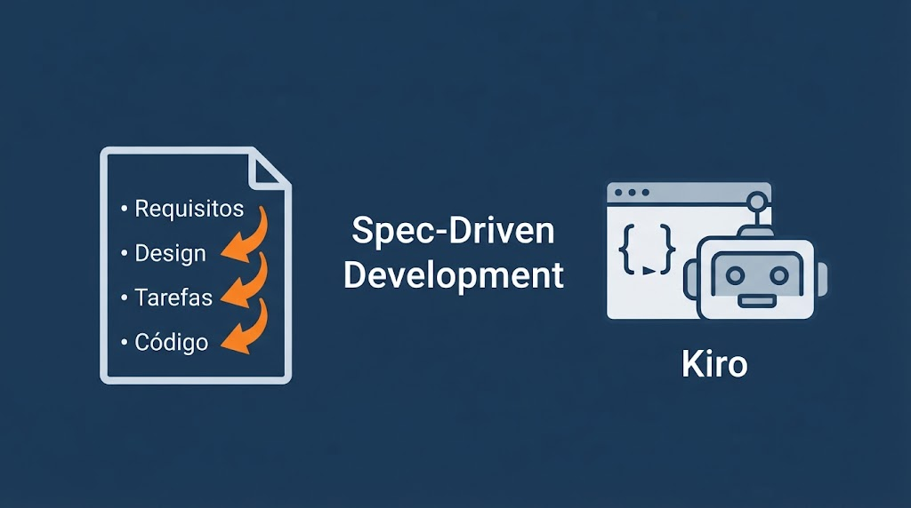
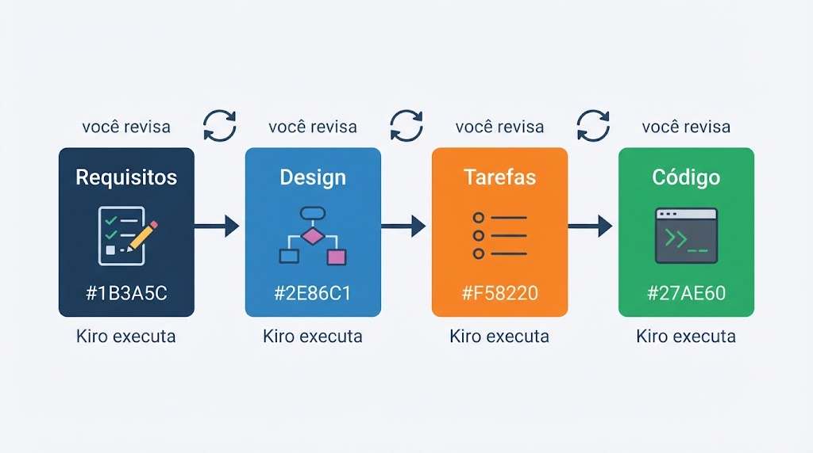
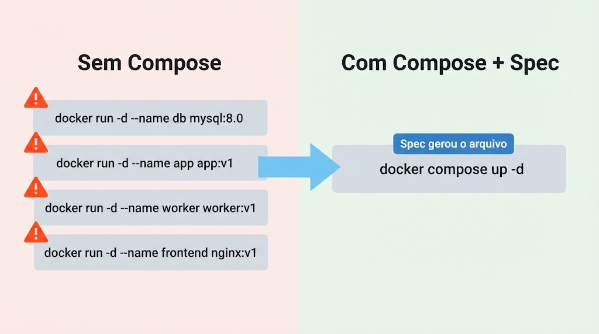
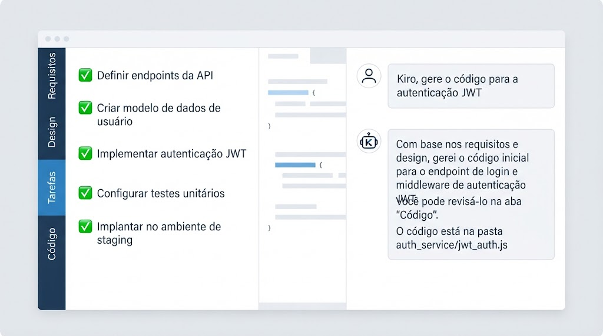

<!-- _class: title -->

# Aula 02 — Docker Compose e Spec-Driven Development

**DevOps — Centro Universitário UniFAAT**
Prof. Alexandre Tavares | Semestre 2026-2

---



---

# Por que Spec-Driven + Docker Compose?

**O problema da TechNova hoje:**
- A API está containerizada (Aula 01 ✅)
- Mas subir app + banco + cache exige 4 comandos manuais, na ordem certa, sem erros
- E a equipe ainda não tem um processo estruturado para construir sistemas com IA

**O que esta aula resolve:**

| Problema | Solução |
|---|---|
| Orquestração manual de múltiplos containers | Docker Compose declarativo |
| IA gerando código sem contexto ou planejamento | Spec-Driven Development com Kiro |
| Revisão manual de tudo que a IA gera | Checklist de validação profissional |

> **Fio condutor:** Spec-Driven é o método. Docker Compose é o projeto. O Lab é a prática.

---

# Objetivos de Aprendizagem

### Docker Compose
- Compreender o problema de orquestração manual de containers
- Definir serviços, redes e volumes em `docker-compose.yml`
- Usar variáveis de ambiente com `.env` e healthchecks
- Dominar os comandos essenciais do Compose

### Spec-Driven Development com Kiro
- Entender a diferença entre Vibe (chat) e Spec (estruturado)
- Aplicar o fluxo: **Requisitos → Design → Tarefas → Código**
- Revisar e validar cada etapa antes de avançar
- Avaliar criticamente o output da IA

> **Meta:** Ao final, você saberá usar IA como ferramenta profissional — não como atalho.

---



---

# Spec-Driven Development — O Conceito

### O que é?
Um workflow onde a IA **pensa antes de agir** — e você controla cada etapa.

### Chat (Vibe) vs. Spec

| | Chat / Vibe | Spec-Driven |
|---|---|---|
| **Início** | Prompt direto | Descrição do que quer construir |
| **Processo** | IA responde imediatamente | Requisitos → Design → Tarefas → Código |
| **Controle** | Você revisa o resultado final | Você aprova cada etapa antes de prosseguir |
| **Rastreabilidade** | Conversa descartável | Documentação gerada automaticamente |
| **Resultado** | Rascunho para revisar | Sistema completo e documentado |

### Por que importa para DevOps?
> Infraestrutura mal especificada gera retrabalho em produção. Spec-Driven força clareza **antes** do código.

---

# As 4 Etapas do Spec-Driven

### Etapa 1 — Requisitos
Você descreve em linguagem natural. Kiro documenta o que o sistema **deve fazer**.
- O que você verifica: todos os endpoints? campos corretos? validações capturadas?

### Etapa 2 — Design
Kiro propõe a arquitetura: estrutura de pastas, modelo de dados, integrações.
- O que você verifica: faz sentido? contempla variáveis de ambiente? segue padrões?

### Etapa 3 — Tarefas
Kiro gera lista ordenada de implementação.
- O que você verifica: a ordem é lógica? cobre tudo? inclui infraestrutura (Dockerfile, Compose)?

### Etapa 4 — Código
Kiro executa as tarefas e gera os arquivos. Em modo **Supervised**, você aprova cada mudança.
- O que você verifica: sintaxe válida? funciona localmente? segue boas práticas?

> **Regra de ouro:** Só avance para a próxima etapa quando estiver satisfeito com a atual.

---

# O Problema: Orquestração Manual

**Cenário TechNova — subir o ambiente completo:**

```bash
docker network create technova-net

docker run -d --name postgres --network technova-net \
  -e POSTGRES_PASSWORD=secret -v pgdata:/var/lib/postgresql/data \
  postgres:16

docker run -d --name redis --network technova-net redis:7

docker run -d --name app --network technova-net \
  -p 3000:3000 -e DATABASE_URL=postgres://... technova-app:1.0
```

**Problemas:**
- Ordem importa — banco precisa estar pronto antes da API
- Muitos flags para lembrar
- Difícil versionar e replicar
- Novos devs levam horas para configurar

> **Este é exatamente o tipo de problema que Spec-Driven resolve:** descreva o ambiente desejado → Kiro gera o `docker-compose.yml` → você valida.

---



---

# O que é Docker Compose

**Definição:** Ferramenta para definir e executar aplicações multi-container usando um arquivo YAML declarativo.

**Princípios:**
- **Declarativo** — descreve o estado desejado, não os passos
- **Reproduzível** — mesmo arquivo = mesmo ambiente sempre
- **Versionável** — o arquivo vai no Git junto com o código
- **Um comando** — `docker compose up` sobe tudo

| Sem Compose | Com Compose |
|---|---|
| Múltiplos `docker run` | Um arquivo YAML |
| Flags manuais | Configuração declarativa |
| Rede criada à mão | Rede automática |
| Ordem de start manual | `depends_on` garante a ordem |
| Dados perdidos no `rm` | Volumes nomeados persistem |

> **Conexão Spec-Driven:** O `docker-compose.yml` é o artefato de infraestrutura que o Kiro gera na Etapa 4 do Spec.

---

# Anatomia do `docker-compose.yml`

```yaml
services:          # Containers da aplicação
  app: ...
  db: ...

networks:          # Redes para comunicação
  backend: ...

volumes:           # Dados persistentes
  pgdata: ...
```

**Estrutura de três blocos:**

| Bloco | Função |
|---|---|
| `services` | Define cada container (build, imagem, portas, variáveis) |
| `networks` | Configura redes de comunicação entre containers |
| `volumes` | Declara volumes para persistência de dados |

> O Compose cria uma rede padrão automaticamente — mas em Spec-Driven, o Kiro normalmente gera a rede customizada já seguindo boas práticas.

---

# Services — Build vs Image

**Usando imagem pronta do registry:**
```yaml
services:
  db:
    image: postgres:16-alpine
    ports:
      - "5432:5432"
    environment:
      POSTGRES_PASSWORD: secret
```

**Fazendo build a partir de Dockerfile:**
```yaml
services:
  app:
    build:
      context: .
      dockerfile: Dockerfile
    ports:
      - "3000:3000"
    environment:
      DATABASE_URL: postgres://user:pass@db:5432/technova
```

- `image:` → baixa do Docker Hub (ou registry privado)
- `build:` → constrói localmente a partir do Dockerfile

> **No Spec:** Kiro gera ambos os blocos automaticamente após o Design ser aprovado.

---

# Networks e Volumes

**Rede customizada — containers se comunicam pelo nome do serviço:**
```yaml
services:
  app:
    networks: [ backend ]
    environment:
      DATABASE_URL: postgres://user:pass@db:5432/technova
  db:
    networks: [ backend ]

networks:
  backend:
    driver: bridge
```
`db` no connection string = Docker resolve para o IP do container `db`.

**Volume nomeado para persistência:**
```yaml
services:
  db:
    volumes:
      - pgdata:/var/lib/postgresql/data

volumes:
  pgdata:
```

> `docker compose down` preserva volumes. `docker compose down -v` apaga tudo — use com cuidado.

---

# depends_on, Healthchecks e `.env`

**`depends_on` com healthcheck — garante que o banco está pronto:**
```yaml
services:
  app:
    depends_on:
      db:
        condition: service_healthy

  db:
    image: postgres:16-alpine
    healthcheck:
      test: ["CMD-SHELL", "pg_isready -U postgres"]
      interval: 10s
      timeout: 5s
      retries: 5
```

**Variáveis de ambiente com `.env`:**
```yaml
# docker-compose.yml
services:
  db:
    environment:
      POSTGRES_PASSWORD: ${DB_PASSWORD}
```
```bash
# .env  (nunca versione este arquivo!)
DB_PASSWORD=minha_senha_segura
```

> **No checklist de validação Spec:** verificar que nenhuma senha está hardcoded é um dos primeiros itens.

---

# Comandos Essenciais do Compose

```bash
# Subir todos os serviços (build + start)
docker compose up -d

# Verificar status dos containers
docker compose ps

# Ver logs de todos os serviços
docker compose logs -f

# Ver logs de um serviço específico
docker compose logs -f app

# Executar comando em um serviço rodando
docker compose exec db psql -U postgres

# Parar e remover containers + rede (preserva volumes)
docker compose down

# Parar e remover TUDO incluindo volumes (dados perdidos!)
docker compose down -v

# Validar sintaxe do arquivo sem subir
docker compose config
```

> **`docker compose config`** é o primeiro passo do checklist de validação após o Kiro gerar o arquivo.

---

# Boas Práticas Docker Compose

**Configuração:**
- Usar `.env` para variáveis sensíveis — nunca hardcode senhas
- Definir `restart: unless-stopped` para resiliência
- Especificar versões de imagens — nunca `latest` em produção
- Usar `depends_on` com `condition: service_healthy`

**Organização:**
- Um `docker-compose.yml` por projeto/ambiente
- Nomear volumes e redes explicitamente
- Comentar portas, variáveis e decisões não óbvias

**Segurança:**
- Não expor portas de banco para o host em produção
- Usar redes internas para comunicação entre serviços
- `.env` no `.gitignore` — fornecer `.env.example` no lugar

> **Conexão Spec-Driven:** Estas boas práticas são o seu **checklist de revisão** da Etapa 4. Se o Kiro omitiu alguma, você corrige antes de aceitar o código.

---



---

# Kiro — Vibe vs. Spec

### Modo Vibe (chat livre)
- Você pergunta → Kiro responde
- Bom para: dúvidas pontuais, explicações, rascunços rápidos
- Limitação: sem contexto acumulado, sem etapas de revisão

### Modo Spec (estruturado)
- Você descreve o sistema → Kiro planeja antes de codificar
- Fluxo: **Requisitos → Design → Tarefas → Código**
- Você controla cada etapa — pode ajustar antes de avançar
- Gera documentação automaticamente junto com o código

### Quando usar cada um?

| Situação | Use |
|---|---|
| "Como funciona o healthcheck do Compose?" | Vibe |
| "Crie uma API REST com PostgreSQL do zero" | **Spec** |
| "Explique este erro no docker compose up" | Vibe |
| "Gere o ambiente completo da TechNova" | **Spec** |

---

# Spec-Driven na Prática — Exemplo TechNova

**Prompt inicial para o Spec:**
> "Quero criar um ambiente Docker Compose para a TechNova com 3 serviços: API Node.js 20 com Express na porta 3000, PostgreSQL 15 como banco de dados com volume nomeado para persistência, e Redis 7 como cache. Todos os serviços na mesma rede bridge customizada. Usar variáveis de ambiente do `.env`. Healthchecks no PostgreSQL e Redis. Restart policy `unless-stopped`."

**O que acontece:**

1. **Requisitos** — Kiro lista os 3 serviços, portas, variáveis, dependências
2. **Design** — Kiro propõe estrutura: `app.js`, `Dockerfile`, `docker-compose.yml`, `.env.example`
3. **Tarefas** — Kiro ordena: Dockerfile → Compose → `.env.example` → healthchecks → testes
4. **Código** — Kiro gera cada arquivo, você valida com `docker compose config` e `docker compose up`

> **Seu papel:** revisar cada etapa. Se o Design não incluiu healthcheck, você pede antes de avançar.

---

# Checklist de Validação — Output do Spec

**Após o Kiro gerar o `docker-compose.yml`, valide:**

| Item | Verificação |
|---|---|
| Sintaxe YAML válida? | `docker compose config` sem erros |
| Imagens existem no Docker Hub? | `docker pull postgres:15-alpine` |
| Senhas hardcoded? | Verificar se usa `${VAR}` do `.env` |
| Healthchecks configurados? | PostgreSQL e Redis com `pg_isready` / `redis-cli ping` |
| `depends_on` com condition? | `condition: service_healthy` |
| Volume nomeado para o banco? | `pgdata:` na seção `volumes:` |
| Rede customizada? | Declarada em `networks:` |
| Restart policy? | `restart: unless-stopped` |
| `.env.example` gerado? | Sem senhas reais |
| Ambiente sobe corretamente? | `docker compose up -d --build` sem erros |

> Este checklist é o que transforma o output da IA em infraestrutura confiável.

---

# IA Responsável — O que o Spec não resolve sozinho

**Limitações que você precisa conhecer:**

- **Alucinações:** Kiro pode gerar imagens que não existem ou flags inválidas
- **Desatualização:** Pode sugerir práticas de versões antigas
- **Contexto limitado:** Não conhece restrições de segurança do seu projeto
- **Dados sensíveis:** Nunca cole senhas ou tokens no prompt

**O que o Spec melhora em relação ao chat:**
- Você revisa requisitos antes de qualquer código ser gerado
- O design documenta as decisões — mais fácil de auditar
- Cada tarefa é rastreável — você sabe o que foi gerado e por quê

**O que o Spec não substitui:**
- Seu conhecimento técnico para validar cada etapa
- Teste local antes de commitar
- Revisão de segurança em configurações de produção

> **Regra de ouro:** Se você não entende o que o Kiro gerou, não use em produção.

---

# AWS Bedrock — Visão Conceitual

**O que é:**
Serviço gerenciado da AWS que dá acesso a modelos de IA generativa via API — sem hospedar ou treinar os modelos.

**Relevância para Spec-Driven DevOps:**

| Cenário | Como Bedrock ajuda |
|---|---|
| Pipeline CI/CD com análise automática | Integrar Claude/Llama no GitHub Actions |
| Análise de logs em produção | Lambda + Bedrock analisa erros automaticamente |
| Geração de documentação de IaC | Bedrock descreve o que o Terraform faz |
| Spec automatizado em pipelines | Gerar requisitos a partir de tickets do Jira |

**Quando usaremos:**
A partir da Aula 03, quando integrarmos IA diretamente em pipelines de automação com Terraform e GitHub Actions.

> Por hoje: Kiro como interface interativa. Em breve: Bedrock como motor nos pipelines.

---

# Cronograma da Aula

| Bloco | Atividade |
|---|---|
| 1 | Revisão TA + Discussão |
| 2 | Teoria — Docker Compose |
| 3 | **Lab Parte 1** — Docker Compose na prática (ambiente TechNova) |
| 4 | Teoria — Spec-Driven Development com Kiro |
| 5 | **Lab Parte 2** — Spec-Driven: criar API completa com Kiro |
| 6 | Encerramento + TF |

**Sobre os laboratórios:**
- **Lab 1:** Criar `docker-compose.yml` manualmente para a TechNova (API + PostgreSQL + Redis)
- **Lab 2:** Usar o Kiro Spec para criar uma API REST do zero — requisitos → design → tarefas → código — e validar cada artefato gerado

> **A conexão:** No Lab 1 você entende o que o Compose faz. No Lab 2 você usa o Spec para gerá-lo — e sabe validar porque fez manualmente antes.

---

# Referências e Próximos Passos

**Referências:**
- Docker Compose Docs — [docs.docker.com/compose](https://docs.docker.com/compose)
- Compose File Reference — [docs.docker.com/compose/compose-file](https://docs.docker.com/compose/compose-file)
- Kiro Documentation — [kiro.dev/docs](https://kiro.dev/docs)
- AWS Bedrock — [aws.amazon.com/bedrock](https://aws.amazon.com/bedrock)

**Para a próxima aula:**
- Completar o TF desta aula (portfólio + PR)
- Estudar o `TA.md` da Aula 03
- Ter Docker Compose funcionando localmente
- Criar conta AWS Free Tier (se ainda não tiver)

**Próxima aula:**
**Aula 03 — Terraform e Segurança AWS (IAM)**
Infraestrutura como Código na nuvem — e o Spec-Driven continua como método.
