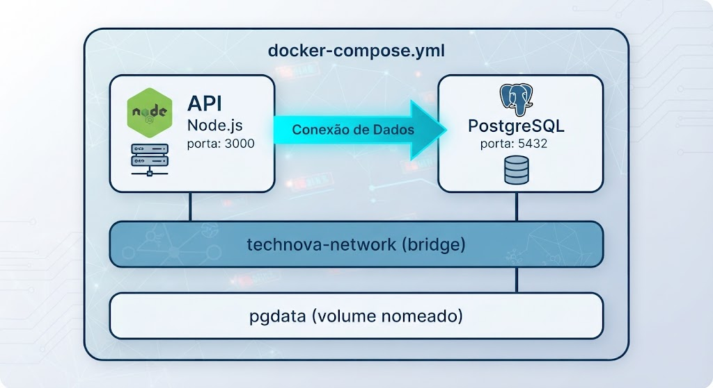
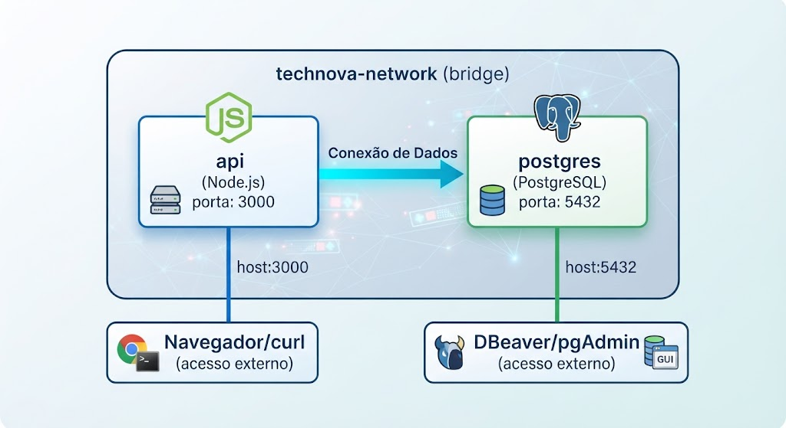

# Laboratório Parte 1 — Orquestrando a TechNova com Docker Compose

**Tempo estimado:** 120 minutos

---

## Missão

> A equipe de Platform Engineering recebeu uma demanda urgente: a API da TechNova precisa de um banco de dados PostgreSQL, e o ambiente de desenvolvimento local deve ser configurável com **um único comando**. Sua missão é escrever o `docker-compose.yml` que orquestre a API e o banco de dados, com persistência de dados, redes configuradas e variáveis de ambiente seguras.

---

## Arquitetura Final

Ao concluir este laboratório, você terá:



---

## Pré-requisitos

- Docker e Docker Compose instalados ([Docker Desktop inclui o Compose](https://www.docker.com/products/docker-desktop/))
- Git instalado e configurado (Aula 01)
- Conceitos de Dockerfile dominados (Aula 01)
- Repositório da TechNova criado na aula anterior
- Terminal funcional (Git Bash no Windows, Terminal no macOS/Linux)
- Editor de texto (VS Code recomendado)

> **Verificar versão do Docker Compose:**
> ```bash
> docker compose version
> ```
> Resultado esperado: `Docker Compose version v2.x.x`

---

## Parte 1 — Preparando o Projeto (15 minutos)

### Passo 1.1: Navegar até o repositório do projeto

```bash
cd technova-api
```

> **Continuidade:** Este é o mesmo repositório da Aula 01. Agora vamos adicionar orquestração multi-container ao projeto que já tem Git e Dockerfile.

### Passo 1.2: Verificar a estrutura atual

Confirme que os seguintes arquivos existem (criados na Aula 01):

```
technova-api/
├── src/
│   └── index.js          ← Código da API
├── package.json          ← Dependências
├── Dockerfile            ← Containerização
├── .dockerignore         ← Exclusões do build
├── .gitignore            ← Exclusões do Git
└── README.md             ← Documentação
```

### Passo 1.3: Garantir que a aplicação suporta variáveis de ambiente

Verifique se o `src/index.js` usa variáveis de ambiente para configuração. Se necessário, atualize:

```javascript
const express = require('express');
const app = express();

// Configuração via variáveis de ambiente
const PORT = process.env.PORT || 3000;
const DB_HOST = process.env.DB_HOST || 'localhost';
const DB_PORT = process.env.DB_PORT || 5432;
const DB_NAME = process.env.DB_NAME || 'technova';

app.use(express.json());

app.get('/', (req, res) => {
  res.json({
    servico: 'TechNova API',
    status: 'online',
    banco: `${DB_HOST}:${DB_PORT}/${DB_NAME}`
  });
});

app.get('/health', (req, res) => {
  res.json({ status: 'healthy', uptime: process.uptime() });
});

app.listen(PORT, () => {
  console.log(`TechNova API rodando na porta ${PORT}`);
  console.log(`Banco de dados: ${DB_HOST}:${DB_PORT}/${DB_NAME}`);
});
```

> **Nota:** O repositório do curso (`app-technova/`) contém a aplicação de referência completa.

### Passo 1.4: Criar o arquivo `.env`

Crie o arquivo `.env` na raiz do projeto:

```env
# Configuração da API
PORT=3000
NODE_ENV=development

# Configuração do PostgreSQL
POSTGRES_DB=technova
POSTGRES_USER=technova
POSTGRES_PASSWORD=technova_dev_2024

# Conexão da API com o Banco
DB_HOST=postgres
DB_PORT=5432
DB_NAME=technova
DB_USER=technova
DB_PASSWORD=technova_dev_2024
```

### Passo 1.5: Criar o arquivo `.env.example`

Este arquivo serve como template para novos desenvolvedores (vai para o Git):

```env
# Configuração da API
PORT=3000
NODE_ENV=development

# Configuração do PostgreSQL
POSTGRES_DB=technova
POSTGRES_USER=technova
POSTGRES_PASSWORD=ALTERE_ESTA_SENHA

# Conexão da API com o Banco
DB_HOST=postgres
DB_PORT=5432
DB_NAME=technova
DB_USER=technova
DB_PASSWORD=ALTERE_ESTA_SENHA
```

### Passo 1.6: Garantir que `.env` está no `.gitignore`

Abra o `.gitignore` e confirme que contém:

```gitignore
node_modules/
.env
*.log
```

> **Segurança:** O `.env` com senhas reais **nunca** deve ir para o Git. O `.env.example` (sem senhas) vai para o repositório como documentação.

✅ **Checkpoint:** Projeto preparado com Dockerfile, código que aceita variáveis de ambiente, e configuração separada em `.env`.

---

## Parte 2 — Escrevendo o `docker-compose.yml` (25 minutos)

### Passo 2.1: Criar o arquivo `docker-compose.yml`

Crie o arquivo `docker-compose.yml` na raiz do projeto:

```yaml
version: '3.8'

services:
  # ================================
  # Serviço: API TechNova (Node.js)
  # ================================
  api:
    build:
      context: .
      dockerfile: Dockerfile
    container_name: technova-api
    ports:
      - "${PORT:-3000}:3000"
    environment:
      - NODE_ENV=${NODE_ENV:-development}
      - PORT=3000
      - DB_HOST=postgres
      - DB_PORT=5432
      - DB_NAME=${POSTGRES_DB:-technova}
      - DB_USER=${POSTGRES_USER:-technova}
      - DB_PASSWORD=${POSTGRES_PASSWORD:-technova_dev_2024}
    depends_on:
      - postgres
    networks:
      - technova-network
    restart: unless-stopped

  # ================================
  # Serviço: PostgreSQL (Banco de Dados)
  # ================================
  postgres:
    image: postgres:15-alpine
    container_name: technova-db
    environment:
      - POSTGRES_DB=${POSTGRES_DB:-technova}
      - POSTGRES_USER=${POSTGRES_USER:-technova}
      - POSTGRES_PASSWORD=${POSTGRES_PASSWORD:-technova_dev_2024}
    ports:
      - "5432:5432"
    volumes:
      - pgdata:/var/lib/postgresql/data
    networks:
      - technova-network
    restart: unless-stopped

# ================================
# Redes
# ================================
networks:
  technova-network:
    driver: bridge

# ================================
# Volumes (persistência)
# ================================
volumes:
  pgdata:
    driver: local
```

### Passo 2.2: Entender cada seção

Analise o arquivo criado:

| Seção | Propósito |
|-------|-----------|
| `services.api` | Define a API Node.js — construída do Dockerfile local |
| `services.postgres` | Define o banco — usa imagem oficial do Docker Hub |
| `build.context` | Diretório onde o Docker procura o Dockerfile |
| `container_name` | Nome fixo para o container (facilita referência) |
| `ports` | Mapeamento host:container — permite acesso externo |
| `environment` | Variáveis interpoladas do `.env` com valores padrão (`${VAR:-default}`) |
| `depends_on` | API espera o container do PostgreSQL iniciar primeiro |
| `volumes` | Dados do banco persistem entre `down` e `up` |
| `networks` | Rede bridge para comunicação entre containers |
| `restart: unless-stopped` | Reinicia automaticamente se o container cair |

### Passo 2.3: Entender a interpolação de variáveis

A sintaxe `${VARIAVEL:-valor_padrao}` significa:
- Se a variável existir no `.env` ou no ambiente do host → usa o valor dela
- Se não existir → usa o valor padrão após `:-`

Exemplo: `${POSTGRES_PASSWORD:-technova_dev_2024}`
- Se `.env` tem `POSTGRES_PASSWORD=minha_senha` → usa `minha_senha`
- Se `.env` não tem essa variável → usa `technova_dev_2024`

### Passo 2.4: Entender a comunicação entre containers

**Ponto-chave:** Dentro da rede, a API se conecta ao banco usando `DB_HOST=postgres` (nome do serviço = hostname). De fora (host), usamos `localhost:5432`.

✅ **Checkpoint:** `docker-compose.yml` escrito com dois serviços, rede e volume configurados.

---

## Parte 3 — Subindo o Ambiente e Testando (20 minutos)

### Passo 3.1: Construir e iniciar todos os serviços

```bash
docker compose up --build
```

> **Nota:** Use `docker compose` (sem hífen) nas versões mais recentes. Em versões antigas, use `docker-compose`.

Observe os logs de ambos os serviços no terminal. Você verá:

```
[+] Running 3/3
 ✔ Network technova-api_technova-network  Created
 ✔ Container technova-db                  Created
 ✔ Container technova-api                 Created
...
technova-db   | PostgreSQL init process complete; ready for start up.
technova-db   | LOG:  database system is ready to accept connections
technova-api  | TechNova API rodando na porta 3000
technova-api  | Banco de dados: postgres:5432/technova
```

### Passo 3.2: Testar a API (em outro terminal)

Abra um **novo terminal** e teste:

```bash
curl http://localhost:3000
```

Resultado esperado:
```json
{
  "servico": "TechNova API",
  "status": "online",
  "banco": "postgres:5432/technova"
}
```

### Passo 3.3: Testar o health check

```bash
curl http://localhost:3000/health
```

Resultado esperado:
```json
{
  "status": "healthy",
  "uptime": 12.345
}
```

### Passo 3.4: Verificar que o PostgreSQL está acessível

```bash
docker compose exec postgres psql -U technova -d technova -c "SELECT version();"
```

Resultado esperado: versão do PostgreSQL rodando dentro do container.

### Passo 3.5: Verificar o status dos serviços

```bash
docker compose ps
```

Resultado esperado:
```
NAME            SERVICE    STATUS    PORTS
technova-api    api        running   0.0.0.0:3000->3000/tcp
technova-db     postgres   running   0.0.0.0:5432->5432/tcp
```

### Passo 3.6: Parar e reiniciar em background

Pare os serviços (Ctrl+C se iniciou sem `-d`) e reinicie em background:

```bash
docker compose down
docker compose up -d --build
```

Agora os serviços rodam em background e você pode usar o mesmo terminal.

✅ **Checkpoint:** Ambiente completo (API + PostgreSQL) rodando com um único comando.

---

## Parte 4 — Testando Persistência de Dados com Volumes (15 minutos)

> **Observação:** A tabela `pedidos` e 3 registros iniciais já foram criados automaticamente pelo arquivo `init.sql` montado no container do PostgreSQL. O script em `docker-entrypoint-initdb.d/` é executado pelo Postgres na **primeira inicialização** do volume. Não é necessário criar a tabela manualmente.

### Passo 4.1: Confirmar que a tabela e os dados de seed existem

```bash
docker compose exec postgres psql -U technova -d technova -c "SELECT * FROM pedidos;"
```

Resultado esperado: 3 registros criados pelo `init.sql`:

```
 id |    cliente     |        item         | quantidade |    status    |         criado_em
----+----------------+---------------------+------------+--------------+----------------------------
  1 | TechNova Corp  | Licença Enterprise  |          1 | aprovado     | ...
  2 | StartupXYZ     | Plano Básico        |          3 | pendente     | ...
  3 | MegaLtda       | Consultoria DevOps  |          1 | em_andamento | ...
```

### Passo 4.2: Inserir novos registros

Adicione pedidos além dos que já vieram do seed:

```bash
docker compose exec postgres psql -U technova -d technova -c "
INSERT INTO pedidos (cliente, item, quantidade, status) VALUES
  ('DevShop',   'Plano Pro',          2,  'pendente'),
  ('CloudCorp', 'Suporte Premium',    1,  'aprovado');"
```

### Passo 4.3: Verificar todos os registros

```bash
docker compose exec postgres psql -U technova -d technova -c "SELECT * FROM pedidos;"
```

Resultado esperado: 5 registros no total (3 do seed + 2 que você acabou de inserir).

### Passo 4.4: Destruir e recriar os containers

```bash
# Parar e remover containers (mas NÃO volumes)
docker compose down

# Verificar que os containers foram removidos
docker compose ps

# Subir tudo novamente
docker compose up -d
```

### Passo 4.5: Verificar que os dados persistiram

```bash
docker compose exec postgres psql -U technova -d technova -c "SELECT * FROM pedidos;"
```

✅ Os 5 registros ainda estão lá — incluindo os 2 que você inseriu! O volume `pgdata` manteve os dados entre recriações de container.

> **Detalhe importante:** o `init.sql` só é executado na **primeira** vez que o volume é criado. Nas próximas subidas com `docker compose up`, o Postgres encontra o volume já inicializado e ignora o script — por isso seus dados inseridos na Passo 4.2 sobrevivem ao `down`/`up`.

### Passo 4.6: Entender o que acontece com `-v`

```bash
# ⚠️ CUIDADO: Este comando REMOVE o volume e os dados!
# NÃO execute agora — é apenas para referência
# docker compose down -v
```

> **Regra de ouro:** Use `docker compose down` no dia a dia. Use `docker compose down -v` apenas quando quiser recomeçar do zero (reset completo do banco). Nesse caso, na próxima subida o `init.sql` será executado novamente e o banco voltará apenas com os 3 registros de seed.

✅ **Checkpoint:** Dados persistem entre reinicializações graças ao volume nomeado.

---

## Parte 5 — Logs, Debugging e Inspeção (15 minutos)

### Passo 5.1: Ver logs de todos os serviços

```bash
docker compose logs
```

### Passo 5.2: Seguir logs em tempo real

```bash
docker compose logs -f
```

Pressione `Ctrl+C` para sair.

### Passo 5.3: Ver logs de um serviço específico

```bash
docker compose logs -f api
docker compose logs -f postgres
```

### Passo 5.4: Ver apenas as últimas N linhas

```bash
docker compose logs --tail=20 api
```

### Passo 5.5: Acessar o shell do container da API

```bash
docker compose exec api sh
```

Dentro do container:
```bash
ls /app
cat package.json
env | grep DB    # Ver variáveis de ambiente
exit
```

### Passo 5.6: Verificar a rede criada

```bash
docker network ls | grep technova
```

Para ver detalhes da rede (containers conectados, IPs):
```bash
docker network inspect technova-api_technova-network
```

### Passo 5.7: Verificar o volume criado

```bash
docker volume ls | grep pgdata
docker volume inspect technova-api_pgdata
```

### Passo 5.8: Verificar uso de recursos

```bash
docker stats --no-stream
```

Mostra CPU, memória e I/O de cada container.

✅ **Checkpoint:** Você sabe inspecionar logs, acessar containers, verificar redes e volumes.

---

## Parte 6 — Recursos Avançados: Healthchecks e Restart Policies (15 minutos)

### Passo 6.1: Adicionar healthcheck ao PostgreSQL

Edite o `docker-compose.yml` e adicione ao serviço `postgres`:

```yaml
  postgres:
    image: postgres:15-alpine
    container_name: technova-db
    environment:
      - POSTGRES_DB=${POSTGRES_DB:-technova}
      - POSTGRES_USER=${POSTGRES_USER:-technova}
      - POSTGRES_PASSWORD=${POSTGRES_PASSWORD:-technova_dev_2024}
    ports:
      - "5432:5432"
    volumes:
      - pgdata:/var/lib/postgresql/data
    networks:
      - technova-network
    restart: unless-stopped
    healthcheck:
      test: ["CMD-SHELL", "pg_isready -U technova -d technova"]
      interval: 10s
      timeout: 5s
      retries: 5
      start_period: 30s
```

### Passo 6.2: Configurar depends_on com condição de healthcheck

Atualize o serviço `api` para esperar o banco estar **realmente pronto** (não apenas iniciado):

```yaml
  api:
    # ... (demais configurações permanecem)
    depends_on:
      postgres:
        condition: service_healthy
```

### Passo 6.3: Aplicar as mudanças

```bash
docker compose down
docker compose up -d --build
```

### Passo 6.4: Verificar o healthcheck

```bash
docker compose ps
```

Agora o status mostra `healthy` para o PostgreSQL:

```
NAME            SERVICE    STATUS              PORTS
technova-api    api        running             0.0.0.0:3000->3000/tcp
technova-db     postgres   running (healthy)   0.0.0.0:5432->5432/tcp
```

### Passo 6.5: Entender as restart policies

| Policy | Comportamento |
|--------|-------------|
| `no` | Nunca reinicia (padrão) |
| `always` | Sempre reinicia (inclusive no boot do host) |
| `unless-stopped` | Reinicia exceto se parado manualmente |
| `on-failure` | Reinicia apenas se o container sair com erro |

Para desenvolvimento local, `unless-stopped` é a melhor opção — garante que o ambiente continua rodando mesmo após reiniciar o computador (com Docker Desktop ativo).

✅ **Checkpoint:** Ambiente com healthchecks e restart policies configurados.

---

## Parte 7 — Versionando com Git (10 minutos)

### Passo 7.1: Verificar os novos arquivos

```bash
git status
```

Você deve ver: `docker-compose.yml`, `.env.example` e possivelmente alterações no `src/index.js`.

> **Importante:** O `.env` NÃO deve aparecer (está no `.gitignore`).

### Passo 7.2: Criar branch para a feature

```bash
git checkout -b feature/docker-compose
```

### Passo 7.3: Adicionar e commitar

```bash
git add docker-compose.yml .env.example src/index.js .gitignore
git commit -m "feat: adiciona Docker Compose com API + PostgreSQL

- Orquestração declarativa com docker-compose.yml
- PostgreSQL com volume nomeado para persistência
- Rede bridge customizada para comunicação
- Healthcheck no banco de dados
- .env.example como template de configuração"
```

### Passo 7.4: Fazer merge na main

```bash
git checkout main
git merge feature/docker-compose
```

### Passo 7.5: Push para o GitHub

```bash
git push origin main
```

✅ **Checkpoint:** Configuração do Docker Compose versionada no Git. Qualquer novo dev pode clonar e rodar `docker compose up`.

---

## Troubleshooting — Problemas Comuns

### ❌ Erro: `port is already allocated` (porta 5432 ou 3000)

**Causa:** Outra instância do PostgreSQL ou outro serviço está usando a porta.

**Solução:**
```bash
# Verificar o que usa a porta
docker ps

# Parar containers antigos
docker stop $(docker ps -q)

# Ou alterar a porta no docker-compose.yml:
# ports:
#   - "5433:5432"   # Use porta alternativa no host
```

### ❌ Erro: `Cannot connect to database` na API

**Causa:** A API iniciou antes do PostgreSQL estar pronto para conexões.

**Solução:**
```bash
# Se não tem healthcheck configurado, reinicie a API:
docker compose restart api

# Melhor solução: adicione healthcheck (Parte 6 deste lab)
```

### ❌ Erro: `YAML syntax error` no docker-compose.yml

**Causa:** Indentação incorreta no YAML.

**Solução:**
- Use **espaços** (nunca tabs)
- Mantenha **2 espaços** por nível de indentação
- Valide com: `docker compose config`
- Use um validador online: [YAML Lint](http://www.yamllint.com/)

### ❌ Dados desapareceram após restart

**Causa:** Usou `docker compose down -v` (flag `-v` remove volumes).

**Solução:**
- Use apenas `docker compose down` (sem `-v`) no dia a dia
- Confira que o volume está declarado na seção `volumes:` do arquivo

### ❌ Alterações no código não refletem no container

**Causa:** A imagem antiga está em cache.

**Solução:**
```bash
# Reconstruir a imagem
docker compose up --build -d

# Ou forçar rebuild sem cache
docker compose build --no-cache
docker compose up -d
```

---

## Validação Final

Ao concluir este laboratório, você deve ter:

- [ ] Docker Compose funcional (`docker compose version`)
- [ ] Arquivo `.env` com configurações locais (não versionado)
- [ ] Arquivo `.env.example` como template (versionado)
- [ ] Arquivo `docker-compose.yml` com serviços API + PostgreSQL
- [ ] Rede `technova-network` conectando os serviços
- [ ] Volume `pgdata` persistindo dados do banco
- [ ] Healthcheck configurado no PostgreSQL
- [ ] Restart policy `unless-stopped` em ambos os serviços
- [ ] Ambiente subindo com `docker compose up -d`
- [ ] API respondendo em `http://localhost:3000`
- [ ] PostgreSQL acessível e com dados persistentes
- [ ] Logs inspecionados de ambos os serviços
- [ ] Todos os arquivos versionados no Git e publicados no GitHub

---

*Pausa para a sessão teórica sobre IA no DevOps. Em seguida, no Laboratório Parte 2, usaremos Kiro para gerar e otimizar configurações semelhantes às que acabamos de criar manualmente.*
