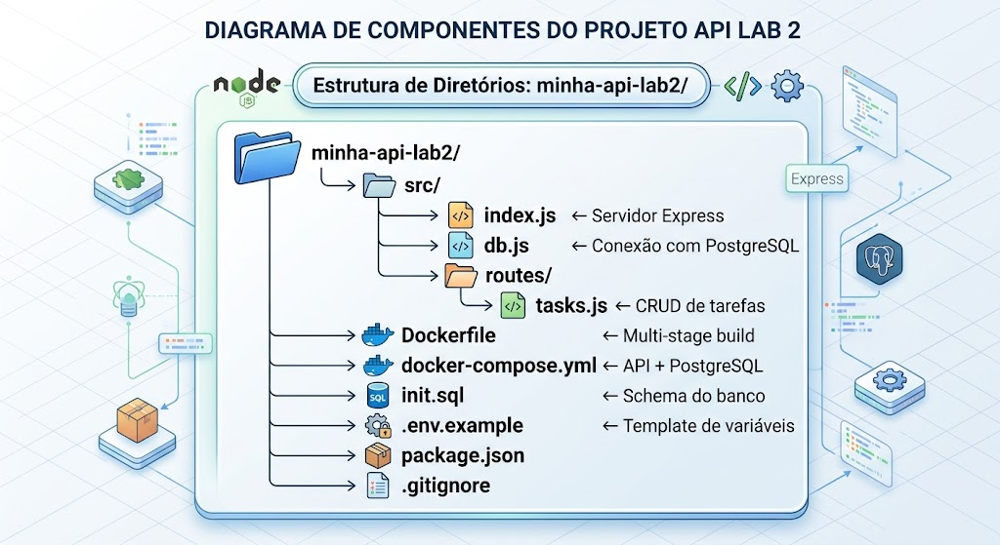

# Laboratório Parte 2 — IA como Copiloto DevOps com Kiro

**Tempo estimado:** 90 minutos

---

## Missão

> A líder da equipe de Platform Engineering da TechNova quer avaliar o uso de IA como ferramenta de produtividade. Sua missão é usar o Kiro para criar uma nova API REST do zero — partindo de uma spec em linguagem natural — e gerar todos os artefatos de infraestrutura (Dockerfile e docker-compose.yml) com auxílio da IA. No final, você terá um projeto completo e funcional gerado com copilotagem de IA.

---

## Pré-requisitos

- Kiro instalado e configurado na sua máquina ([download](https://kiro.dev/))
- Docker Compose configurado e funcional (Laboratório Parte 1 concluído)
- Conexão com internet (Kiro precisa de conectividade para funcionar)

> **Nota:** Se o Kiro não estiver disponível, o professor indicará uma alternativa equivalente.

---

## Contexto: O que é uma Spec no Kiro?

O Kiro possui um modo chamado **Spec** — um workflow estruturado onde você descreve o que quer construir em linguagem natural e o Kiro:

1. Gera um documento de **requisitos** (o que o sistema deve fazer)
2. Gera um documento de **design** (como será implementado)
3. Gera uma lista de **tarefas** de implementação
4. Executa as tarefas e **gera o código** completo

Isso é diferente de simplesmente pedir código em um chat. A Spec força a IA a pensar no problema antes de escrever uma linha de código — e permite que você revise e ajuste cada etapa antes de avançar.

---

## Parte 1 — Criando o Projeto Base (10 minutos)

### Passo 1.1: Criar uma pasta para o novo projeto

Crie uma pasta nova fora do repositório da TechNova para este laboratório:

```bash
mkdir ~/minha-api-lab2
cd ~/minha-api-lab2
```

### Passo 1.2: Abrir a pasta no Kiro

Abra a pasta `minha-api-lab2` no Kiro:
- Vá em **File → Open Folder** e selecione `~/minha-api-lab2`

### Passo 1.3: Inicializar um repositório Git

No terminal integrado do Kiro:

```bash
git init
echo "node_modules/" > .gitignore
echo ".env" >> .gitignore
```

✅ **Checkpoint:** Pasta vazia aberta no Kiro com Git inicializado.

---

## Parte 2 — Criando a Spec com Kiro (20 minutos)

### Passo 2.1: Iniciar uma sessão Spec

No Kiro, clique em **New Session** e selecione o tipo **Spec**.

> **Dica:** A sessão Spec é diferente da sessão Vibe (chat livre). Na Spec, o Kiro guia você por etapas estruturadas: requisitos → design → tarefas → implementação.

### Passo 2.2: Descrever o que você quer construir

Na sessão Spec, descreva o projeto com o seguinte prompt inicial:

> **Prompt:**
> ```
> Quero criar uma API REST em Node.js 20 com Express chamada "tasks-api".
> A API gerencia uma lista de tarefas com os campos:
> - id (gerado automaticamente)
> - titulo (string, obrigatório)
> - descricao (string, opcional)
> - status (pendente | em_andamento | concluida, padrão: pendente)
> - criado_em (timestamp automático)
>
> Os endpoints necessários são:
> - GET /tasks — listar todas as tarefas
> - GET /tasks/:id — buscar tarefa por ID
> - POST /tasks — criar nova tarefa
> - PUT /tasks/:id — atualizar tarefa
> - DELETE /tasks/:id — remover tarefa
> - GET /health — health check
>
> O banco de dados é PostgreSQL 15.
> A porta da API é 3000.
> ```

### Passo 2.3: Revisar o documento de Requisitos

O Kiro irá gerar um documento de requisitos. Leia com atenção e verifique:

- [ ] Todos os endpoints solicitados estão listados?
- [ ] Os campos da entidade `tarefa` estão corretos?
- [ ] As validações (campos obrigatórios, valores válidos para status) foram capturadas?
- [ ] O banco de dados e a porta estão corretos?

Se algo estiver faltando ou errado, corrija diretamente no documento ou peça ao Kiro para ajustar:

> **Exemplo de correção:**
> "Adicione nos requisitos que o endpoint POST /tasks deve retornar status HTTP 201, e que o DELETE deve retornar a tarefa removida."

Só avance quando estiver satisfeito com os requisitos.

### Passo 2.4: Revisar o documento de Design

Após aprovar os requisitos, o Kiro gera o documento de design técnico. Verifique:

- [ ] A estrutura de pastas proposta faz sentido?
- [ ] O modelo de dados reflete os campos corretos?
- [ ] A camada de conexão com o banco está prevista?
- [ ] O design menciona variáveis de ambiente para configuração?

Ajuste o que for necessário antes de prosseguir.

### Passo 2.5: Revisar as Tarefas de Implementação

O Kiro gera uma lista de tarefas ordenadas para implementar o projeto. Observe:

- A ordem das tarefas faz sentido? (ex: configuração do banco antes das rotas)
- As tarefas cobrem tudo que você pediu?
- Há tarefas sobre Dockerfile e docker-compose.yml?

Se não houver tarefas de infraestrutura, adicione:

> "Adicione tarefas para: criar o Dockerfile com multi-stage build, criar o docker-compose.yml com API + PostgreSQL, e criar o arquivo .env.example."

✅ **Checkpoint:** Spec completa com requisitos, design e tarefas revisados e aprovados.

---

## Parte 3 — Gerando o Código com Kiro (25 minutos)

### Passo 3.1: Executar as tarefas

Com a Spec aprovada, autorize o Kiro a executar as tarefas. Observe o processo:

- O Kiro cria os arquivos um a um
- Você pode acompanhar cada arquivo sendo gerado
- Em modo **Supervised**, você aprova cada mudança antes de ser aplicada
- Em modo **Autopilot**, o Kiro executa tudo e você revisa ao final

> **Recomendação para este laboratório:** use o modo **Supervised** para ver cada etapa e entender o que está sendo criado.

### Passo 3.2: Acompanhar a geração dos arquivos

Observe quais arquivos o Kiro cria. A estrutura esperada ao final é:


### Passo 3.3: Intervir quando necessário

Se o Kiro gerar algo incorreto ou incompleto, corrija via chat durante a execução:

> **Exemplos de intervenção:**
> - "O Dockerfile não tem o usuário não-root. Adicione antes do CMD."
> - "O docker-compose.yml está sem healthcheck no PostgreSQL. Adicione."
> - "Faltou o arquivo init.sql com o CREATE TABLE. Crie-o."

### Passo 3.4: Verificar o docker-compose.yml gerado

Abra o `docker-compose.yml` gerado e valide usando o checklist:

| Item | ✅/❌ | Observação |
|------|:---:|-----------|
| Sintaxe YAML válida? | | |
| Imagem do Postgres está correta? (`postgres:15-alpine`) | | |
| Volume nomeado declarado para o banco? | | |
| Rede bridge customizada declarada? | | |
| Variáveis sensíveis via `.env`, não hardcoded? | | |
| `depends_on` com healthcheck configurado? | | |
| Restart policy presente? | | |
| `init.sql` montado no container do Postgres? | | |

Se algum item falhar, peça ao Kiro para corrigir com um prompt específico.

### Passo 3.5: Validar a sintaxe do docker-compose.yml

```bash
docker compose config
```

Se retornar o YAML expandido sem erros, a sintaxe está correta. Se houver erros, cole-os no chat do Kiro:

> "O docker compose config retornou: [cole o erro]. Corrija o arquivo."

✅ **Checkpoint:** Código completo gerado, docker-compose.yml válido e estrutura de arquivos conferida.

---

## Parte 4 — Testando a API Gerada (20 minutos)

### Passo 4.1: Criar o arquivo .env

```bash
cp .env.example .env
```

Edite o `.env` com uma senha de desenvolvimento (não use senhas reais).

### Passo 4.2: Subir o ambiente

```bash
docker compose up -d --build
```

Acompanhe os logs para garantir que API e PostgreSQL subiram corretamente:

```bash
docker compose logs -f
```

Aguarde ver algo como:
```
tasks-api  | tasks-api rodando na porta 3000
tasks-db   | database system is ready to accept connections
```

### Passo 4.3: Testar o health check

```bash
curl http://localhost:3000/health
```

Resultado esperado:
```json
{ "status": "healthy", "uptime": 12.3 }
```

### Passo 4.4: Criar uma tarefa

```bash
curl -X POST http://localhost:3000/tasks \
  -H "Content-Type: application/json" \
  -d '{"titulo": "Estudar Docker Compose", "descricao": "Lab Parte 1 da Aula 02", "status": "concluida"}'
```

Resultado esperado: tarefa criada com `id` e `criado_em` preenchidos automaticamente.

### Passo 4.5: Listar as tarefas

```bash
curl http://localhost:3000/tasks
```

### Passo 4.6: Atualizar e deletar

```bash
# Atualizar (substitua 1 pelo id retornado no POST)
curl -X PUT http://localhost:3000/tasks/1 \
  -H "Content-Type: application/json" \
  -d '{"titulo": "Estudar Docker Compose", "status": "concluida"}'

# Deletar
curl -X DELETE http://localhost:3000/tasks/1
```

### Passo 4.7: Testar a persistência

Destrua e recrie os containers sem apagar o volume e confirme que os dados sobrevivem:

```bash
docker compose down
docker compose up -d
curl http://localhost:3000/tasks
```

✅ **Checkpoint:** API funcionando com todos os endpoints e dados persistindo entre reinicializações.

---

## Parte 5 — Reflexão Crítica: IA como Copiloto (15 minutos)

### Passo 5.1: Comparar com o Lab Parte 1

Você acabou de criar uma API completa com Kiro. No Lab Parte 1, fez o mesmo processo manualmente com a TechNova. Compare:

| Aspecto | Lab Parte 1 (manual) | Lab Parte 2 (Kiro/Spec) |
|---------|---------------------|------------------------|
| Tempo para ter o ambiente rodando | | |
| Quantidade de decisões que você tomou | | |
| Qualidade do código gerado | | |
| Você entendeu o que foi criado? | | |
| Precisou corrigir algo? | | |

### Passo 5.2: Identificar onde a IA ajudou e onde falhou

Registre honestamente:

**A IA ajudou quando:**
- [ ] Gerou a estrutura de arquivos rapidamente
- [ ] Escreveu código repetitivo (CRUD, conexão com banco)
- [ ] Seguiu boas práticas sem que eu precisasse lembrar de cada uma
- [ ] Outro: _______________

**A IA falhou ou precisei corrigir quando:**
- [ ] Gerou imagem Docker incorreta ou inexistente
- [ ] Esqueceu variável de ambiente ou configuração
- [ ] Código não rodou na primeira tentativa
- [ ] Não seguiu uma boa prática importante
- [ ] Outro: _______________

### Passo 5.3: Reflexão sobre o papel do conhecimento técnico

> A IA gerou o código. Mas quem validou se estava correto? Quem sabia que `init.sql` precisava ser montado? Quem identificou que o healthcheck estava faltando?

Responda:

1. Você teria conseguido validar o output da IA sem o Lab Parte 1?
2. O que aconteceria se um desenvolvedor sem conhecimento de Docker usasse o output da IA diretamente em produção?
3. Qual é o risco de depender da IA sem entender o que ela gera?

### Passo 5.4: Criar seu checklist pessoal de validação

Baseado na experiência deste laboratório, escreva seu próprio checklist. Salve em `ia-checklist.md` no projeto:

```markdown
## Checklist de Validação para Output de IA — DevOps

- [ ] Sintaxe está válida? (`docker compose config`, `yamllint`)
- [ ] Imagens Docker existem no Docker Hub? (`docker pull`)
- [ ] Variáveis sensíveis estão no `.env`, não hardcoded?
- [ ] Healthchecks estão configurados?
- [ ] `depends_on` garante a ordem de inicialização?
- [ ] Volume para persistência do banco está declarado?
- [ ] `init.sql` (ou equivalente) cria o schema na primeira subida?
- [ ] A aplicação sobe e responde sem erros? (`docker compose up`)
- [ ] Entendo o que cada linha do arquivo faz?
```

✅ **Checkpoint:** Reflexão crítica concluída e checklist pessoal criado.

---

## Validação Final do Laboratório

Ao concluir este laboratório, você deve ter:

- [ ] Pasta `minha-api-lab2` criada com Git inicializado
- [ ] Spec criada no Kiro com requisitos, design e tarefas revisados
- [ ] API `tasks-api` gerada pelo Kiro com CRUD completo de tarefas
- [ ] Dockerfile com multi-stage build e usuário não-root
- [ ] `docker-compose.yml` com API + PostgreSQL, healthcheck e volume
- [ ] Ambiente subindo com `docker compose up -d --build`
- [ ] Todos os endpoints testados e funcionando (`curl`)
- [ ] Persistência de dados validada (`down` + `up`)
- [ ] Tabela comparativa Lab 1 vs Lab 2 preenchida
- [ ] Checklist pessoal de validação criado (`ia-checklist.md`)

---

## Resumo: Quando Usar IA como Copiloto DevOps

| Cenário | Recomendação |
|---------|-------------|
| Criar estrutura inicial de um projeto | ✅ Excelente — Spec acelera muito |
| Gerar código repetitivo (CRUD, conexão) | ✅ Excelente — depois revise |
| Aprender sintaxe nova | ✅ Peça explicações detalhadas |
| Debugging com mensagem de erro | ✅ Cole o erro e peça análise |
| Otimizar configurações existentes | ✅ Peça sugestões, avalie cada uma |
| Decisões de arquitetura críticas | ⚠️ Use como input, não como decisão final |
| Configurações de segurança em produção | ⚠️ Sempre valide com docs oficiais |
| Código que você não entende | ❌ Nunca use output que você não compreende |
| Senhas e tokens | ❌ Nunca compartilhe dados sensíveis em prompts |

---

*Parabéns! Você criou uma API completa do zero usando o Kiro como copiloto, validou cada artefato gerado e desenvolveu senso crítico sobre quando e como confiar na IA. Na Tarefa de Fixação, você combinará as duas habilidades: usar Kiro para gerar um rascunho e suas habilidades manuais para validar e refinar.*
