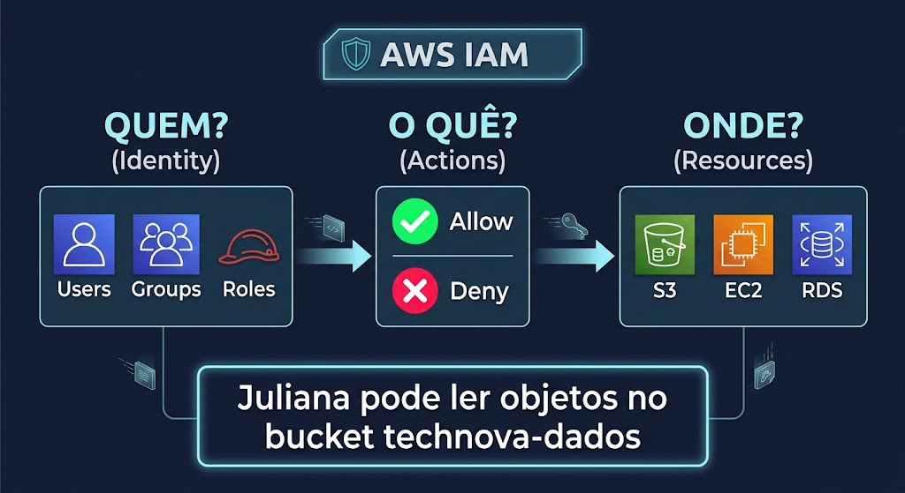

# Aula 03 — Terraform e Segurança AWS (IAM)

## Objetivos de Aprendizagem

Ao final desta aula, o aluno será capaz de:

1. Compreender o conceito de Infraestrutura como Código (IaC) e seus benefícios sobre o gerenciamento manual
2. Identificar os componentes fundamentais do Terraform: providers, resources e state
3. Escrever configurações básicas em HCL (HashiCorp Configuration Language) com o provider AWS
4. Executar o fluxo completo do Terraform: `init` → `plan` → `apply` → `destroy`
5. Compreender o modelo de segurança da AWS baseado em IAM (Identity and Access Management)
6. Diferenciar os conceitos de users, groups, roles e policies no IAM
7. Aplicar o princípio do menor privilégio (least privilege) no design de permissões
8. Provisionar recursos IAM (users, groups, roles, policies) usando Terraform

---

## Contexto Narrativo

> **O Resgate da TechNova — Episódio 3: "Da Nuvem Sem Controle à Infraestrutura Segura"**

O Módulo 1 foi um sucesso. A API da TechNova está containerizada (Aula 01), o ambiente local orquestrado com Docker Compose, e tudo versionado no Git com apoio do Kiro para boas práticas de desenvolvimento (Aula 02). Qualquer desenvolvedor clona o repo e sobe o ambiente com um único comando.

Mas na reunião de sprint, o CTO Carlos Mendes trouxe uma nova demanda:

> "O ambiente local está excelente. Mas os clientes não acessam `localhost:3000`. Precisamos colocar isso na **AWS**. Quem sabe criar a infraestrutura lá?"

O silêncio tomou a sala. Juliana Santos, dev sênior, levantou a mão:

> "Eu criei um bucket S3 no mês passado... pelo Console da AWS. Cliquei em umas 15 telas, não lembro exatamente o que configurei, e não consigo reproduzir."

O CTO respondeu:

> "Infraestrutura criada na mão, sem documentação, sem reprodução, sem controle de versão. E pior — descobri que **todo mundo está usando as credenciais root** da conta AWS. Se qualquer laptop for comprometido, o atacante tem acesso TOTAL."

A líder de Platform Engineering abriu um sorriso:

> "Existem soluções para ambos os problemas. Primeiro: **Terraform** — escrevemos código que declara os recursos AWS que queremos, e ele cria tudo automaticamente. Segundo: **IAM** — criamos usuários individuais, grupos por equipe, e cada um acessa apenas o mínimo necessário. E o melhor: podemos gerenciar o IAM com o próprio Terraform. Segurança como código."

O CTO bateu na mesa:

> "Perfeito. Ninguém mais usa root. Quero Terraform implementado E permissões corretas. Comecem com um bucket S3 para provar o conceito, depois implementem IAM para toda a equipe."

Esse é o desafio desta aula: dar os primeiros passos com Terraform, provisionar recursos reais na AWS, e implementar um modelo de segurança robusto com IAM — tudo gerenciado como código, versionável e auditável.

---

## Cronograma da Aula

| Bloco | Atividade |
|-------|-----------|
| 1 | Revisão do TA + Discussão em Grupo |
| 2 | Conteúdo Teórico — Terraform Fundamentals |
| 3 | Laboratório Parte 1 — Terraform Basics (S3) |
| 4 | Conteúdo Teórico — IAM e Segurança |
| 5 | Laboratório Parte 2 — IAM com Terraform |
| 6 | Encerramento + Orientação TF |

---

## Entrega do Trabalho em Aula

O trabalho em aula vale **1 ponto na nota final** do semestre (contabilizado apenas ao final, com todos os trabalhos entregues).

### Onde entregar

Na **mesma pasta** da entrega do TF, no fork da disciplina:

```
entregas/aula-03/SEU-RA/trabalho-em-aula.md
```

### O que entregar

Um arquivo `trabalho-em-aula.md` com as respostas das atividades realizadas em sala (discussões, análises, tabelas preenchidas).

### Observações

- A entrega é **individual** — mesmo que a atividade tenha sido em grupo
- O arquivo pode ser adicionado no **mesmo PR** do TF ou em PR separado
- Entregas parciais (apenas algumas aulas) **não garantem o ponto**

---

## Entrega do Trabalho de Fixação (TF)

O TF desta aula deve ser desenvolvido no **seu repositório pessoal** (`unifaat-devops-portfolio`, pasta `aula-03/`). A entrega neste repositório da disciplina consiste em um **arquivo Markdown (`entrega.md`)** contendo o **link para o seu repositório** e as evidências solicitadas.

### Passo a Passo

1. **Desenvolva o TF** no seu repositório pessoal (`unifaat-devops-portfolio/aula-03/`)
2. Faça **fork** do repositório da disciplina (se ainda não fez)
3. Crie uma **branch**: `SEU-RA/tf-03`
4. Crie a pasta `entregas/aula-03/SEU-RA/`
5. Adicione o arquivo **`entrega.md`** com o link do seu repositório + evidências
6. Faça commits descritivos seguindo [Conventional Commits](https://www.conventionalcommits.org/pt-br/)
7. Abra um **Pull Request** para o repositório original com título: `[Aula 03] RA: XXXXX - Nome Completo`

### Modelo do arquivo `entrega.md`

```markdown
# Entrega — Aula 03: Terraform + IAM

**Aluno:** [Seu nome completo]  
**RA:** [Seu RA]  
**Data:** [Data da entrega]

## Repositório

- URL: https://github.com/SEU-USUARIO/unifaat-devops-portfolio

## Evidências

- [ ] `providers.tf` com provider AWS configurado
- [ ] `main.tf` com users, groups e memberships
- [ ] `policies.tf` com mínimo 3 custom policies
- [ ] `roles.tf` com service role + instance profile
- [ ] `variables.tf` e `outputs.tf` configurados
- [ ] `terraform-plan-output.txt` com evidência do plano
- [ ] `README.md` com explicação do design e reflexão sobre menor privilégio
- [ ] Tags obrigatórias em todos os recursos
- [ ] `.gitignore` configurado (sem `.tfstate` no repositório)

## Evidência do Terraform Plan

[Cole aqui um trecho do output do `terraform plan` ou screenshot]
```

> **Importante:** O repositório pessoal do aluno deve estar **público** para que o professor consiga avaliar. PRs que não contenham o link para o repositório ou cujo repositório esteja privado serão considerados **incompletos**.

Para detalhes completos sobre os entregáveis e critérios de avaliação, consulte o arquivo [`TF.md`](TF.md).

---

## Pré-requisitos

- **Conta AWS** criada com Free Tier ativo — [Criar conta AWS](https://aws.amazon.com/free/)
- **Terraform** instalado (≥ 1.0) — [Download](https://developer.hashicorp.com/terraform/downloads)
- **AWS CLI** instalado e configurado — [Guia](https://docs.aws.amazon.com/cli/latest/userguide/getting-started-install.html)
- Docker e Docker Compose funcionando (Aulas 01-02)
- Git instalado e configurado (Aulas 01-02)
- Editor de texto (VS Code com extensão HashiCorp Terraform recomendada)

> **⚠️ Free Tier:** Todos os recursos criados nesta aula são elegíveis ao AWS Free Tier. IAM é sempre gratuito. Lembre-se de executar `terraform destroy` ao final de cada laboratório.

---

## Conteúdo Teórico — Parte 1: Terraform Fundamentals

### 1. O Problema: Infraestrutura Manual Não Escala

Na Aula 01, aprendemos que gerenciar múltiplos containers manualmente era insustentável — e Docker Compose resolveu isso com um arquivo declarativo. O mesmo problema existe na nuvem, porém em escala muito maior:

**Cenário manual (AWS Console):**

| Ação | Problema |
|------|----------|
| Criar um bucket S3 pelo console | Configurações não ficam documentadas |
| Configurar permissões clicando em checkboxes | Impossível auditar o que foi marcado |
| Criar VPC com subnets pelo wizard | Não reproduzível — qual CIDR foi usado? |
| Lançar EC2 selecionando opções | Novo ambiente = refazer tudo manualmente |

**Consequências da infraestrutura manual:**

- 🔴 **Não reproduzível** — criar staging igual a produção requer repetir dezenas de passos
- 🔴 **Não versionável** — mudanças não têm histórico (quem alterou o quê?)
- 🔴 **Propensa a erros** — um clique errado pode comprometer segurança
- 🔴 **Não auditável** — compliance e governança ficam comprometidos
- 🔴 **Lenta** — escalar infraestrutura é um processo manual demorado

### 2. Infraestrutura como Código (IaC)

**Infraestrutura como Código** (Infrastructure as Code) é a prática de gerenciar e provisionar infraestrutura através de arquivos de configuração legíveis por máquina, em vez de processos manuais interativos.


**Princípios do IaC:**

1. **Declarativo** — você descreve o estado desejado, a ferramenta cuida de como chegar lá
2. **Versionável** — arquivos `.tf` ficam no Git, com histórico completo
3. **Reproduzível** — o mesmo código gera a mesma infraestrutura, sempre
4. **Idempotente** — aplicar o mesmo código duas vezes não cria duplicatas
5. **Auditável** — Pull Requests para infraestrutura = revisão antes de aplicar

**Analogia com Docker Compose:**

| Conceito | Docker Compose | Terraform |
|----------|----------------|-----------|
| O que gerencia | Containers locais | Recursos na nuvem |
| Arquivo de configuração | `docker-compose.yml` | `main.tf` |
| Linguagem | YAML | HCL |
| Comando para criar | `docker compose up` | `terraform apply` |
| Comando para destruir | `docker compose down` | `terraform destroy` |
| Estado | Docker Engine sabe o que está rodando | `terraform.tfstate` rastreia recursos |

### 3. O que é o Terraform?

Terraform é uma ferramenta open-source criada pela HashiCorp para provisionar e gerenciar infraestrutura em qualquer provedor de nuvem (AWS, Azure, GCP) usando uma linguagem declarativa chamada HCL.

**Características principais:**

- **Multi-cloud** — mesmo fluxo para AWS, Azure, GCP e centenas de outros provedores
- **Declarativo** — você diz "quero um bucket S3 com estas configurações", não "execute estes 5 passos"
- **Planejamento** — `terraform plan` mostra o que será alterado ANTES de aplicar
- **Gerenciamento de estado** — rastreia o que já foi criado para detectar mudanças
- **Open Source** — código aberto, comunidade ativa, ecossistema de módulos

### 4. HCL — HashiCorp Configuration Language

HCL é a linguagem usada para escrever configurações Terraform. É simples, legível e projetada para descrever infraestrutura:

```hcl
# Bloco provider — define qual provedor de nuvem usar
provider "aws" {
  region = "us-east-1"
}

# Bloco resource — define um recurso a ser criado
resource "aws_s3_bucket" "meu_bucket" {
  bucket = "technova-dados-2024"

  tags = {
    Environment = "development"
    Project     = "TechNova"
    ManagedBy   = "Terraform"
  }
}
```

**Anatomia de um bloco HCL:**

```hcl
tipo_do_bloco "tipo_do_recurso" "nome_local" {
  argumento1 = "valor1"
  argumento2 = "valor2"

  bloco_aninhado {
    propriedade = "valor"
  }
}
```

**Tipos de blocos principais:**

| Bloco | Propósito | Exemplo |
|-------|-----------|---------|
| `provider` | Conecta ao provedor de nuvem | `provider "aws" {}` |
| `resource` | Declara um recurso a ser criado | `resource "aws_s3_bucket" "x" {}` |
| `variable` | Define parâmetros de entrada | `variable "region" {}` |
| `output` | Expõe valores após criação | `output "bucket_arn" {}` |
| `terraform` | Configuração do Terraform em si | `terraform { required_version }` |

### 5. Providers (Provedores)

Um **provider** é o plugin que conecta o Terraform a uma API de serviço (AWS, Azure, GitHub, etc.):

```hcl
# Configuração do provider AWS
provider "aws" {
  region = "us-east-1"    # Região da AWS (Virginia - Free Tier OK)
}
```

O provider AWS permite ao Terraform criar e gerenciar recursos como:
- S3 (armazenamento)
- EC2 (servidores)
- RDS (banco de dados)
- VPC (redes)
- IAM (permissões)

> **Nota:** Usaremos **apenas recursos elegíveis ao AWS Free Tier** neste curso.

### 6. Resources (Recursos)

Um **resource** é a unidade fundamental do Terraform — cada bloco `resource` descreve um componente de infraestrutura:

```hcl
# Criar um bucket S3 (armazenamento de objetos)
resource "aws_s3_bucket" "dados_app" {
  bucket = "technova-dados-app-2024"

  tags = {
    Name        = "technova-dados-app"
    Environment = "development"
    ManagedBy   = "Terraform"
  }
}

# Bloquear acesso público ao bucket
resource "aws_s3_bucket_public_access_block" "dados_app_block" {
  bucket = aws_s3_bucket.dados_app.id

  block_public_acls       = true
  block_public_policy     = true
  ignore_public_acls      = true
  restrict_public_buckets = true
}
```

**Formato do tipo de recurso:** `<provider>_<serviço>_<tipo>`

| Exemplo | Provider | Serviço | Tipo |
|---------|----------|---------|------|
| `aws_s3_bucket` | AWS | S3 | Bucket |
| `aws_instance` | AWS | EC2 | Instância |
| `aws_iam_user` | AWS | IAM | Usuário |
| `aws_iam_role` | AWS | IAM | Role |

### 7. O Fluxo do Terraform: init → plan → apply → destroy


- **`terraform init`** — Inicializa o diretório, baixa plugins dos providers
- **`terraform plan`** — Mostra exatamente o que será criado/alterado/destruído (dry-run)
- **`terraform apply`** — Executa as ações planejadas, cria recursos na AWS
- **`terraform destroy`** — Remove todos os recursos gerenciados

> **Segurança:** SEMPRE execute `plan` antes de `apply`. Revise o que será alterado.

### 8. O Arquivo de Estado (`terraform.tfstate`)

Quando o Terraform cria recursos, ele registra o estado atual em um arquivo JSON chamado `terraform.tfstate`. Este arquivo é a "memória" do Terraform — ele sabe o que criou e pode detectar mudanças.

**Regras do `terraform.tfstate`:**

1. ⚠️ **Nunca edite manualmente** — o Terraform gerencia este arquivo
2. 🔒 **Nunca versione no Git** — pode conter segredos (senhas, chaves)
3. 📁 Adicione ao `.gitignore`: `*.tfstate` e `*.tfstate.backup`
4. 🔄 Em aulas futuras, aprenderemos a armazenar o estado remotamente (S3 + DynamoDB)

### 9. Estrutura de um Projeto Terraform

```
terraform-projeto/
├── main.tf              ← Recursos principais
├── variables.tf         ← Variáveis de entrada
├── outputs.tf           ← Valores de saída
├── providers.tf         ← Configuração dos providers
├── terraform.tfvars     ← Valores das variáveis (não versionar se tiver segredos)
├── .terraform/          ← Plugins baixados (gerado pelo init)
├── terraform.tfstate    ← Estado atual (NÃO versionar)
└── .gitignore           ← Excluir .terraform/ e *.tfstate
```

---

## Conteúdo Teórico — Parte 2: IAM e Segurança

### 1. O Problema: Credenciais Root Compartilhadas

No Lab Parte 1, todos usaram credenciais para criar o bucket S3. Em uma empresa real, compartilhar credenciais root é um desastre de segurança:


**A conexão natural:** Para usar Terraform na AWS de forma segura, você PRECISA de IAM configurado corretamente. Não adianta ter infraestrutura como código se qualquer pessoa tem acesso irrestrito.

### 2. IAM — Identity and Access Management

O **IAM** é o serviço da AWS que gerencia **quem** pode fazer **o quê** em **quais recursos**:



**Características do IAM:**

- 🆓 **Gratuito** — sem custo adicional, independente do número de users/roles/policies
- 🌐 **Global** — IAM não é regional, vale para toda a conta AWS
- 🔒 **Granular** — permissões podem ser tão específicas quanto "ler objeto X no bucket Y"
- 📋 **Auditável** — todas as ações são registradas no CloudTrail

### 3. Componentes do IAM

#### 3.1 Users (Usuários)

Um **user** representa uma pessoa ou aplicação que interage com a AWS. Cada pessoa deve ter seu próprio user — nunca compartilhar credenciais.

#### 3.2 Groups (Grupos)

Um **group** é uma coleção de users que compartilham as mesmas permissões. Permite gerenciar permissões por equipe/função:


#### 3.3 Roles (Funções)

Um **role** é uma identidade com permissões que pode ser **assumida** por users, serviços AWS, ou contas externas. Ideal para comunicação entre serviços (ex: EC2 → S3) — credenciais temporárias, rotação automática.

#### 3.4 Policies (Políticas)

Uma **policy** é um documento JSON que define permissões:

```json
{
  "Version": "2012-10-17",
  "Statement": [
    {
      "Sid": "AllowS3Read",
      "Effect": "Allow",
      "Action": ["s3:GetObject", "s3:ListBucket"],
      "Resource": [
        "arn:aws:s3:::technova-dados",
        "arn:aws:s3:::technova-dados/*"
      ]
    }
  ]
}
```

| Campo | Descrição |
|-------|-----------|
| `Version` | Sempre `"2012-10-17"` |
| `Effect` | `Allow` ou `Deny` |
| `Action` | Ações permitidas/negadas (ex: `s3:GetObject`) |
| `Resource` | Recursos afetados (ARN) |

### 4. O Princípio do Menor Privilégio (Least Privilege)

> **"Conceda apenas as permissões mínimas necessárias para realizar a tarefa."**

| Cenário | ❌ Violação | ✅ Correto |
|---------|-----------|----------|
| Dev precisa ler logs do S3 | `AmazonS3FullAccess` | `s3:GetObject` no bucket específico |
| CI/CD precisa fazer deploy | `AdministratorAccess` | Permissões específicas para EC2 + S3 |
| App precisa ler DB | Credenciais root do RDS | Role com acesso ao database específico |

### 5. Service Roles — Comunicação Entre Serviços

Quando um serviço AWS (ex: EC2) precisa acessar outro (ex: S3), usamos **roles** em vez de access keys:

| Access Keys (RUIM) | Roles (BOM) |
|---------------------|-------------|
| Credenciais fixas no código | Credenciais temporárias automáticas |
| Se vazar, acesso permanente | Rotação automática a cada hora |
| Difícil de revogar | Revoga desanexando o role |
| Violação de segurança | Conformidade com boas práticas AWS |

### 6. Boas Práticas de Segurança IAM

1. **Nunca use root para operações do dia a dia** — crie IAM users
2. **Ative MFA na conta root** — proteção contra comprometimento
3. **Aplique menor privilégio** — comece com zero permissões, adicione conforme necessário
4. **Use groups para organizar permissões** — não anexe policies diretamente a users
5. **Prefira roles a access keys** — especialmente para serviços AWS
6. **Revise permissões periodicamente** — remova acessos que não são mais necessários
7. **Use tags para identificar** — `ManagedBy = "Terraform"` facilita auditoria
8. **Versione configurações IAM no Git** — via Terraform, toda mudança é rastreável

---

## Resumo dos Conceitos

| Conceito | Descrição |
|----------|-----------|
| IaC | Gerenciar infraestrutura através de código versionável |
| Terraform | Ferramenta open-source para IaC multi-cloud |
| HCL | Linguagem de configuração do Terraform |
| Provider | Plugin que conecta Terraform a um serviço (AWS) |
| Resource | Bloco que declara um componente de infraestrutura |
| `terraform init` | Inicializa projeto e baixa plugins |
| `terraform plan` | Mostra o que será alterado (dry-run) |
| `terraform apply` | Aplica as mudanças na nuvem |
| `terraform destroy` | Remove recursos criados |
| `terraform.tfstate` | Arquivo de estado que rastreia recursos |
| IAM | Serviço de gerenciamento de identidade e acesso da AWS |
| User | Representa uma pessoa ou aplicação |
| Group | Coleção de users com permissões compartilhadas |
| Role | Identidade assumível por serviços temporariamente |
| Policy | Documento JSON que define permissões (Allow/Deny) |
| Least Privilege | Conceder apenas o mínimo necessário |

---

## 💰 Free Tier

- **S3:** 5 GB armazenamento, 20.000 GET, 2.000 PUT/mês (12 meses)
- **IAM:** Sempre gratuito — sem limites de users, groups, roles ou policies

> **⚠️ Sempre execute `terraform destroy` após os laboratórios para não incorrer em custos.**

---

*Próximas etapas: Laboratório Parte 1 (Terraform Basics) → Laboratório Parte 2 (IAM com Terraform) → TF (Trabalho de Fixação)*
