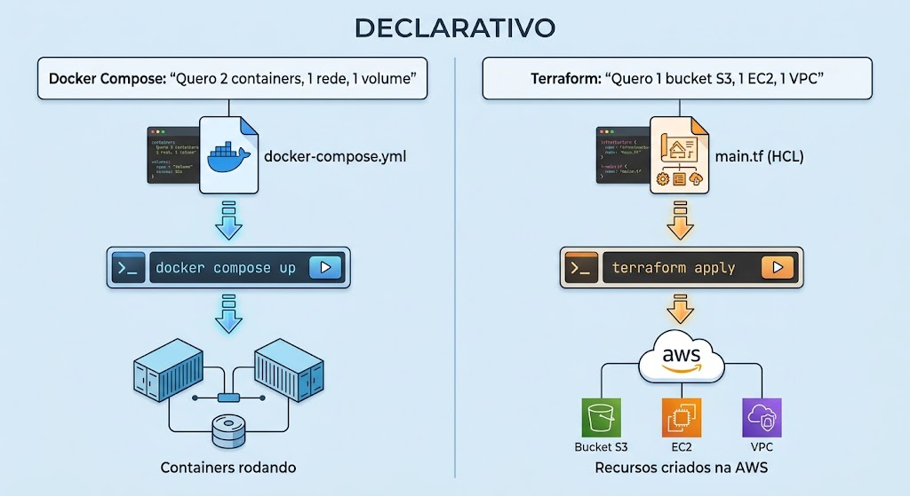
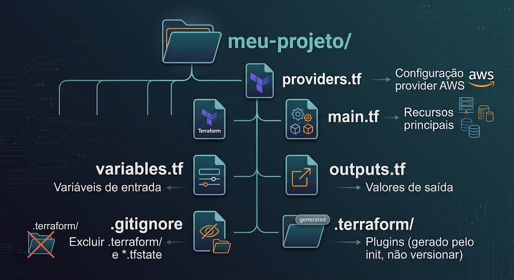
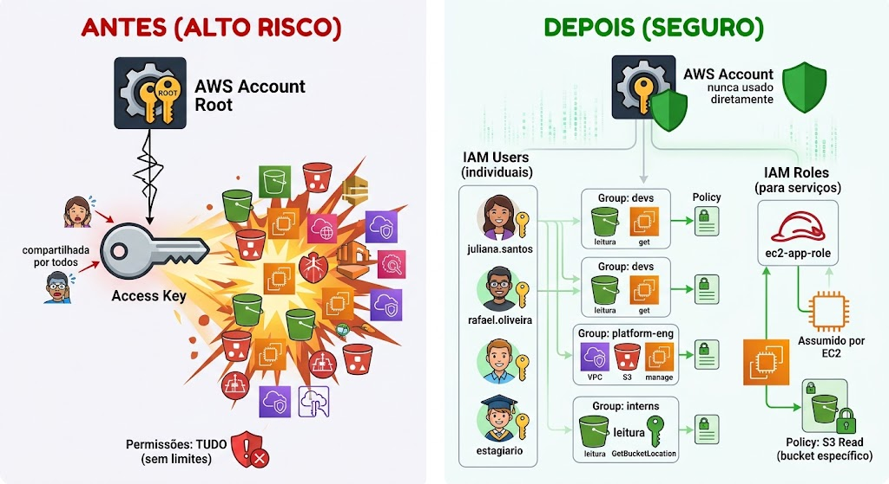

# Trabalho Anterior (TA) — Preparação Prévia

**Tempo estimado de leitura: ~60 minutos**

---

## Parte 1 — Terraform: Infraestrutura como Código (~35 min)

### O Desabafo do CTO: "Cansei de Clicar em Console"

> **De:** Carlos Mendes, CTO — TechNova
> **Para:** Equipe de Platform Engineering
> **Assunto:** URGENTE — Infraestrutura na mão não funciona mais

Equipe,

Parabéns pelo trabalho no Módulo 1. O Docker Compose resolveu nosso problema de ambiente local — qualquer dev sobe tudo com `docker compose up`. Excelente.

Mas temos um problema **sério** na nuvem.

Na sexta-feira, precisei criar um ambiente de staging na AWS para demonstrar a API para um investidor. Passei **3 horas** no Console da AWS:

1. Entrei no S3, cliquei "Create Bucket", preenchi 4 telas de configuração
2. Fui no IAM, criei uma policy, um role, anexei à policy... 6 telas
3. Tentei criar um EC2, mas a VPC padrão tinha configurações estranhas
4. Criei uma VPC nova — mais 8 telas (subnets, route tables, internet gateway...)
5. Voltei ao EC2, mas esqueci de abrir a porta 3000 no Security Group
6. Criei o Security Group, voltei, relançei a instância...

**Resultado:** 3 horas de cliques, sem documentação de nada que fiz. Se precisar recriar, começo do zero.

E o pior: **na segunda-feira, o estagiário entrou no Console e deletou o bucket por engano**. Não temos como saber o que estava configurado para recriar.

Vocês resolveram o problema do ambiente local com Docker Compose. **Preciso da mesma coisa para a nuvem.**

Carlos Mendes
CTO, TechNova

---

### O Padrão que Já Conhecemos

No Módulo 1, a TechNova seguiu uma progressão clara:

| Aula | Problema | Solução | Princípio |
|------|----------|---------|-----------|
| 01 | Código se perdia + containers manuais | Git + Docker | Versionar código, declarar ambiente |
| 02 | Orquestração complexa + DevEx | Docker Compose + Kiro | Declarar infraestrutura local |
| **03** | **Infra cloud manual + insegurança** | **Terraform + IAM** | **Declarar infra cloud + segurança** |

Perceba o padrão: **transformar processos manuais em arquivos declarativos versionáveis**.

### Infraestrutura Manual vs. Infraestrutura como Código

**Abordagem Manual (Console AWS):**

1. Acessar https://console.aws.amazon.com
2. Navegar até S3 → Create Bucket
3. Preencher nome, região, configurações de acesso
4. Clicar em "Create"
5. Repetir para cada novo recurso...

❌ Sem histórico | ❌ Sem reprodução | ❌ Sem revisão por pares

**Abordagem IaC (Terraform):**

```hcl
resource "aws_s3_bucket" "backups" {
  bucket = "technova-backups-2024"

  tags = {
    Environment = "production"
    ManagedBy   = "Terraform"
  }
}
```

✅ Versionado no Git | ✅ Reproduzível | ✅ Revisável via Pull Request

### A Conexão Docker Compose ↔ Terraform

Docker Compose e Terraform seguem o **mesmo paradigma**:



A diferença principal:
- **Docker Compose** gerencia containers **no seu computador**
- **Terraform** gerencia recursos **na nuvem** (AWS, Azure, GCP)

### O que é o Terraform?

Terraform é uma ferramenta **open-source** da HashiCorp para provisionar infraestrutura em qualquer provedor de nuvem usando uma linguagem declarativa chamada **HCL** (HashiCorp Configuration Language).

**Conceitos fundamentais:**

1. **Provider** — plugin que conecta o Terraform à AWS (ou Azure, GCP, etc.)
2. **Resource** — bloco que declara um componente de infraestrutura (bucket, EC2, user)
3. **State** — arquivo que rastreia o que o Terraform já criou

### HCL — Exemplos Básicos

```hcl
# providers.tf — Conexão com a AWS
provider "aws" {
  region = "us-east-1"
}

# main.tf — Recursos a criar
resource "aws_s3_bucket" "dados" {
  bucket = "technova-dados-2024"

  tags = {
    Project   = "TechNova"
    ManagedBy = "Terraform"
  }
}
```

### O Fluxo do Terraform

| Comando | O que faz | Analogia |
|---------|-----------|----------|
| `terraform init` | Baixa plugins dos providers | `npm install` |
| `terraform plan` | Mostra o que será feito (dry-run) | `docker compose config` |
| `terraform apply` | Cria/altera recursos na nuvem | `docker compose up` |
| `terraform destroy` | Remove todos os recursos | `docker compose down` |

> **Regra de ouro:** SEMPRE execute `plan` antes de `apply` para revisar o que será alterado.

### O Arquivo de Estado (`terraform.tfstate`)

- Registra o que o Terraform criou (JSON)
- Permite detectar mudanças e manter idempotência
- **NUNCA** versione no Git (pode conter segredos)
- **NUNCA** edite manualmente
- Adicione ao `.gitignore`: `*.tfstate` e `*.tfstate.backup`

### Estrutura de Projeto Terraform


### Boas Práticas Iniciais

1. Sempre execute `plan` antes de `apply`
2. Use tags em todos os recursos
3. Destrua recursos após exercícios (Free Tier)
4. Adicione `.terraform/` e `*.tfstate` ao `.gitignore`
5. Use variáveis — evite valores hardcoded
6. Nomes de S3 são globalmente únicos — use prefixo pessoal

---

## Parte 2 — IAM: Segurança na AWS (~25 min)

### Relatório de Auditoria de Segurança

> **De:** SecureOps Consultoria em Segurança
> **Para:** Carlos Mendes, CTO — TechNova
> **Assunto:** 🔴 CRÍTICO — Relatório de Auditoria de Credenciais

### Achados Críticos

| # | Vulnerabilidade | Severidade |
|---|----------------|------------|
| 1 | Uso de credenciais root para operações diárias | 🔴 CRÍTICO |
| 2 | Mesma access key compartilhada entre 4 pessoas | 🔴 CRÍTICO |
| 3 | Nenhum MFA ativado na conta root | 🟠 ALTO |
| 4 | Sem separação de permissões por equipe/função | 🟠 ALTO |
| 5 | Access keys sem rotação há mais de 90 dias | 🟡 MÉDIO |

**Impacto potencial de credenciais root vazadas:**
- Deletar todos os recursos AWS
- Criar instâncias EC2 para mineração de criptomoedas (custo: milhares/mês)
- Acessar dados sensíveis de clientes
- Alterar billing e métodos de pagamento

### O que Precisamos: De Root para Least Privilege

**Antes (INSEGURO):**


### Os 4 Pilares do IAM

1. **Users** — Identidades individuais (uma por pessoa)
2. **Groups** — Agrupamento lógico de users (ex: "devs", "platform-eng")
3. **Policies** — Documentos JSON que definem o que é permitido/negado
4. **Roles** — Identidades assumíveis por serviços (ex: EC2 assume role para acessar S3)

### Anatomia de uma Policy (JSON)

```json
{
  "Version": "2012-10-17",
  "Statement": [
    {
      "Sid": "AllowS3Read",
      "Effect": "Allow",
      "Action": ["s3:GetObject", "s3:ListBucket"],
      "Resource": [
        "arn:aws:s3:::technova-dados",
        "arn:aws:s3:::technova-dados/*"
      ]
    }
  ]
}
```

| Campo | Descrição | Exemplo |
|-------|-----------|---------|
| `Version` | Versão da linguagem de policy | Sempre `"2012-10-17"` |
| `Statement` | Array de permissões | Um ou mais blocos |
| `Sid` | Identificador (opcional) | `"AllowS3Read"` |
| `Effect` | Allow ou Deny | `"Allow"` |
| `Action` | Ações permitidas/negadas | `"s3:GetObject"` |
| `Resource` | Recursos afetados (ARN) | `"arn:aws:s3:::bucket/*"` |

### O Princípio do Menor Privilégio

A regra de ouro da segurança cloud:

> "Nunca conceda mais permissões do que o estritamente necessário para realizar uma tarefa específica."

**Exemplo prático:**
- O dev precisa **ler** objetos do bucket `technova-dados`?
  - ❌ Dar `AmazonS3FullAccess` (permite deletar qualquer bucket da conta!)
  - ✅ Dar `s3:GetObject` apenas no `arn:aws:s3:::technova-dados/*`

### AWS Managed vs Custom Policies

| Tipo | Descrição | Quando usar |
|------|-----------|-------------|
| AWS Managed | Pré-criadas pela AWS (ex: `AmazonS3ReadOnlyAccess`) | Labs e aprendizado |
| Customer Managed | Criadas por você, com menor privilégio | Produção |
| Inline | Anexada diretamente a um user/group | Evitar (difícil manter) |

> **Recomendação:** Prefira **custom policies** em produção. AWS Managed Policies geralmente concedem mais permissões do que o necessário.

### Boas Práticas de Segurança (8 itens)

1. **Nunca use root** para operações do dia a dia
2. **Ative MFA** na conta root e em todos os users
3. **Aplique menor privilégio** — comece com zero, adicione o necessário
4. **Use groups** — não anexe policies diretamente a users
5. **Prefira roles a access keys** para serviços
6. **Revise permissões periodicamente**
7. **Use tags** (`ManagedBy = "Terraform"`)
8. **Versione IAM no Git** via Terraform — auditável por PRs

### A Conexão: Terraform + IAM

Assim como declaramos infraestrutura (S3) em código Terraform, vamos declarar a **segurança** em código Terraform:

| Infraestrutura | Segurança |
|----------------|-----------|
| `resource "aws_s3_bucket"` | `resource "aws_iam_user"` |
| Bucket reproduzível | Permissões reproduzíveis |
| Versionado no Git | Versionado no Git (auditável!) |
| Mudança = PR review | Mudança de permissão = PR review |

---

## Questões de Verificação

Responda as questões abaixo para confirmar sua compreensão. As respostas serão discutidas no início da aula.

### Questão 1

Qual é o principal benefício da Infraestrutura como Código (IaC) em comparação com a criação manual de recursos pelo Console AWS?

- A) IaC é mais rápida porque não precisa de autenticação na AWS
- B) IaC torna a infraestrutura documentada, reproduzível, versionável e auditável — se algo der errado, o código permite recriar tudo de forma idêntica
- C) IaC funciona apenas para S3, não para outros serviços AWS
- D) IaC elimina a necessidade de ter uma conta na AWS

### Questão 2

No fluxo do Terraform, qual é o propósito do comando `terraform plan`?

- A) Criar os recursos na nuvem imediatamente
- B) Mostrar exatamente o que será criado, alterado ou destruído ANTES de executar, permitindo revisão e evitando surpresas
- C) Fazer backup dos recursos existentes
- D) Verificar se a conta AWS tem créditos suficientes

### Questão 3

Na TechNova, o estagiário precisa apenas visualizar objetos no bucket S3 `technova-dados`. Qual abordagem segue o princípio do menor privilégio?

- A) Dar ao estagiário `AdministratorAccess` — assim ele nunca terá problemas de permissão
- B) Dar ao estagiário `AmazonS3FullAccess` — assim ele pode acessar qualquer bucket
- C) Criar uma policy customizada que permite apenas `s3:GetObject` e `s3:ListBucket` no recurso `arn:aws:s3:::technova-dados` e `arn:aws:s3:::technova-dados/*`
- D) Compartilhar a access key root com o estagiário — é mais fácil

### Questão 4

Por que usar IAM Roles (com credenciais temporárias) é melhor que usar access keys fixas para comunicação entre serviços AWS (ex: EC2 acessando S3)?

- A) Roles são mais baratos que access keys
- B) Roles geram credenciais temporárias com rotação automática — se vazarem, expiram rapidamente. Access keys são permanentes e, se vazarem, dão acesso até serem manualmente revogadas
- C) Access keys não funcionam com S3
- D) Roles permitem mais ações que access keys

---

*Traga suas dúvidas sobre a leitura para discussão no início da aula. Pense: "Se eu fosse configurar a AWS da TechNova do zero, como criaria a infraestrutura E as permissões de forma segura e reproduzível?"*
