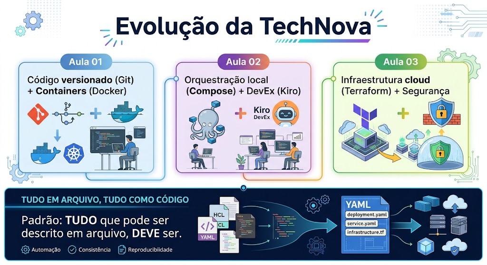
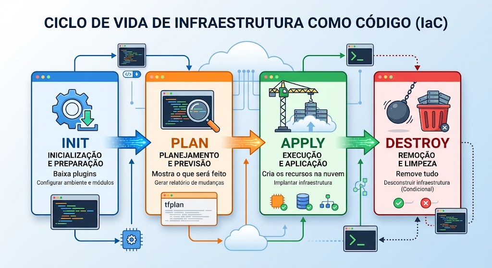
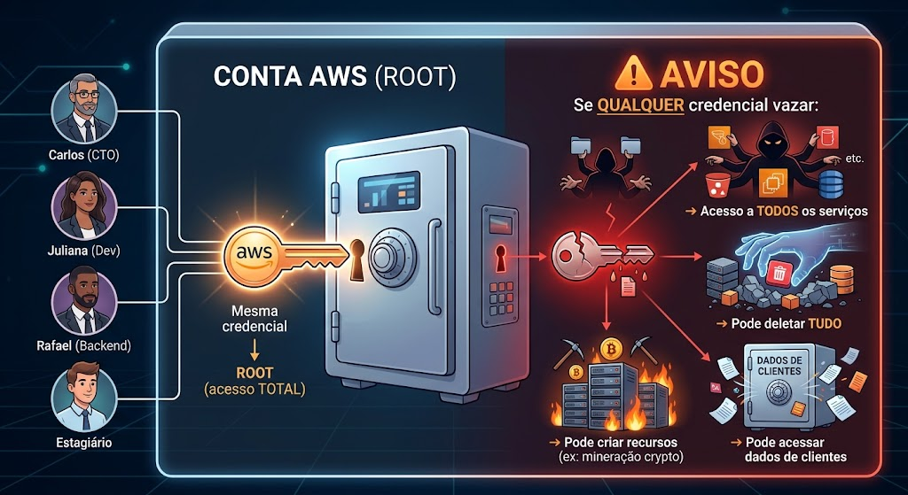
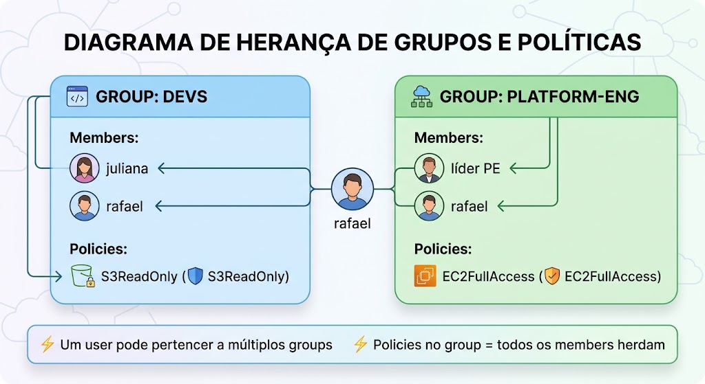

<!-- _class: title -->

# Aula 03 — Terraform e Segurança AWS (IAM)

**DevOps — Centro Universitário UniFAAT**
Prof. Alexandre Tavares | Semestre 2026-2

---



---

# Por que IaC + Segurança + Spec-Driven?

**Evolução natural do projeto TechNova:**
- Aula 01: Código versionado + Dockerfile ✅
- Aula 02: Docker Compose + Spec-Driven (IA planeja antes de agir) ✅
- **Aula 03: Infraestrutura na AWS com Terraform + Segurança com IAM**

**O que esta aula resolve:**

| Problema | Solução |
|---|---|
| Infraestrutura criada manualmente no Console AWS | Terraform — IaC declarativo e versionável |
| Todos usando credenciais root | IAM — users, groups, roles, policies |
| IA gerando código sem validação de segurança | Spec-Driven com checklist de segurança |

> **Fio condutor:** O Spec-Driven continua como método. Terraform e IAM são os novos artefatos que o Kiro pode gerar — mas você valida com o princípio do menor privilégio.

---

# Objetivos de Aprendizagem

### Terraform (IaC)
- Compreender os princípios de Infraestrutura como Código
- Escrever configurações básicas em HCL (HashiCorp Configuration Language)
- Dominar o fluxo: `init` → `plan` → `apply` → `destroy`
- Gerenciar o estado com `terraform.tfstate`

### IAM (Segurança)
- Diferenciar Users, Groups, Roles e Policies
- Aplicar o princípio do menor privilégio
- Criar Service Roles para comunicação entre serviços
- Provisionar IAM completo usando Terraform

### Spec-Driven
- Usar Kiro Spec para gerar configurações Terraform
- Validar output de IA com checklist de segurança
- Revisar policies geradas contra princípio de menor privilégio

---

# O Problema: Infraestrutura Manual

**Cenário TechNova — criação pelo Console:**

- Marcos cria um EC2 pelo Console... sem documentar
- Juliana cria outro EC2 com configuração diferente
- Ninguém sabe quantos recursos existem
- Staging e produção são totalmente diferentes
- Criação de infraestrutura leva horas de cliques manuais

**Consequências:**

| Problema | Impacto |
|---|---|
| Não reproduzível | Staging ≠ Produção |
| Não versionável | Sem histórico de mudanças |
| Propensa a erros | Um clique errado = incidente |
| Não auditável | "Quem criou isso?" |
| Lenta | Escalar = repetir tudo manualmente |

> **Conexão Spec-Driven:** Da mesma forma que Docker Compose resolve orquestração local (Aula 02), Terraform resolve infraestrutura na nuvem — e o Spec gera ambos.

---



---

# IaC — Infraestrutura como Código

**Definição:** Gerenciar e provisionar infraestrutura através de arquivos de configuração ao invés de processos manuais.

**Princípios:**
- **Versionável** — código no Git, histórico completo de mudanças
- **Reproduzível** — mesmo código = mesma infra, sempre
- **Declarativo** — descreve o estado desejado, não os passos
- **Idempotente** — aplicar 2x não cria duplicatas
- **Auditável** — PRs para infraestrutura = revisão antes de aplicar

**Analogia com o que já conhecemos:**

| Conceito | Docker Compose | Terraform |
|---|---|---|
| O que gerencia | Containers locais | Recursos na nuvem |
| Arquivo | `docker-compose.yml` | `main.tf` |
| Linguagem | YAML | HCL |
| Criar | `docker compose up` | `terraform apply` |
| Destruir | `docker compose down` | `terraform destroy` |
| Estado | Docker Engine | `terraform.tfstate` |

---

# O que é Terraform

**Características:**
- **Open-source** — mantido pela HashiCorp
- **Multi-cloud** — AWS, Azure, GCP, +3000 providers
- **Declarativo** — descreve o estado desejado
- **HCL** — HashiCorp Configuration Language (legível por humanos)
- **Planejamento** — `plan` mostra o que muda ANTES de aplicar

**Quando usar Terraform vs. Console:**

| Console AWS (manual) | Terraform (IaC) |
|---|---|
| Exploração rápida, aprendizado | Qualquer ambiente que precisa ser reproduzível |
| Teste de 5 minutos | Staging, produção, múltiplas contas |
| Protótipo descartável | Infraestrutura que vai pro Git |

> **No Spec-Driven:** Kiro gera arquivos `.tf` na Etapa 4 (Código). Você valida com `terraform plan` antes de aplicar.

---

# HCL — Blocos Básicos

```hcl
# Provider — qual cloud/serviço usar
provider "aws" {
  region = "us-east-1"
}

# Resource — o que criar
resource "aws_s3_bucket" "dados" {
  bucket = "technova-dados-2024"

  tags = {
    Environment = "development"
    ManagedBy   = "Terraform"
  }
}

# Output — valores para exportar
output "bucket_arn" {
  value = aws_s3_bucket.dados.arn
}
```

**Formato:** `tipo_bloco "tipo_recurso" "nome_local" { ... }`

| Bloco | Propósito | Exemplo |
|---|---|---|
| `provider` | Conecta ao provedor de nuvem | `provider "aws" {}` |
| `resource` | Declara um recurso | `resource "aws_s3_bucket" "x" {}` |
| `variable` | Parâmetros de entrada | `variable "region" {}` |
| `output` | Expõe valores após criação | `output "arn" {}` |

---

# O Fluxo: init → plan → apply → destroy

```bash
# 1. Inicializar — baixa providers e módulos
terraform init

# 2. Planejar — mostra o que será criado/alterado/destruído
terraform plan

# 3. Aplicar — executa as mudanças na AWS
terraform apply

# 4. Destruir — remove tudo que foi criado
terraform destroy
```

**Regras de segurança:**
- **SEMPRE** execute `plan` antes de `apply`
- **SEMPRE** revise o output do plan antes de confirmar
- **SEMPRE** execute `destroy` após laboratórios (evitar custos)
- **NUNCA** aplique em produção sem revisão de PR

> **Conexão Spec-Driven:** `terraform plan` é o equivalente da Etapa 3 (Tarefas) — mostra exatamente o que será feito antes de executar. Revise como faria com requisitos.

---

# terraform.tfstate — O Estado

**O que é:** Arquivo JSON que mapeia recursos declarados no código com recursos reais na AWS.

**Para que serve:**
- Saber o que já existe (evita duplicação)
- Calcular o diff entre código atual e infra real
- Gerenciar dependências entre recursos

**Regras do `.tfstate`:**

| Regra | Motivo |
|---|---|
| Nunca edite manualmente | Terraform gerencia este arquivo |
| Nunca versione no Git | Pode conter segredos |
| Adicione ao `.gitignore` | `*.tfstate` e `*.tfstate.backup` |
| Em produção: estado remoto | S3 + DynamoDB (Aula 05) |

> Na Aula 05 aprenderemos Remote State com S3 — por enquanto, o estado fica local.

---

# Estrutura de Projeto Terraform

```
aula-03/
├── main.tf              ← Recursos principais (users, groups)
├── policies.tf          ← Custom policies
├── roles.tf             ← Service roles + instance profiles
├── variables.tf         ← Variáveis de entrada
├── outputs.tf           ← Valores exportados
├── providers.tf         ← Configuração do provider AWS
├── .gitignore           ← Exclui .terraform/ e *.tfstate
├── terraform-plan-output.txt  ← Evidência do plan
└── README.md            ← Explicação do design
```

**`.gitignore` obrigatório:**
```
.terraform/
*.tfstate
*.tfstate.backup
.terraform.lock.hcl
*.tfvars
```

> **Checklist Spec-Driven:** Quando o Kiro gerar arquivos `.tf`, verifique se a estrutura segue este padrão. Se gerou tudo em um único arquivo, peça para separar.

---

# O Problema: Credenciais Root Compartilhadas

**Cenário TechNova:**
- Todos usam a mesma conta root da AWS
- Access Keys da root no Slack do time
- Qualquer pessoa pode deletar qualquer recurso
- Impossível saber quem fez o quê
- Se uma key vazar, acesso total à conta



**Impacto de segurança:**

| Risco | Consequência |
|---|---|
| Key vazada | Acesso irrestrito à conta inteira |
| Sem auditoria | "Quem deletou o banco?" |
| Sem separação | Estagiário tem mesmo acesso que CTO |
| Sem rotação | Keys antigas = superfície de ataque permanente |

> **O IAM resolve TODOS esses problemas** — e com Terraform, a solução é versionável e auditável.

---

# IAM — Identity and Access Management

**Três perguntas do IAM:**

| Pergunta | Conceito IAM |
|---|---|
| **Quem** está acessando? | Identity (User, Role) |
| **O que** pode fazer? | Policy (permissões) |
| **Onde** pode fazer? | Resource (ARN específico) |

**Características:**
- Gratuito — sem custo, sem limites
- Global — vale para toda a conta AWS
- Granular — permissões por ação + recurso
- Auditável — CloudTrail registra tudo

---

# Users, Groups e Roles

### Users
- Representam uma pessoa ou aplicação
- Têm credenciais (senha para Console, Access Key para CLI)

### Groups
- Agrupam users com mesma função
- Policies atribuídas ao grupo valem para todos os membros

### Roles
- Identidade assumível temporariamente
- Sem credenciais fixas — usa STS (Security Token Service)
- Ideal para serviços (EC2 → S3) e cross-account



> **Regra:** Nunca atache policies diretamente a users — use groups. Nunca use access keys para serviços — use roles.

---

# Policies — Documento JSON

```json
{
  "Version": "2012-10-17",
  "Statement": [{
    "Effect": "Allow",
    "Action": ["s3:GetObject", "s3:PutObject"],
    "Resource": "arn:aws:s3:::technova-app-data/*"
  }]
}
```

| Campo | Descrição |
|---|---|
| `Effect` | `Allow` ou `Deny` |
| `Action` | Ações permitidas/negadas |
| `Resource` | ARN do recurso específico |
| `Condition` | Restrições adicionais (opcional) |

**Tipos de policies:**
- **AWS Managed** — criadas pela AWS (ex: `AmazonS3ReadOnlyAccess`)
- **Customer Managed** — criadas por você (menor privilégio real)
- **Inline** — embutidas diretamente no user/group/role

> **Spec-Driven:** O Kiro pode gerar policies, mas SEMPRE valide: está usando `*` demais? Tem `Deny` para ações destrutivas?

---

# Princípio do Menor Privilégio

> **"Conceda apenas as permissões estritamente necessárias para realizar a tarefa."**

| Amplo demais | Mínimo necessário |
|---|---|
| `s3:*` em `*` | `s3:GetObject` em `bucket-x/*` |
| `ec2:*` em `*` | `ec2:DescribeInstances` + `ec2:StartInstances` com tag condition |
| `AdministratorAccess` | Custom policy com ações específicas |
| `AmazonS3FullAccess` | Policy que permite apenas leitura no bucket do projeto |

**Como aplicar:**
1. Comece com **zero permissões**
2. Adicione apenas o necessário para a tarefa
3. Use **Conditions** para restringir (por tag, por IP, por horário)
4. Use **Deny explícito** para ações destrutivas

> **Checklist Spec-Driven:** Se o Kiro gerar `Action: ["s3:*"]` ou `Resource: "*"`, rejeite e peça para especificar.

---

# Service Roles — EC2 → S3

**Problema:** Como uma aplicação rodando em EC2 acessa S3 sem hardcoded credentials?

**Solução:** Instance Profile + Role

```
EC2 Instance ← Instance Profile ← IAM Role ← Policy (S3 access)
```

| Access Keys (RUIM) | Roles (BOM) |
|---|---|
| Credenciais fixas no código | Credenciais temporárias automáticas |
| Se vazar, acesso permanente | Rotação automática a cada hora |
| Difícil de revogar | Revoga desanexando o role |

**Componentes:**
1. **Trust Policy** — define quem pode assumir o role (`ec2.amazonaws.com`)
2. **Permissions Policy** — define o que o role pode fazer
3. **Instance Profile** — vincula o role à instância EC2

---

# Terraform + IAM

```hcl
# Cria a policy
resource "aws_iam_policy" "s3_read" {
  name   = "TechNova-S3-Read"
  policy = jsonencode({
    Version = "2012-10-17"
    Statement = [{
      Effect   = "Allow"
      Action   = ["s3:GetObject", "s3:ListBucket"]
      Resource = ["arn:aws:s3:::technova-*", "arn:aws:s3:::technova-*/*"]
    }]
  })
}

# Cria o group e anexa a policy
resource "aws_iam_group" "developers" {
  name = "technova-developers"
}

resource "aws_iam_group_policy_attachment" "devs_s3" {
  group      = aws_iam_group.developers.name
  policy_arn = aws_iam_policy.s3_read.arn
}
```

> **Spec-Driven aplicado:** Descreva a equipe e permissões no Spec. Kiro gera os `.tf`. Você valida no `terraform plan` que não tem `*` em excesso.

---

# Boas Práticas de Segurança

**8 regras fundamentais:**

1. **Nunca use root** — crie usuários IAM individuais
2. **MFA obrigatório** — para Console e operações sensíveis
3. **Menor privilégio** — só o necessário, nada mais
4. **Groups para organizar** — nunca policies direto em users
5. **Roles para serviços** — nunca access keys em EC2
6. **Tags em tudo** — `ManagedBy = "Terraform"` facilita auditoria
7. **Deny explícito** — protege contra erros de Allow
8. **Revisão periódica** — remova acessos não utilizados

> **Conexão Spec-Driven:** Estas regras são o checklist da Etapa 4 (Código) para qualquer `.tf` que envolva IAM. Se o Kiro violar alguma, você corrige antes de aceitar.

---

# Checklist de Validação — Terraform + IAM

**Após o Kiro gerar arquivos `.tf`, valide:**

| Item | Verificação |
|---|---|
| Sintaxe válida? | `terraform validate` sem erros |
| Plan faz sentido? | `terraform plan` — recursos esperados |
| Credenciais hardcoded? | Nenhuma access key no código |
| Policies com `*`? | Rejeitar — especificar ações e recursos |
| `Deny` para destrutivos? | `Delete*`, `Terminate*` bloqueados |
| Tags obrigatórias? | Project, ManagedBy, Aluno, RA |
| `.gitignore` configurado? | `.terraform/`, `*.tfstate` excluídos |
| Provider com versão? | `~> 5.0` (não latest) |
| Outputs declarados? | ARNs dos recursos criados |
| `terraform destroy` ao final? | Nunca deixar recursos ativos |

> Este checklist é o que transforma output de IA em infraestrutura segura e auditável.

---

# Cronograma da Aula

| Bloco | Atividade | Duração |
|---|---|---|
| 1 | Revisão TA + Discussão | 30 min |
| 2 | Teoria — Terraform e IaC | 50 min |
| 3 | **Lab Parte 1** — Primeiro projeto Terraform (S3) | 120 min |
| 4 | Teoria — IAM e Segurança | 50 min |
| 5 | **Lab Parte 2** — IAM com Terraform | 120 min |
| 6 | Encerramento + TF | 15 min |

**Sobre os laboratórios:**
- **Lab 1:** Criar bucket S3 com Terraform — fluxo completo init/plan/apply/destroy
- **Lab 2:** Criar estrutura IAM completa (groups, users, policies, roles) usando Terraform

> **A conexão:** No Lab 1 você entende o fluxo do Terraform. No Lab 2 aplica segurança como código — e pode usar Spec-Driven para gerar o rascunho inicial dos `.tf`.

---

# Referências e Próximos Passos

**Referências:**
- Terraform Docs — [developer.hashicorp.com/terraform](https://developer.hashicorp.com/terraform)
- AWS IAM Docs — [docs.aws.amazon.com/IAM](https://docs.aws.amazon.com/IAM)
- Terraform AWS Provider — [registry.terraform.io/providers/hashicorp/aws](https://registry.terraform.io/providers/hashicorp/aws)
- IAM Actions Reference — [docs.aws.amazon.com/service-authorization](https://docs.aws.amazon.com/service-authorization/latest/reference/)
- Kiro Documentation — [kiro.dev/docs](https://kiro.dev/docs)

**Para a próxima aula:**
- Completar o TF desta aula (portfólio + PR)
- Estudar o `TA.md` da Aula 04
- Ter Terraform instalado e AWS CLI configurado
- Executar `terraform destroy` em todos os recursos criados

**Próxima aula:**
**Aula 04 — VPC, Networking e EC2**
Redes privadas, subnets, security groups — a base para deploy da TechNova na AWS.
