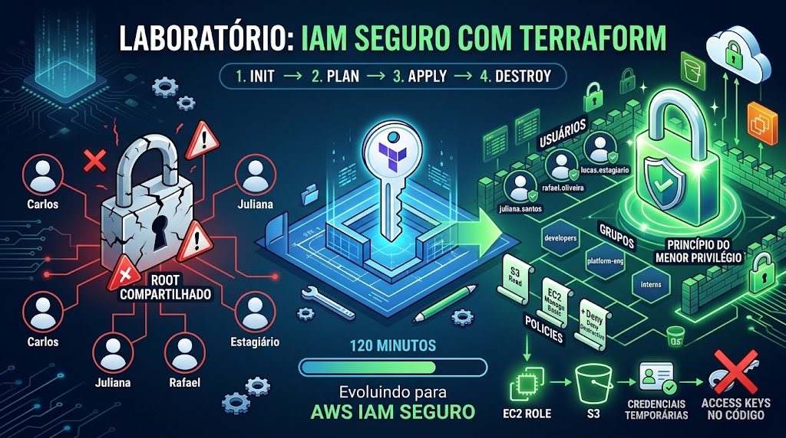
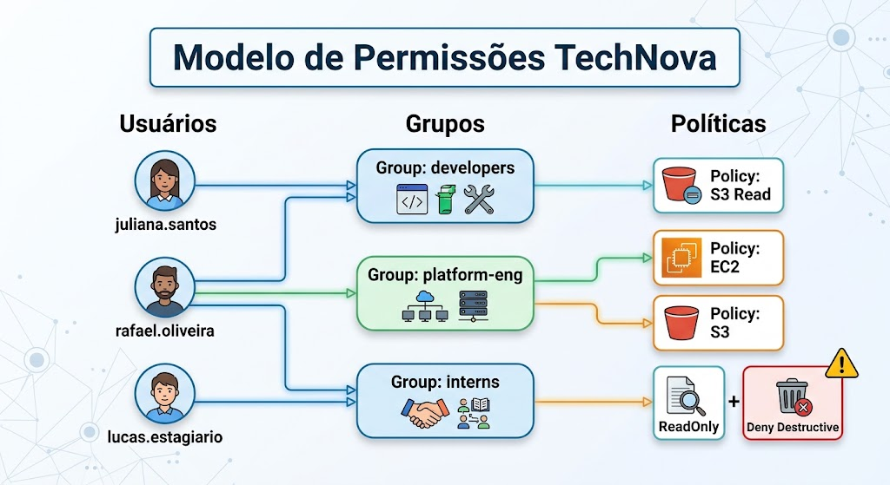
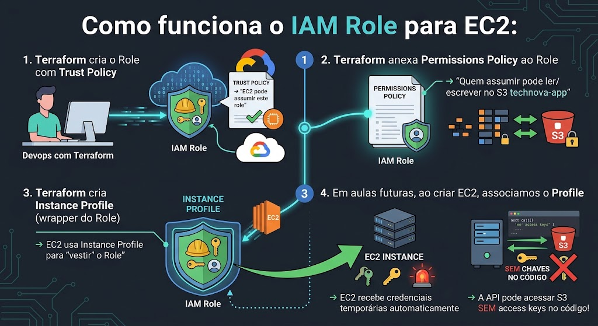
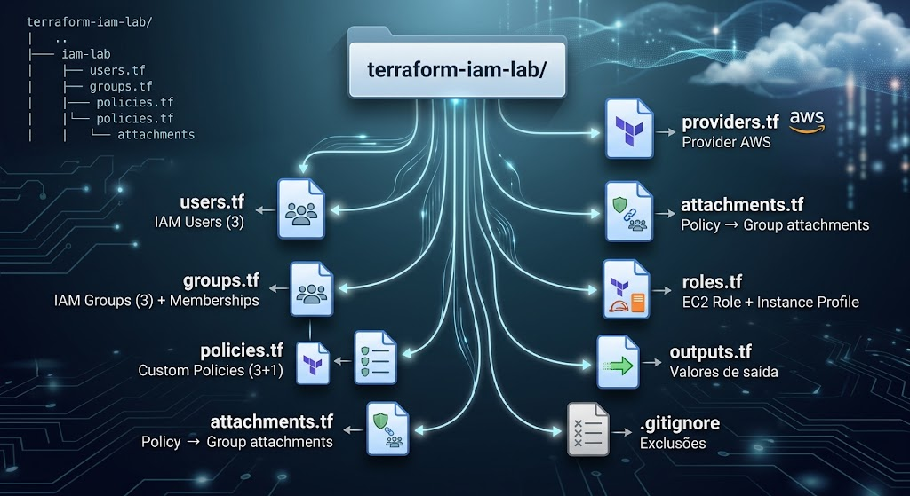

# Lab Parte 2: Configurando IAM Seguro com Terraform

**Tempo estimado:** 120 minutos

## Missão: Implementar Controle de Acesso Seguro para a TechNova

> A auditoria de segurança revelou que a TechNova está usando credenciais root compartilhadas — um risco crítico. A equipe de Platform Engineering recebeu a missão de implementar IAM adequado: usuários individuais, grupos por equipe, policies de menor privilégio, e roles para serviços. Tudo gerenciado via Terraform.

---

## Pré-requisitos

- Terraform instalado e funcional (Lab Parte 1)
- AWS CLI configurado com credenciais válidas (Lab Parte 1)
- Conhecimento do fluxo `terraform init → plan → apply → destroy` (Lab Parte 1)
- Editor de texto (VS Code com extensão HashiCorp Terraform)

> **💰 Free Tier:** IAM é **sempre gratuito**. Não há limite de users, groups, roles ou policies. Este lab não gera nenhum custo.

---

## Parte 1 — Criando IAM Group para Desenvolvedores (15 minutos)

### Passo 1.1: Criar o diretório do projeto

```bash
mkdir terraform-iam-lab
cd terraform-iam-lab
```

### Passo 1.2: Criar `providers.tf`

```hcl
terraform {
  required_version = ">= 1.0"

  required_providers {
    aws = {
      source  = "hashicorp/aws"
      version = "~> 5.0"
    }
  }
}

provider "aws" {
  region = "us-east-1"
}
```

### Passo 1.3: Criar `.gitignore`

```bash
cat > .gitignore << 'EOF'
# Terraform
.terraform/
*.tfstate
*.tfstate.backup
*.tfvars
.terraform.lock.hcl
EOF
```

### Passo 1.4: Inicializar o Terraform

```bash
terraform init
```

### Passo 1.5: Criar o arquivo `groups.tf`

```hcl
# =============================================
# IAM Groups — Organização por Equipe
# Permissões são gerenciadas no nível do grupo
# =============================================

# Grupo: Todos os desenvolvedores
resource "aws_iam_group" "developers" {
  name = "technova-developers"
}

# Grupo: Equipe de Platform Engineering (acesso mais amplo)
resource "aws_iam_group" "platform_eng" {
  name = "technova-platform-eng"
}

# Grupo: Estagiários (acesso restrito — somente leitura)
resource "aws_iam_group" "interns" {
  name = "technova-interns"
}
```

### Passo 1.6: Aplicar

```bash
terraform plan
terraform apply -auto-approve
```

### Passo 1.7: Verificar os grupos

```bash
aws iam list-groups --query 'Groups[?contains(GroupName, `technova`)]' --output table
```

✅ **Checkpoint:** 3 IAM groups criados — base para organizar permissões por equipe.

---

## Parte 2 — Criando IAM Users e Adicionando a Groups (20 minutos)

### Passo 2.1: Criar o arquivo `users.tf`

```hcl
# =============================================
# IAM Users — Equipe TechNova
# Cada pessoa tem seu próprio user (nunca compartilhar)
# =============================================

# Desenvolvedora Sênior
resource "aws_iam_user" "juliana" {
  name = "juliana.santos"

  tags = {
    Team      = "Development"
    Role      = "Senior Developer"
    Project   = "TechNova"
    ManagedBy = "Terraform"
  }
}

# Desenvolvedor Backend
resource "aws_iam_user" "rafael" {
  name = "rafael.oliveira"

  tags = {
    Team      = "Platform Engineering"
    Role      = "Backend Developer"
    Project   = "TechNova"
    ManagedBy = "Terraform"
  }
}

# Estagiário
resource "aws_iam_user" "estagiario" {
  name = "lucas.estagiario"

  tags = {
    Team      = "Development"
    Role      = "Intern"
    Project   = "TechNova"
    ManagedBy = "Terraform"
  }
}
```

### Passo 2.2: Adicionar memberships ao `groups.tf`

Adicione ao final do arquivo `groups.tf`:

```hcl
# =============================================
# Group Memberships — Quem pertence a qual grupo
# =============================================

# Juliana e Rafael são desenvolvedores
resource "aws_iam_group_membership" "dev_members" {
  name  = "dev-group-membership"
  group = aws_iam_group.developers.name

  users = [
    aws_iam_user.juliana.name,
    aws_iam_user.rafael.name,
  ]
}

# Rafael também faz parte de Platform Engineering
resource "aws_iam_group_membership" "platform_members" {
  name  = "platform-eng-membership"
  group = aws_iam_group.platform_eng.name

  users = [
    aws_iam_user.rafael.name,
  ]
}

# Lucas (estagiário) no grupo de interns
resource "aws_iam_group_membership" "intern_members" {
  name  = "intern-group-membership"
  group = aws_iam_group.interns.name

  users = [
    aws_iam_user.estagiario.name,
  ]
}
```

### Passo 2.3: Aplicar

```bash
terraform plan
terraform apply -auto-approve
```

### Passo 2.4: Verificar membros de um grupo

```bash
aws iam get-group --group-name technova-developers --query 'Users[].UserName' --output text
```

Resultado esperado:
```
juliana.santos    rafael.oliveira
```

✅ **Checkpoint:** 3 users criados com memberships corretas. Rafael pertence a 2 groups.

---

## Parte 3 — Criando Custom Policy com Menor Privilégio (25 minutos)

### Passo 3.1: Criar o arquivo `policies.tf`

```hcl
# =============================================
# IAM Policies — Princípio do Menor Privilégio
# Cada policy concede APENAS o mínimo necessário
# =============================================

# Policy: Leitura de S3 (para o grupo developers)
resource "aws_iam_policy" "s3_read" {
  name        = "technova-s3-read"
  description = "Permite leitura e listagem no bucket technova-dados"

  policy = jsonencode({
    Version = "2012-10-17"
    Statement = [
      {
        Sid    = "AllowS3List"
        Effect = "Allow"
        Action = [
          "s3:ListBucket",
          "s3:GetBucketLocation"
        ]
        Resource = "arn:aws:s3:::technova-dados-*"
      },
      {
        Sid    = "AllowS3Read"
        Effect = "Allow"
        Action = [
          "s3:GetObject",
          "s3:GetObjectVersion"
        ]
        Resource = "arn:aws:s3:::technova-dados-*/*"
      }
    ]
  })

  tags = {
    Project   = "TechNova"
    ManagedBy = "Terraform"
  }
}

# Policy: Gerenciamento de EC2 (para Platform Engineering)
resource "aws_iam_policy" "ec2_manage" {
  name        = "technova-ec2-manage"
  description = "Permite gerenciar instâncias EC2 com tag Project=TechNova"

  policy = jsonencode({
    Version = "2012-10-17"
    Statement = [
      {
        Sid    = "AllowEC2Describe"
        Effect = "Allow"
        Action = [
          "ec2:DescribeInstances",
          "ec2:DescribeImages",
          "ec2:DescribeSecurityGroups",
          "ec2:DescribeVpcs",
          "ec2:DescribeSubnets"
        ]
        Resource = "*"
      },
      {
        Sid    = "AllowEC2Manage"
        Effect = "Allow"
        Action = [
          "ec2:StartInstances",
          "ec2:StopInstances",
          "ec2:RebootInstances"
        ]
        Resource = "*"
        Condition = {
          StringEquals = {
            "ec2:ResourceTag/Project" = "TechNova"
          }
        }
      }
    ]
  })

  tags = {
    Project   = "TechNova"
    ManagedBy = "Terraform"
  }
}

# Policy: Somente leitura geral (para estagiários)
resource "aws_iam_policy" "readonly_basic" {
  name        = "technova-readonly-basic"
  description = "Permite apenas visualizar recursos - sem modificação"

  policy = jsonencode({
    Version = "2012-10-17"
    Statement = [
      {
        Sid    = "AllowReadOnlyS3"
        Effect = "Allow"
        Action = [
          "s3:ListBucket",
          "s3:GetObject"
        ]
        Resource = [
          "arn:aws:s3:::technova-dados-*",
          "arn:aws:s3:::technova-dados-*/*"
        ]
      },
      {
        Sid    = "AllowDescribeEC2"
        Effect = "Allow"
        Action = [
          "ec2:DescribeInstances",
          "ec2:DescribeSecurityGroups"
        ]
        Resource = "*"
      },
      {
        Sid    = "DenyDestructiveActions"
        Effect = "Deny"
        Action = [
          "ec2:TerminateInstances",
          "s3:DeleteBucket",
          "s3:DeleteObject",
          "iam:Delete*",
          "iam:Create*"
        ]
        Resource = "*"
      }
    ]
  })

  tags = {
    Project   = "TechNova"
    ManagedBy = "Terraform"
  }
}
```

### Passo 3.2: Observe a estrutura das policies

- **`technova-s3-read`** — Permite apenas leitura em buckets que começam com `technova-dados-*`
- **`technova-ec2-manage`** — Permite gerenciar EC2, mas APENAS instâncias com tag `Project=TechNova`
- **`technova-readonly-basic`** — Permite visualizar, mas EXPLICITAMENTE nega ações destrutivas

> **Princípio do menor privilégio em ação:** O estagiário não pode deletar nada, os devs podem ler S3, e apenas Platform Engineering pode gerenciar EC2.

### Passo 3.3: Aplicar as policies

```bash
terraform plan
terraform apply -auto-approve
```

### Passo 3.4: Verificar policies criadas

```bash
aws iam list-policies --scope Local --query 'Policies[?contains(PolicyName, `technova`)].[PolicyName, Arn]' --output table
```

✅ **Checkpoint:** 3 custom policies criadas seguindo o princípio do menor privilégio.

---

## Parte 4 — Anexando Policies ao Group (10 minutos)

### Passo 4.1: Criar o arquivo `attachments.tf`

```hcl
# =============================================
# Policy Attachments — Conectar policies aos groups
# Permissões fluem: Policy → Group → Users
# =============================================

# Desenvolvedores podem ler S3
resource "aws_iam_group_policy_attachment" "devs_s3_read" {
  group      = aws_iam_group.developers.name
  policy_arn = aws_iam_policy.s3_read.arn
}

# Platform Engineering pode gerenciar EC2
resource "aws_iam_group_policy_attachment" "platform_ec2" {
  group      = aws_iam_group.platform_eng.name
  policy_arn = aws_iam_policy.ec2_manage.arn
}

# Platform Engineering também pode ler S3
resource "aws_iam_group_policy_attachment" "platform_s3" {
  group      = aws_iam_group.platform_eng.name
  policy_arn = aws_iam_policy.s3_read.arn
}

# Estagiários: somente leitura
resource "aws_iam_group_policy_attachment" "interns_readonly" {
  group      = aws_iam_group.interns.name
  policy_arn = aws_iam_policy.readonly_basic.arn
}
```

### Passo 4.2: Aplicar

```bash
terraform apply -auto-approve
```

### Passo 4.3: Verificar permissões do grupo

```bash
aws iam list-attached-group-policies --group-name technova-developers --output table
```

### Passo 4.4: Visualizar o modelo final



✅ **Checkpoint:** Policies anexadas aos groups. Cada user herda permissões do(s) grupo(s).

---

## Parte 5 — Criando Service Role para EC2 → S3 (25 minutos)

### Passo 5.1: Criar o arquivo `roles.tf`

Quando a API da TechNova rodar em EC2, ela precisará acessar o S3 para ler configurações. Vamos criar um role com credenciais temporárias:

```hcl
# =============================================
# IAM Role — Para Serviço EC2 acessar S3
# Melhor que access keys: credenciais temporárias automáticas
# =============================================

# Role que EC2 pode assumir
resource "aws_iam_role" "ec2_app_role" {
  name = "technova-ec2-app-role"

  # Trust Policy: QUEM pode assumir este role
  assume_role_policy = jsonencode({
    Version = "2012-10-17"
    Statement = [
      {
        Sid    = "AllowEC2Assume"
        Effect = "Allow"
        Principal = {
          Service = "ec2.amazonaws.com"
        }
        Action = "sts:AssumeRole"
      }
    ]
  })

  tags = {
    Project   = "TechNova"
    Purpose   = "EC2 Application Access"
    ManagedBy = "Terraform"
  }
}

# Permissions Policy: O QUE o role permite fazer
resource "aws_iam_policy" "app_s3_access" {
  name        = "technova-app-s3-access"
  description = "Permite a aplicação TechNova ler e escrever no bucket de dados"

  policy = jsonencode({
    Version = "2012-10-17"
    Statement = [
      {
        Sid    = "AllowAppS3Access"
        Effect = "Allow"
        Action = [
          "s3:GetObject",
          "s3:PutObject",
          "s3:ListBucket"
        ]
        Resource = [
          "arn:aws:s3:::technova-app-data-*",
          "arn:aws:s3:::technova-app-data-*/*"
        ]
      }
    ]
  })

  tags = {
    Project   = "TechNova"
    ManagedBy = "Terraform"
  }
}

# Anexar a policy ao role
resource "aws_iam_role_policy_attachment" "ec2_app_s3" {
  role       = aws_iam_role.ec2_app_role.name
  policy_arn = aws_iam_policy.app_s3_access.arn
}

# Instance Profile — permite EC2 "vestir" o role
resource "aws_iam_instance_profile" "ec2_app_profile" {
  name = "technova-ec2-app-profile"
  role = aws_iam_role.ec2_app_role.name

  tags = {
    Project   = "TechNova"
    ManagedBy = "Terraform"
  }
}
```

### Passo 5.2: Entender o fluxo do Role



### Passo 5.3: Aplicar

```bash
terraform plan
terraform apply -auto-approve
```

### Passo 5.4: Verificar o role criado

```bash
aws iam get-role --role-name technova-ec2-app-role --query 'Role.[RoleName, Arn]' --output table
```

### Passo 5.5: Verificar o instance profile

```bash
aws iam list-instance-profiles --query 'InstanceProfiles[?contains(InstanceProfileName, `technova`)].[InstanceProfileName, Roles[0].RoleName]' --output table
```

✅ **Checkpoint:** Role para EC2 criado com trust policy + permissions policy + instance profile.

---

## Parte 6 — Testando e Validando Permissões (15 minutos)

### Passo 6.1: Criar `outputs.tf`

```hcl
# =============================================
# Outputs — Valores úteis após apply
# =============================================

output "users_created" {
  description = "Lista de IAM users criados"
  value = [
    aws_iam_user.juliana.name,
    aws_iam_user.rafael.name,
    aws_iam_user.estagiario.name,
  ]
}

output "groups_created" {
  description = "Lista de IAM groups criados"
  value = [
    aws_iam_group.developers.name,
    aws_iam_group.platform_eng.name,
    aws_iam_group.interns.name,
  ]
}

output "policies_created" {
  description = "ARNs das policies customizadas"
  value = {
    s3_read        = aws_iam_policy.s3_read.arn
    ec2_manage     = aws_iam_policy.ec2_manage.arn
    readonly_basic = aws_iam_policy.readonly_basic.arn
    app_s3_access  = aws_iam_policy.app_s3_access.arn
  }
}

output "ec2_role_arn" {
  description = "ARN do role para EC2"
  value       = aws_iam_role.ec2_app_role.arn
}

output "ec2_instance_profile" {
  description = "Nome do Instance Profile para EC2"
  value       = aws_iam_instance_profile.ec2_app_profile.name
}
```

### Passo 6.2: Aplicar e verificar outputs

```bash
terraform apply -auto-approve
```

### Passo 6.3: Usar o IAM Policy Simulator (opcional)

Acesse https://policysim.aws.amazon.com/ para testar se as policies funcionam como esperado:

1. Selecione o user `juliana.santos`
2. Teste a ação `s3:GetObject` no recurso `arn:aws:s3:::technova-dados-*/*`
3. Resultado esperado: **Allowed** (via group `technova-developers`)

4. Teste a ação `ec2:TerminateInstances`
5. Resultado esperado: **Denied** (não tem permissão)

### Passo 6.4: Verificar a estrutura do projeto

```bash
ls -la *.tf
```

Estrutura esperada:


✅ **Checkpoint:** Modelo IAM completo da TechNova implementado via Terraform.

---

## Parte 7 — Destruindo e Limpando (10 minutos)

### Passo 7.1: Destruir todos os recursos

```bash
terraform destroy
```

Confirme com `yes` quando solicitado.

Resultado esperado:
```
Destroy complete! Resources: XX destroyed.
```

### Passo 7.2: Confirmar remoção

```bash
aws iam list-users --query 'Users[?contains(UserName, `juliana`) || contains(UserName, `rafael`) || contains(UserName, `lucas`)]' --output text
```

Nenhum resultado = todos os users removidos.

> **💰 Nota:** Embora IAM seja gratuito, limpe recursos de lab para manter a conta organizada e evitar confusão em exercícios futuros.

✅ **Checkpoint:** Todos os recursos IAM destruídos. Conta limpa.

---

## Troubleshooting — Problemas Comuns

### ❌ Erro: `EntityAlreadyExists`

**Causa:** Já existe um user/group/policy com o mesmo nome.
**Solução:**
```bash
# Verificar se existe
aws iam get-user --user-name juliana.santos
# Se existir de lab anterior, delete manualmente ou altere o nome
```

### ❌ Erro: `DeleteConflict` ao destruir

**Causa:** O user tem access keys ou pertence a grupos que impedem deleção.
**Solução:**
```bash
terraform destroy -target=aws_iam_group_membership.dev_members
terraform destroy
```

### ❌ Erro: `MalformedPolicyDocument`

**Causa:** Erro na sintaxe JSON da policy.
**Solução:**
- Verifique se `Version` é `"2012-10-17"`
- Confirme vírgulas e colchetes no `Statement`
- Use `terraform validate` para checar sintaxe

### ❌ Erro: `AccessDenied` ao criar recursos IAM

**Causa:** Suas credenciais atuais não têm permissão para criar recursos IAM.
**Solução:**
- Verifique se suas credenciais têm `IAMFullAccess`
- Se estiver usando AWS Academy/Lab, verifique permissões disponíveis

### ❌ Erro: `LimitExceeded`

**Causa:** Limite de policies por conta atingido.
**Solução:**
```bash
aws iam list-policies --scope Local --query 'Policies[].PolicyName'
# Delete policies órfãs de labs anteriores
```

---

## Validação Final

Ao concluir este laboratório, você deve ter:

- [ ] Projeto Terraform com 7 arquivos: `providers.tf`, `users.tf`, `groups.tf`, `policies.tf`, `attachments.tf`, `roles.tf`, `outputs.tf`
- [ ] 3 IAM users criados: `juliana.santos`, `rafael.oliveira`, `lucas.estagiario`
- [ ] 3 IAM groups: `technova-developers`, `technova-platform-eng`, `technova-interns`
- [ ] 3+ custom policies com princípio do menor privilégio
- [ ] Policies corretamente anexadas aos groups
- [ ] 1 IAM role para EC2 com trust policy e instance profile
- [ ] Compreensão: Policy → Group → User (herança de permissões)
- [ ] Compreensão: Trust Policy → Role → Instance Profile (para serviços)
- [ ] Todos os recursos destruídos com `terraform destroy`

---

*A TechNova agora tem um modelo de segurança robusto! Ninguém mais usa root, cada pessoa tem seu user, permissões são gerenciadas por grupo, e serviços usam roles com credenciais temporárias. No Trabalho de Fixação (TF), você implementará sua própria estrutura IAM completa.*
