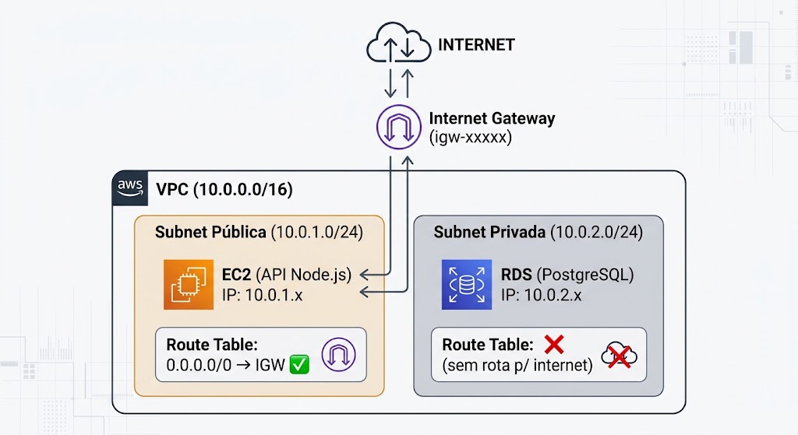
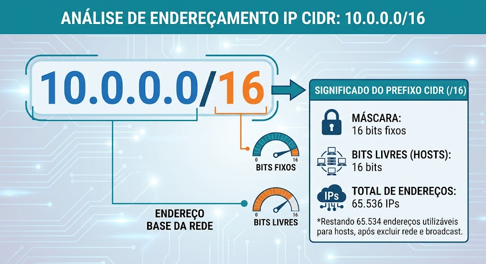
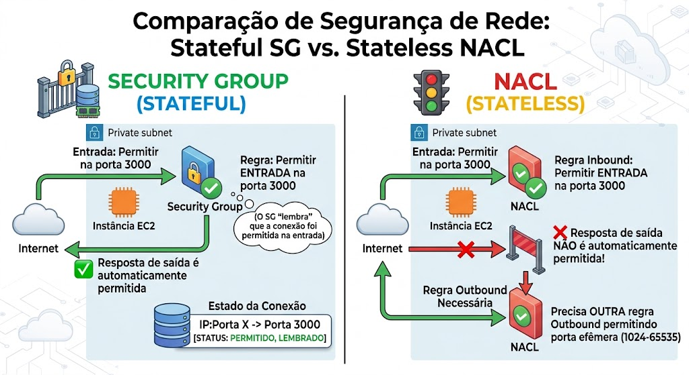
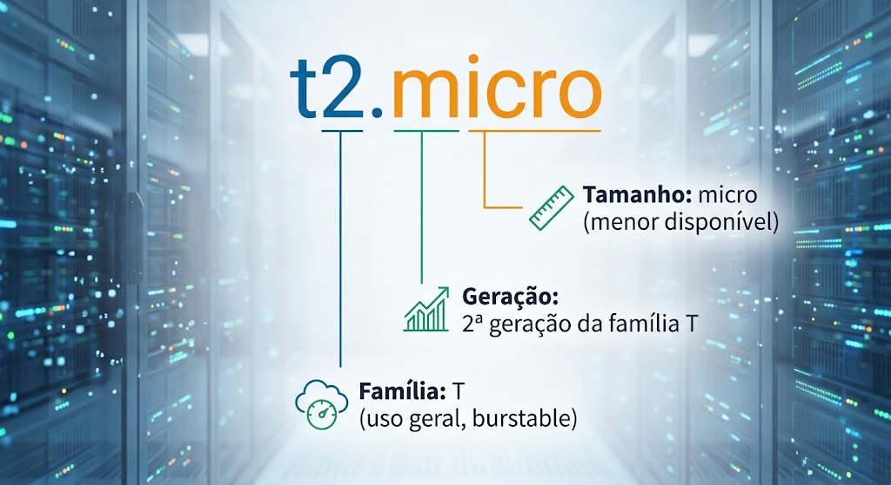
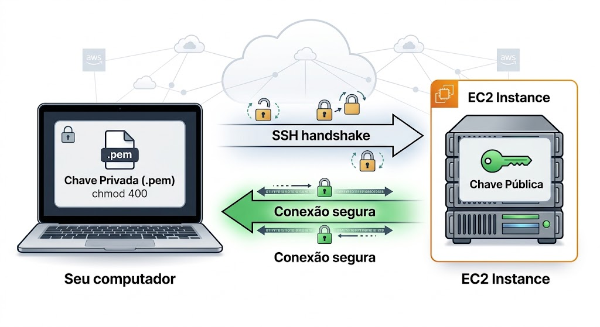
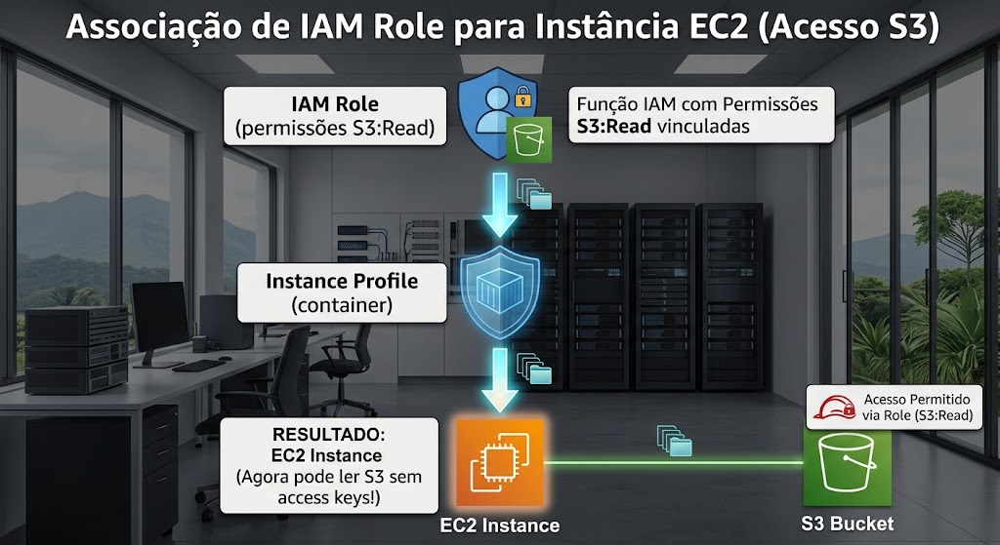

# TA — Trabalho Anterior | Aula 04

## Instruções

Este material deve ser estudado **ANTES** da aula. A leitura completa é obrigatória e será avaliada através das questões ao final.

**Tempo estimado de leitura:** ~60 minutos

---

## Parte 1 — VPC e Networking

### 1. O Problema: Por Que Não Usar a VPC Padrão?

Quando você cria uma conta AWS, cada região já vem com uma **VPC padrão** (Default VPC). Ela funciona para testes rápidos, mas é inadequada para qualquer aplicação séria:

**Problemas da VPC padrão:**

1. **Rede compartilhada** — todos os recursos ficam na mesma rede, sem segmentação
2. **Sem isolamento** — não há separação entre componentes públicos e privados
3. **Banco de dados exposto** — se você criar um RDS na VPC padrão, ele pode ficar acessível da internet
4. **CIDR fixo** — você não controla o espaço de endereços (172.31.0.0/16)
5. **Sem governança** — difícil aplicar políticas de segurança consistentes

**Cenário da TechNova:**

Imagine que a equipe coloca a API Node.js e o banco PostgreSQL na VPC padrão. Um atacante que explorar uma vulnerabilidade na API terá acesso direto ao banco — não há barreira de rede entre eles. Com uma VPC customizada, o banco fica em uma subnet privada, inacessível diretamente da internet.

---

### 2. VPC — Sua Rede Privada na AWS

Uma **VPC** (Virtual Private Cloud) é uma rede virtual logicamente isolada dentro da nuvem AWS. É como ter seu próprio data center virtual:

- Você define o **espaço de endereçamento** (bloco CIDR)
- Cria **sub-redes** (subnets) para segmentar recursos
- Controla o **tráfego** com firewalls e tabelas de rotas
- Decide o que é **público** e o que é **privado**

---

### 3. Arquitetura de Rede — Visão Geral

**Componentes e suas funções:**
- **VPC** — a rede principal (container para tudo)
- **Subnets** — subdivisões da VPC em blocos menores
- **Internet Gateway (IGW)** — porta de entrada/saída para a internet
- **Route Tables** — regras que direcionam o tráfego

---

### 4. CIDR Notation — Entendendo Endereços IP

CIDR (Classless Inter-Domain Routing) é a notação usada para definir blocos de endereços IP:

**Exemplos práticos:**

| Notação CIDR | Faixa de IPs | Quantidade |
|--------------|-------------|------------|
| `10.0.0.0/16` | 10.0.0.0 a 10.0.255.255 | 65.536 |
| `10.0.1.0/24` | 10.0.1.0 a 10.0.1.255 | 256 |
| `10.0.2.0/24` | 10.0.2.0 a 10.0.2.255 | 256 |
| `0.0.0.0/0` | Todos os IPs (qualquer lugar) | — |

**Regra simples:** Quanto MAIOR o número após a barra, MENOR a rede.
- `/16` = rede grande (VPC)
- `/24` = rede média (subnet)
- `/32` = um único IP

**Na nossa arquitetura:**
- VPC: `10.0.0.0/16` — espaço total com 65.536 IPs
- Subnet Pública: `10.0.1.0/24` — 256 IPs para recursos públicos
- Subnet Privada: `10.0.2.0/24` — 256 IPs para recursos internos

> **Nota:** A AWS reserva 5 IPs em cada subnet (primeiro, último, e 3 internos), então uma /24 tem efetivamente 251 IPs utilizáveis.

---

### 5. Subnets: Pública vs Privada

A diferença entre subnet pública e privada é **apenas uma questão de roteamento**:

| Subnet Pública | Subnet Privada |
|----------------|----------------|
| Tem rota para Internet Gateway | NÃO tem rota para IGW |
| Recursos podem receber IP público | Recursos só têm IP privado |
| Acesso de/para a internet | Só acesso interno (VPC) |
| Uso: APIs, load balancers, bastion hosts | Uso: bancos de dados, cache, workers |

---

### 6. Internet Gateway (IGW)

O Internet Gateway é o componente que permite comunicação entre a VPC e a internet pública:

- É **gratuito** — sem taxas por hora ou por dados
- Uma VPC pode ter **no máximo um** IGW
- É **altamente disponível** (gerenciado pela AWS, sem single point of failure)
- Sem ele, NADA na VPC acessa a internet

---

### 7. Route Tables — Direcionando o Tráfego

Uma Route Table é uma lista de regras (rotas) que determinam para onde o tráfego de rede vai:

**Route Table para subnet pública:**

| Destino | Alvo | Significado |
|---------|------|-------------|
| `10.0.0.0/16` | local | Tráfego interno da VPC — fica aqui |
| `0.0.0.0/0` | igw-xxxxx | Todo o resto — vai para a internet |

**Route Table para subnet privada:**

| Destino | Alvo | Significado |
|---------|------|-------------|
| `10.0.0.0/16` | local | Tráfego interno apenas |

> A rota `local` é automática e não pode ser removida. Ela garante que recursos dentro da mesma VPC se comuniquem.

---

### 8. NAT Gateway (Conceito)

E se um recurso na subnet privada precisa **baixar atualizações** da internet, mas não pode ser **acessado** de fora?

O **NAT Gateway** resolve isso:
- Fica na subnet **pública** (tem acesso ao IGW)
- A subnet privada tem uma rota `0.0.0.0/0 → nat-gateway`
- Permite tráfego **outbound** (saída), bloqueia **inbound** (entrada)
- Traduz endereços privados para público (Network Address Translation)

> **⚠️ Custo:** NAT Gateway custa ~$0.045/hora (~$32/mês). Não usaremos nos laboratórios, mas é importante saber que existe para quando a TechNova crescer.

---

### 9. Security Groups vs NACLs

**Security Groups** (SGs) e **Network ACLs** (NACLs) são dois tipos de firewall na AWS:

| Aspecto | Security Group | NACL |
|---------|---------------|------|
| Opera no nível de | Instância (interface de rede) | Subnet |
| É **stateful** ou stateless? | **Stateful** | Stateless |
| Regras | Apenas ALLOW (permitir) | ALLOW e DENY |
| Default inbound | Nega tudo | Permite tudo |
| Avaliação | Todas as regras são avaliadas | Avaliação por ordem numérica |

**O que "stateful" significa na prática:**

> **Neste curso** usaremos principalmente Security Groups. São mais simples e suficientes para o cenário da TechNova.

---

### 10. VPC é GRATUITA

Um ponto muito importante: a VPC em si **não custa nada**! Componentes gratuitos:
- VPC (pode ter várias por conta)
- Subnets (quantas quiser)
- Internet Gateway
- Route Tables
- Security Groups e NACLs

O que **custa dinheiro** é:
- NAT Gateway (~$32/mês) — não usaremos
- Elastic IP não associado ($0.005/hora)
- VPN/DirectConnect — enterprise

---

## Parte 2 — EC2 Instances

### 1. EC2 — Servidores Virtuais Sob Demanda

**EC2** (Elastic Compute Cloud) permite criar servidores virtuais na AWS em segundos. É como alugar um computador na nuvem:

- Escolha o sistema operacional (AMI)
- Escolha a capacidade de hardware (instance type)
- Conecte à sua rede (VPC/subnet)
- Controle acesso (Security Group + Key Pair)
- Automatize a configuração (User Data)

---

### 2. AMI — Amazon Machine Image

Uma **AMI** é uma "imagem" do sistema operacional e software base da instância. É como um template que define com o que a máquina começa:

| AMI | Baseada em | Ideal para |
|-----|-----------|------------|
| Amazon Linux 2023 | Fedora/RHEL | AWS-optimized, Free Tier |
| Ubuntu 22.04 LTS | Debian | Comunidade grande |
| Windows Server 2022 | Windows | Aplicações .NET |

**Usaremos Amazon Linux 2023** porque:
- É otimizada para performance na AWS
- AWS CLI já vem instalada
- Suporte LTS (Long Term Support)
- Sem custo adicional de licença
- Atualizações de segurança gratuitas

> **Dica:** Cada região tem IDs de AMI diferentes. No Terraform, usaremos um `data source` para buscar automaticamente a AMI mais recente.

---

### 3. Instance Types — Escolhendo o Hardware

O instance type define a capacidade de processamento e memória da máquina virtual:

**Nomenclatura:**

**Famílias comuns:**
- **T** (Turbo/burstable) — uso geral, créditos de CPU
- **M** (General purpose) — balance entre CPU/RAM
- **C** (Compute optimized) — alta performance CPU
- **R** (RAM optimized) — muita memória

**Para este curso:** Sempre `t2.micro` (1 vCPU, 1 GB RAM) — é Free Tier!

---

### 4. Key Pairs — Acesso SSH

Para acessar uma instância EC2 via terminal (SSH), usamos um par de chaves criptográficas:

- **Chave pública** — fica na instância EC2 (no arquivo `~/.ssh/authorized_keys`)
- **Chave privada** — fica com você (arquivo `.pem` no seu computador)

**Fluxo de conexão:**

**Regras de segurança:**
- A chave privada é disponibilizada **UMA VEZ** ao criar — se perder, perde acesso
- Permissões obrigatórias: `chmod 400 minha-chave.pem`
- **NUNCA** versione chaves privadas no Git (adicione `*.pem` ao `.gitignore`)

---

### 5. Security Groups — Firewall do EC2

Security Groups são o principal mecanismo de firewall para instâncias EC2. Definem regras de ingress (entrada) e egress (saída):

**Para a API da TechNova, precisamos:**
- Porta **22** (SSH) — apenas do seu IP (para administração)
- Porta **3000** (Node.js) — de qualquer lugar (para acessar a API)
- Saída — todo tráfego permitido (para baixar pacotes npm, etc.)

> **Lembre-se:** Security Groups são **stateful** — se você permite a entrada na porta 3000, a resposta sai automaticamente sem precisar de regra extra.

---

### 6. User Data — Script de Automação

User Data é um script shell que executa automaticamente **no primeiro boot** da instância:

**O que podemos fazer com User Data:**
- Instalar pacotes (Node.js, Git, Docker)
- Clonar repositórios
- Configurar e iniciar aplicações
- Criar arquivos de configuração
- Configurar serviços do sistema

**Características importantes:**
- Executa como **root** (não precisa `sudo`)
- Roda apenas no **primeiro boot** (não em reinicializações)
- Se falhar, a instância inicia mas a aplicação pode não funcionar
- Logs disponíveis em `/var/log/cloud-init-output.log`

---

### 7. Instance Profile — IAM para EC2

Na Aula 03, aprendemos sobre IAM Roles. Para que um EC2 use uma Role, precisamos de um **Instance Profile**:

**Vantagens sobre access keys hardcoded:**
- Credenciais temporárias (rotação automática)
- Não há segredos no código
- Fácil de auditar e revogar
- É a prática recomendada pela AWS

---

### 8. Free Tier — EC2

| Recurso | Limite | Período |
|---------|--------|---------|
| t2.micro | 750 horas/mês | 12 meses |
| EBS gp2 | 30 GB | 12 meses |
| Snapshots | 1 GB | 12 meses |

**750 horas = uma instância 24/7 por um mês inteiro.** Mas no nosso caso, vamos criar e destruir a cada lab — então estamos muito longe de atingir o limite.

---

## Questões de Múltipla Escolha

### Questão 1

**Por que a equipe TechNova NÃO deve usar a VPC padrão para sua infraestrutura de produção?**

a) Porque a VPC padrão tem um custo mensal alto  
b) Porque a VPC padrão não permite criar instâncias EC2  
c) Porque a VPC padrão não oferece isolamento adequado — todos os recursos ficam expostos na mesma rede sem segmentação entre público e privado  
d) Porque a VPC padrão só funciona na região us-east-1  

---

### Questão 2

**Qual é a diferença fundamental entre uma subnet pública e uma subnet privada na AWS?**

a) A subnet pública tem mais IPs disponíveis que a privada  
b) A subnet pública fica em uma AZ diferente da privada  
c) A subnet pública tem uma rota para o Internet Gateway na sua Route Table, permitindo comunicação com a internet  
d) A subnet pública usa CIDR /16 e a privada usa CIDR /24  

---

### Questão 3

**Security Groups na AWS são considerados "stateful". O que isso significa na prática?**

a) Que as regras são salvas permanentemente e não podem ser alteradas  
b) Que se uma regra permite tráfego de entrada em uma porta, a resposta de saída é automaticamente permitida sem necessidade de regra explícita  
c) Que o Security Group mantém log de todas as conexões realizadas  
d) Que é necessário criar regras de entrada e saída para cada conexão funcionar  

---

### Questão 4

**Qual é a função do User Data em uma instância EC2?**

a) Armazenar dados do usuário (documentos, fotos) no disco da instância  
b) Definir as credenciais de login do usuário root  
c) Executar um script automaticamente no primeiro boot da instância, permitindo instalar software e configurar a aplicação sem intervenção manual  
d) Fazer backup automático dos dados da instância para o S3  

---

*Traga suas dúvidas sobre a leitura para discussão no início da aula. Pense: "Como posso organizar a rede da TechNova na AWS de forma segura, separando o que é público do que é privado, e automatizando tudo com Terraform?"*

---

## Referências

### AWS VPC e Networking

- Amazon Web Services. **What is Amazon VPC?**. AWS Documentation. Disponível em: [https://docs.aws.amazon.com/vpc/latest/userguide/what-is-amazon-vpc.html](https://docs.aws.amazon.com/vpc/latest/userguide/what-is-amazon-vpc.html)
- Amazon Web Services. **VPC Subnets**. AWS Documentation. Disponível em: [https://docs.aws.amazon.com/vpc/latest/userguide/configure-subnets.html](https://docs.aws.amazon.com/vpc/latest/userguide/configure-subnets.html)
- Amazon Web Services. **Internet Gateways**. AWS Documentation. Disponível em: [https://docs.aws.amazon.com/vpc/latest/userguide/VPC_Internet_Gateway.html](https://docs.aws.amazon.com/vpc/latest/userguide/VPC_Internet_Gateway.html)
- Amazon Web Services. **Route Tables**. AWS Documentation. Disponível em: [https://docs.aws.amazon.com/vpc/latest/userguide/VPC_Route_Tables.html](https://docs.aws.amazon.com/vpc/latest/userguide/VPC_Route_Tables.html)
- Amazon Web Services. **Security Groups**. AWS Documentation. Disponível em: [https://docs.aws.amazon.com/vpc/latest/userguide/vpc-security-groups.html](https://docs.aws.amazon.com/vpc/latest/userguide/vpc-security-groups.html)

### AWS EC2

- Amazon Web Services. **Amazon EC2 User Guide**. AWS Documentation. Disponível em: [https://docs.aws.amazon.com/AWSEC2/latest/UserGuide/](https://docs.aws.amazon.com/AWSEC2/latest/UserGuide/)
- Amazon Web Services. **Run commands on your EC2 instance at launch (User Data)**. AWS Documentation. Disponível em: [https://docs.aws.amazon.com/AWSEC2/latest/UserGuide/user-data.html](https://docs.aws.amazon.com/AWSEC2/latest/UserGuide/user-data.html)
- Amazon Web Services. **Amazon EC2 Key Pairs**. AWS Documentation. Disponível em: [https://docs.aws.amazon.com/AWSEC2/latest/UserGuide/ec2-key-pairs.html](https://docs.aws.amazon.com/AWSEC2/latest/UserGuide/ec2-key-pairs.html)

### Terraform

- HashiCorp. **AWS VPC Resource**. Terraform Registry. Disponível em: [https://registry.terraform.io/providers/hashicorp/aws/latest/docs/resources/vpc](https://registry.terraform.io/providers/hashicorp/aws/latest/docs/resources/vpc)
- HashiCorp. **AWS Subnet Resource**. Terraform Registry. Disponível em: [https://registry.terraform.io/providers/hashicorp/aws/latest/docs/resources/subnet](https://registry.terraform.io/providers/hashicorp/aws/latest/docs/resources/subnet)
- HashiCorp. **AWS Instance Resource**. Terraform Registry. Disponível em: [https://registry.terraform.io/providers/hashicorp/aws/latest/docs/resources/instance](https://registry.terraform.io/providers/hashicorp/aws/latest/docs/resources/instance)
- HashiCorp. **AWS Security Group Resource**. Terraform Registry. Disponível em: [https://registry.terraform.io/providers/hashicorp/aws/latest/docs/resources/security_group](https://registry.terraform.io/providers/hashicorp/aws/latest/docs/resources/security_group)

### Redes e Endereçamento IP

- CIDR.xyz. **Calculadora visual de CIDR**. Disponível em: [https://cidr.xyz/](https://cidr.xyz/)
- Amazon Web Services. **VPC CIDR Blocks**. AWS Documentation. Disponível em: [https://docs.aws.amazon.com/vpc/latest/userguide/vpc-cidr-blocks.html](https://docs.aws.amazon.com/vpc/latest/userguide/vpc-cidr-blocks.html)
