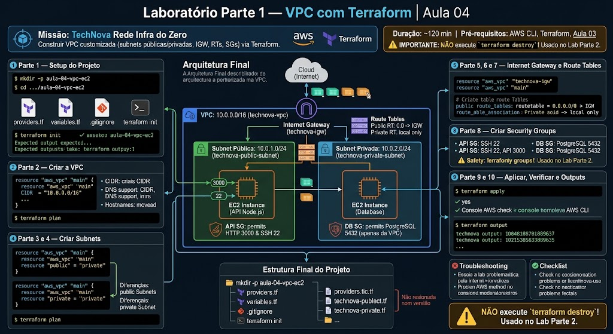
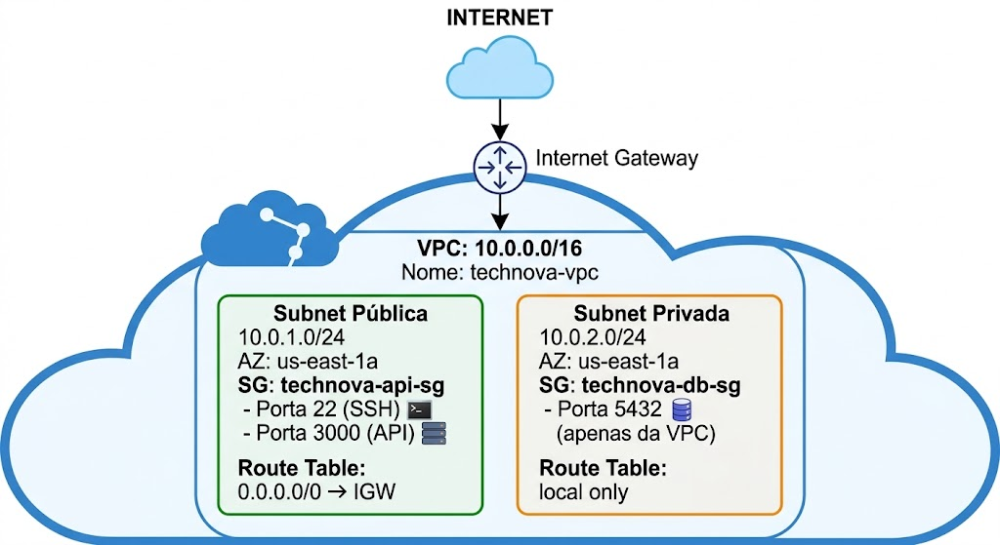
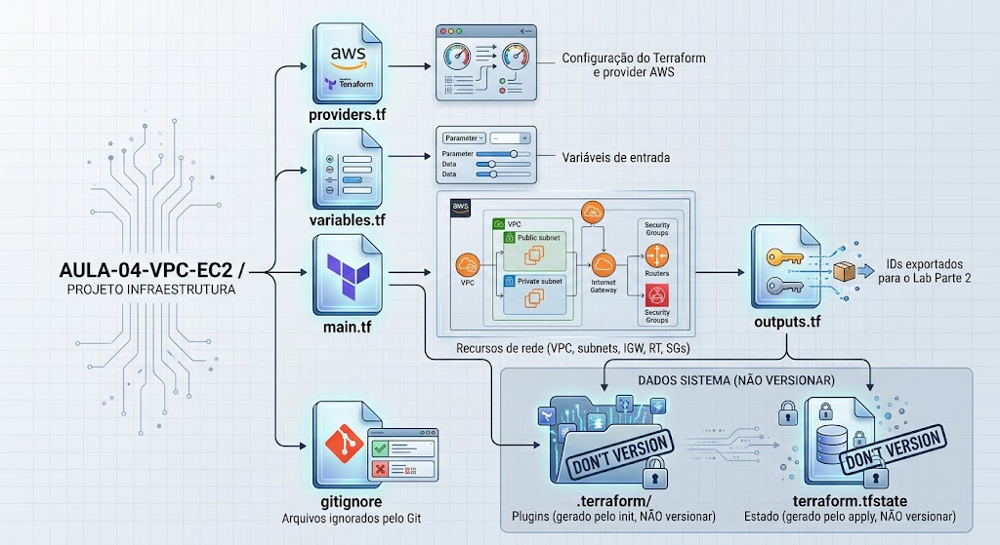

# Laboratório Parte 1 — VPC com Terraform | Aula 04

## Missão

Construir a infraestrutura de rede da TechNova do zero: uma VPC customizada com subnets públicas e privadas, Internet Gateway, Route Tables e Security Groups — tudo usando Terraform.

**Duração:** ~120 minutos  
**Pré-requisito:** AWS CLI configurado, Terraform instalado, conhecimento da Aula 03 (Terraform basics + IAM)

> **⚠️ IMPORTANTE:** Ao final deste laboratório, NÃO execute `terraform destroy`! O Laboratório Parte 2 utiliza a infraestrutura criada aqui.

---

## Arquitetura Final



---

## Parte 1 — Setup do Projeto (10 min)

### 1.1 Criar a estrutura de diretórios

```bash
# Na pasta do seu projeto de aula
mkdir -p aula-04-vpc-ec2
cd aula-04-vpc-ec2
```

### 1.2 Criar o arquivo de providers

Crie o arquivo `providers.tf`:

```hcl
# providers.tf - Configuração do Terraform e provider AWS

terraform {
  required_version = ">= 1.0"

  required_providers {
    aws = {
      source  = "hashicorp/aws"
      version = "~> 5.0"
    }
  }
}

provider "aws" {
  region = var.aws_region

  default_tags {
    tags = {
      Project     = "TechNova"
      Environment = "development"
      ManagedBy   = "Terraform"
      Aula        = "04"
    }
  }
}
```

### 1.3 Criar o arquivo de variáveis

Crie o arquivo `variables.tf`:

```hcl
# variables.tf - Variáveis do projeto

variable "aws_region" {
  description = "Região AWS para criar os recursos"
  type        = string
  default     = "us-east-1"
}

variable "project_name" {
  description = "Nome do projeto (usado em tags e nomes de recursos)"
  type        = string
  default     = "technova"
}

variable "vpc_cidr" {
  description = "Bloco CIDR da VPC"
  type        = string
  default     = "10.0.0.0/16"
}

variable "public_subnet_cidr" {
  description = "Bloco CIDR da subnet pública"
  type        = string
  default     = "10.0.1.0/24"
}

variable "private_subnet_cidr" {
  description = "Bloco CIDR da subnet privada"
  type        = string
  default     = "10.0.2.0/24"
}

variable "availability_zone" {
  description = "Availability Zone para as subnets"
  type        = string
  default     = "us-east-1a"
}
```

### 1.4 Criar o .gitignore

Crie o arquivo `.gitignore`:

```
# Terraform
.terraform/
*.tfstate
*.tfstate.backup
*.tfvars
.terraform.lock.hcl

# Chaves SSH
*.pem
*.key

# OS
.DS_Store
Thumbs.db
```

### 1.5 Inicializar o Terraform

```bash
terraform init
```

**Saída esperada:**
```
Initializing the backend...
Initializing provider plugins...
- Finding hashicorp/aws versions matching "~> 5.0"...
- Installing hashicorp/aws v5.x.x...

Terraform has been successfully initialized!
```

---

## Parte 2 — Criar a VPC (15 min)

### 2.1 Conceito

A VPC é o container principal de toda a nossa rede. Vamos criar com o CIDR `10.0.0.0/16`, que nos dá 65.536 endereços IP — espaço de sobra para crescer.

### 2.2 Implementação

Crie o arquivo `main.tf` e adicione:

```hcl
# main.tf - Recursos de rede da TechNova

# =============================================================
# VPC
# =============================================================

resource "aws_vpc" "main" {
  cidr_block           = var.vpc_cidr
  enable_dns_support   = true
  enable_dns_hostnames = true

  tags = {
    Name = "${var.project_name}-vpc"
  }
}
```

**Explicação dos parâmetros:**
- `cidr_block` — define o espaço de IPs da VPC (10.0.0.0/16 = 65.536 IPs)
- `enable_dns_support` — ativa resolução DNS interna na VPC
- `enable_dns_hostnames` — permite que instâncias recebam nomes DNS públicos

### 2.3 Verificar

```bash
terraform plan
```

Você deve ver:
```
Plan: 1 to add, 0 to change, 0 to destroy.
```

> **Ainda não aplique!** Vamos adicionar mais recursos primeiro.

---

## Parte 3 — Criar a Subnet Pública (15 min)

### 3.1 Conceito

A subnet pública é onde ficarão os recursos que precisam de acesso à internet (API, load balancer). Usaremos o CIDR `10.0.1.0/24` (256 IPs).

### 3.2 Implementação

Adicione ao `main.tf`:

```hcl
# =============================================================
# SUBNETS
# =============================================================

# Subnet Pública - para recursos que precisam de acesso à internet
resource "aws_subnet" "public" {
  vpc_id                  = aws_vpc.main.id
  cidr_block              = var.public_subnet_cidr
  availability_zone       = var.availability_zone
  map_public_ip_on_launch = true

  tags = {
    Name = "${var.project_name}-public-subnet"
    Type = "public"
  }
}
```

**Explicação:**
- `vpc_id` — associa a subnet à nossa VPC (referência ao recurso criado acima)
- `cidr_block` — bloco de IPs desta subnet (deve estar DENTRO do CIDR da VPC)
- `availability_zone` — zona de disponibilidade onde a subnet será criada
- `map_public_ip_on_launch` — instâncias nesta subnet recebem IP público automaticamente

> **Nota:** A referência `aws_vpc.main.id` é como o Terraform conecta recursos. Ele sabe que a subnet depende da VPC e cria na ordem correta.

---

## Parte 4 — Criar a Subnet Privada (10 min)

### 4.1 Conceito

A subnet privada é para recursos que NÃO devem ser acessíveis da internet (banco de dados, cache). CIDR: `10.0.2.0/24`.

### 4.2 Implementação

Adicione ao `main.tf`:

```hcl
# Subnet Privada - para recursos internos (banco de dados, cache)
resource "aws_subnet" "private" {
  vpc_id            = aws_vpc.main.id
  cidr_block        = var.private_subnet_cidr
  availability_zone = var.availability_zone

  tags = {
    Name = "${var.project_name}-private-subnet"
    Type = "private"
  }
}
```

**Diferença da pública:**
- **Sem** `map_public_ip_on_launch` — instâncias aqui não recebem IP público
- Será associada a uma Route Table sem rota para o IGW

---

## Parte 5 — Criar o Internet Gateway (15 min)

### 5.1 Conceito

O Internet Gateway é o componente que conecta nossa VPC à internet. Sem ele, nada entra ou sai da VPC.

### 5.2 Implementação

Adicione ao `main.tf`:

```hcl
# =============================================================
# INTERNET GATEWAY
# =============================================================

resource "aws_internet_gateway" "main" {
  vpc_id = aws_vpc.main.id

  tags = {
    Name = "${var.project_name}-igw"
  }
}
```

**Simples assim!** O IGW é criado e automaticamente anexado à VPC pelo parâmetro `vpc_id`.

---

## Parte 6 — Criar Route Table para Subnet Pública (15 min)

### 6.1 Conceito

A Route Table define as regras de roteamento. Para a subnet pública, precisamos de uma rota que direcione todo o tráfego externo (`0.0.0.0/0`) para o Internet Gateway.

### 6.2 Implementação

Adicione ao `main.tf`:

```hcl
# =============================================================
# ROUTE TABLES
# =============================================================

# Route Table para a subnet pública
resource "aws_route_table" "public" {
  vpc_id = aws_vpc.main.id

  # Rota para a internet via Internet Gateway
  route {
    cidr_block = "0.0.0.0/0"
    gateway_id = aws_internet_gateway.main.id
  }

  tags = {
    Name = "${var.project_name}-public-rt"
  }
}
```

**Explicação da rota:**
- `cidr_block = "0.0.0.0/0"` — "todo tráfego com destino a qualquer IP"
- `gateway_id` — "direcione para o Internet Gateway"

> **Nota:** A rota `local` (10.0.0.0/16 → local) é adicionada automaticamente pela AWS. Não precisamos declarar.

---

## Parte 7 — Associar Route Table à Subnet Pública (10 min)

### 7.1 Conceito

Criar a Route Table não é suficiente — precisamos **associá-la** à subnet pública. Sem essa associação, a subnet usa a Route Table padrão da VPC (que não tem rota para o IGW).

### 7.2 Implementação

Adicione ao `main.tf`:

```hcl
# Associação: Route Table Pública ↔ Subnet Pública
resource "aws_route_table_association" "public" {
  subnet_id      = aws_subnet.public.id
  route_table_id = aws_route_table.public.id
}
```

**É isso que torna a subnet "pública"!** A combinação de:
1. Route Table com rota para IGW ✅
2. Associação dessa RT à subnet ✅
3. `map_public_ip_on_launch = true` ✅

> **Subnet privada:** Não precisa de associação explícita — ela usa a Route Table padrão da VPC que só tem a rota `local`.

---

## Parte 8 — Criar Security Groups (20 min)

### 8.1 Conceito

Security Groups são firewalls virtuais que controlam o tráfego para as instâncias. Vamos criar dois:
1. **API SG** — para o servidor web (permite HTTP na 3000 e SSH na 22)
2. **DB SG** — para o banco de dados futuro (permite PostgreSQL 5432 apenas da VPC)

### 8.2 Security Group para a API

Adicione ao `main.tf`:

```hcl
# =============================================================
# SECURITY GROUPS
# =============================================================

# Security Group para a API (EC2 na subnet pública)
resource "aws_security_group" "api" {
  name        = "${var.project_name}-api-sg"
  description = "Security group para a API TechNova - permite HTTP e SSH"
  vpc_id      = aws_vpc.main.id

  # SSH - acesso para administração
  ingress {
    description = "SSH"
    from_port   = 22
    to_port     = 22
    protocol    = "tcp"
    cidr_blocks = ["0.0.0.0/0"] # Em produção, restringir ao seu IP!
  }

  # API Node.js - acesso público
  ingress {
    description = "API Node.js"
    from_port   = 3000
    to_port     = 3000
    protocol    = "tcp"
    cidr_blocks = ["0.0.0.0/0"]
  }

  # Saída - permitir todo tráfego de saída
  egress {
    description = "All outbound traffic"
    from_port   = 0
    to_port     = 0
    protocol    = "-1"
    cidr_blocks = ["0.0.0.0/0"]
  }

  tags = {
    Name = "${var.project_name}-api-sg"
  }
}
```

> **⚠️ Nota de segurança:** Em produção, a porta SSH (22) deveria ser restrita ao IP do administrador (ex: `"203.0.113.50/32"`). Aqui usamos `0.0.0.0/0` para facilitar o lab, mas isso NÃO é recomendado em ambientes reais.

### 8.3 Security Group para o Banco de Dados (futuro)

```hcl
# Security Group para o banco de dados (subnet privada)
resource "aws_security_group" "db" {
  name        = "${var.project_name}-db-sg"
  description = "Security group para o banco de dados - acesso apenas da VPC"
  vpc_id      = aws_vpc.main.id

  # PostgreSQL - acesso apenas de dentro da VPC
  ingress {
    description = "PostgreSQL from VPC"
    from_port   = 5432
    to_port     = 5432
    protocol    = "tcp"
    cidr_blocks = [var.vpc_cidr] # Apenas tráfego interno da VPC (10.0.0.0/16)
  }

  # Saída - permitir todo tráfego de saída
  egress {
    description = "All outbound traffic"
    from_port   = 0
    to_port     = 0
    protocol    = "-1"
    cidr_blocks = ["0.0.0.0/0"]
  }

  tags = {
    Name = "${var.project_name}-db-sg"
  }
}
```

**Diferença fundamental:**
- API SG: `cidr_blocks = ["0.0.0.0/0"]` → qualquer IP da internet pode acessar
- DB SG: `cidr_blocks = [var.vpc_cidr]` → **apenas** recursos dentro da VPC (10.0.0.0/16) podem acessar

---

## Parte 9 — Aplicar e Verificar (10 min)

### 9.1 Executar o plan

```bash
terraform plan
```

**Saída esperada (resumo):**
```
Plan: 7 to add, 0 to change, 0 to destroy.

  + aws_vpc.main
  + aws_subnet.public
  + aws_subnet.private
  + aws_internet_gateway.main
  + aws_route_table.public
  + aws_route_table_association.public
  + aws_security_group.api
  + aws_security_group.db
```

> Revise o plan! Verifique se os CIDRs, nomes e regras estão corretos.

### 9.2 Aplicar

```bash
terraform apply
```

Digite `yes` quando solicitado.

**Saída esperada:**
```
Apply complete! Resources: 8 added, 0 changed, 0 destroyed.
```

### 9.3 Verificar no Console AWS (opcional)

Se quiser confirmar visualmente:
1. Acesse o Console AWS → VPC
2. Verifique que a VPC `technova-vpc` foi criada
3. Confira as subnets, Internet Gateway e Route Tables

---

## Parte 10 — Adicionar Outputs (10 min)

### 10.1 Conceito

Outputs exportam valores úteis após o `terraform apply`. Precisaremos dos IDs da VPC, subnets e Security Groups no Laboratório Parte 2.

### 10.2 Implementação

Crie o arquivo `outputs.tf`:

```hcl
# outputs.tf - Valores exportados após a criação

output "vpc_id" {
  description = "ID da VPC criada"
  value       = aws_vpc.main.id
}

output "public_subnet_id" {
  description = "ID da subnet pública"
  value       = aws_subnet.public.id
}

output "private_subnet_id" {
  description = "ID da subnet privada"
  value       = aws_subnet.private.id
}

output "api_security_group_id" {
  description = "ID do Security Group da API"
  value       = aws_security_group.api.id
}

output "db_security_group_id" {
  description = "ID do Security Group do banco de dados"
  value       = aws_security_group.db.id
}

output "internet_gateway_id" {
  description = "ID do Internet Gateway"
  value       = aws_internet_gateway.main.id
}
```

### 10.3 Aplicar para ver os outputs

```bash
terraform apply
```

**Saída esperada (ao final):**
```
Outputs:

api_security_group_id = "sg-0abc123def456789"
db_security_group_id  = "sg-0def456abc789012"
internet_gateway_id   = "igw-0123456789abcdef"
private_subnet_id     = "subnet-0abc123private"
public_subnet_id      = "subnet-0abc123public"
vpc_id                = "vpc-0abc123def456789"
```

> **Anote esses valores!** Eles serão usados no Laboratório Parte 2.

Para consultar os outputs a qualquer momento:

```bash
terraform output
```

---

## Troubleshooting — Problemas Comuns

### Problema 1: "Error: creating VPC: UnauthorizedOperation"

**Causa:** Suas credenciais AWS não têm permissão para criar VPCs.

**Solução:**
```bash
# Verifique se o AWS CLI está configurado
aws sts get-caller-identity

# Se não estiver, configure:
aws configure
```

Verifique que seu usuário IAM tem a policy `AmazonVPCFullAccess` ou equivalente.

---

### Problema 2: "Error: InvalidSubnet.Range: The CIDR 'x.x.x.x/x' is invalid"

**Causa:** O CIDR da subnet não está dentro do CIDR da VPC.

**Solução:** Certifique-se de que:
- VPC: `10.0.0.0/16`
- Subnets devem ser subconjuntos: `10.0.X.0/24` (onde X = 1, 2, 3, etc.)

---

### Problema 3: "Error: InvalidParameterValue: CIDR block already in use"

**Causa:** Já existe uma subnet com o mesmo CIDR nesta VPC.

**Solução:** 
```bash
# Verifique o estado atual
terraform state list

# Se houver conflito com recursos manuais, mude o CIDR ou importe o recurso
```

---

### Problema 4: "Error: Provider produced inconsistent final plan"

**Causa:** O provider AWS teve inconsistência entre plan e apply.

**Solução:**
```bash
# Tente novamente
terraform apply
```

---

### Problema 5: "Error: VPCLimitExceeded"

**Causa:** Você atingiu o limite de VPCs na região (padrão: 5 por região).

**Solução:**
```bash
# Verifique quantas VPCs existem
aws ec2 describe-vpcs --query "Vpcs[].VpcId" --output text

# Deletar VPCs não utilizadas ou usar outra região
```

---

## Checklist de Validação

Antes de seguir para o Laboratório Parte 2, verifique:

- [ ] `terraform apply` executou sem erros
- [ ] VPC `technova-vpc` criada com CIDR 10.0.0.0/16
- [ ] Subnet pública criada com CIDR 10.0.1.0/24
- [ ] Subnet privada criada com CIDR 10.0.2.0/24
- [ ] Internet Gateway criado e anexado à VPC
- [ ] Route Table pública com rota 0.0.0.0/0 → IGW
- [ ] Route Table associada à subnet pública
- [ ] Security Group API com portas 22 e 3000 abertas
- [ ] Security Group DB com porta 5432 apenas da VPC
- [ ] Outputs mostrando IDs de todos os recursos
- [ ] `terraform output` funciona corretamente

---

## Estrutura Final do Projeto



---

> **⚠️ NÃO execute `terraform destroy`!** O Laboratório Parte 2 usa a VPC, subnet e Security Groups criados aqui. Mantenha tudo rodando e siga para a próxima parte.
