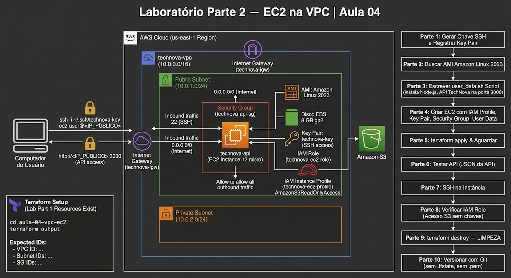
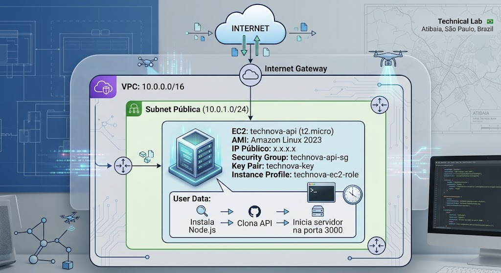
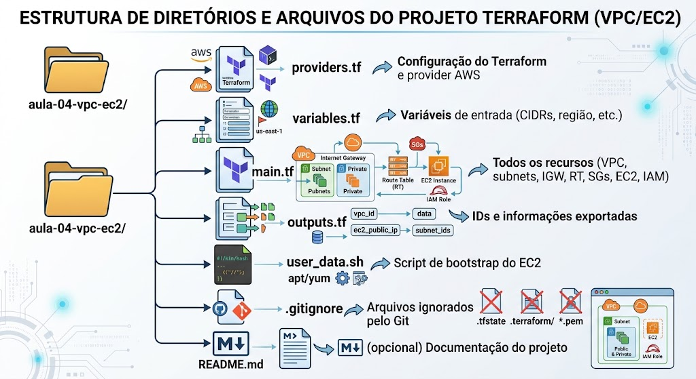

# Laboratório Parte 2 — EC2 na VPC | Aula 04


## Missão

Provisionar uma instância EC2 dentro da VPC customizada criada no Lab Parte 1, com a API TechNova rodando e acessível publicamente via porta 3000.

**Duração:** ~120 minutos  
**Pré-requisito:** Laboratório Parte 1 completo (VPC, subnets, IGW, Security Groups existindo)

> **⚠️ IMPORTANTE:** Este lab DEPENDE dos recursos criados no Lab Parte 1. Execute `terraform output` para confirmar que a infraestrutura de rede está ativa.

---

## Arquitetura Final



---

## Verificação Inicial

Antes de começar, confirme que o Lab Parte 1 está ativo:

```bash
cd aula-04-vpc-ec2
terraform output
```

Você deve ver os IDs da VPC, subnets e Security Groups. Se não aparecer nada, volte ao Lab Parte 1.

---

## Parte 1 — Criar Key Pair para SSH (15 min)

### 1.1 Conceito

Para acessar a instância EC2 via SSH, precisamos de um par de chaves. Vamos gerar a chave localmente e registrá-la na AWS via Terraform.

### 1.2 Gerar a chave SSH localmente

```bash
# Gerar par de chaves (NÃO coloque senha - apenas Enter)
ssh-keygen -t rsa -b 4096 -f ~/.ssh/technova-key -N ""
```

Isso cria dois arquivos:
- `~/.ssh/technova-key` — chave privada (NUNCA compartilhe!)
- `~/.ssh/technova-key.pub` — chave pública (vai para a AWS)

### 1.3 Ajustar permissões

```bash
chmod 400 ~/.ssh/technova-key
```

### 1.4 Registrar a chave na AWS via Terraform

Adicione ao `main.tf`:

```hcl
# =============================================================
# KEY PAIR
# =============================================================

resource "aws_key_pair" "main" {
  key_name   = "${var.project_name}-key"
  public_key = file("~/.ssh/technova-key.pub")

  tags = {
    Name = "${var.project_name}-key"
  }
}
```

> **Nota:** O `file()` lê o conteúdo da chave pública do seu computador. A chave privada permanece local — nunca é enviada à AWS.

---

## Parte 2 — Buscar a AMI Amazon Linux 2023 (15 min)

### 2.1 Conceito

Em vez de fixar um ID de AMI (que muda por região e com atualizações), usaremos um `data source` para buscar automaticamente a AMI mais recente da Amazon Linux 2023.

### 2.2 Implementação

Adicione ao `main.tf`:

```hcl
# =============================================================
# DATA SOURCE - AMI
# =============================================================

# Busca a AMI mais recente do Amazon Linux 2023
data "aws_ami" "amazon_linux" {
  most_recent = true
  owners      = ["amazon"]

  filter {
    name   = "name"
    values = ["al2023-ami-2023.*-x86_64"]
  }

  filter {
    name   = "virtualization-type"
    values = ["hvm"]
  }

  filter {
    name   = "architecture"
    values = ["x86_64"]
  }
}
```

**Explicação:**
- `most_recent = true` — pega a versão mais recente
- `owners = ["amazon"]` — garante que é oficial da Amazon
- Filtros garantem que é Amazon Linux 2023 para arquitetura x86_64
- `data source` não CRIA nada — apenas CONSULTA informações da AWS

---

## Parte 3 — Escrever o User Data Script (20 min)

### 3.1 Conceito

O User Data é um script que executa automaticamente no primeiro boot da instância. Vamos usá-lo para instalar Node.js, clonar a API da TechNova e iniciar o servidor.

### 3.2 Criar o script

Crie o arquivo `user_data.sh`:

```bash
#!/bin/bash
# user_data.sh - Script de bootstrap para a instância EC2
# Executa como root no primeiro boot

set -e  # Parar em caso de erro

# Log de início
echo "=== TechNova User Data - Início: $(date) ===" >> /var/log/technova-setup.log

# 1. Atualizar o sistema
echo "Atualizando sistema..." >> /var/log/technova-setup.log
yum update -y

# 2. Instalar Node.js 18 LTS
echo "Instalando Node.js..." >> /var/log/technova-setup.log
curl -fsSL https://rpm.nodesource.com/setup_18.x | bash -
yum install -y nodejs git

# 3. Verificar instalação
node --version >> /var/log/technova-setup.log
npm --version >> /var/log/technova-setup.log

# 4. Criar diretório da aplicação
mkdir -p /home/ec2-user/app
cd /home/ec2-user/app

# 5. Criar a aplicação TechNova (versão simplificada para o lab)
cat > package.json << 'EOF'
{
  "name": "technova-api",
  "version": "1.0.0",
  "description": "TechNova API - Deploy na AWS",
  "main": "server.js",
  "scripts": {
    "start": "node server.js"
  },
  "dependencies": {
    "express": "^4.18.0"
  }
}
EOF

cat > server.js << 'EOF'
const express = require('express');
const os = require('os');

const app = express();
const PORT = 3000;

app.get('/', (req, res) => {
  res.json({
    message: 'TechNova API - Rodando na AWS!',
    hostname: os.hostname(),
    platform: os.platform(),
    uptime: Math.floor(os.uptime()) + ' segundos',
    timestamp: new Date().toISOString()
  });
});

app.get('/health', (req, res) => {
  res.json({ status: 'healthy', service: 'technova-api' });
});

app.get('/orders', (req, res) => {
  res.json({
    orders: [
      { id: 1, product: 'Widget A', status: 'shipped' },
      { id: 2, product: 'Widget B', status: 'processing' }
    ]
  });
});

app.listen(PORT, '0.0.0.0', () => {
  console.log(`TechNova API rodando na porta ${PORT}`);
});
EOF

# 6. Instalar dependências
npm install

# 7. Ajustar permissões
chown -R ec2-user:ec2-user /home/ec2-user/app

# 8. Iniciar a aplicação (como serviço simples)
# Usar nohup para manter rodando após o script terminar
nohup node server.js > /var/log/technova-api.log 2>&1 &

# Log de conclusão
echo "=== TechNova User Data - Fim: $(date) ===" >> /var/log/technova-setup.log
echo "API iniciada na porta 3000" >> /var/log/technova-setup.log
```

### 3.3 Tornar executável (opcional, mas boa prática)

```bash
chmod +x user_data.sh
```

---

## Parte 4 — Criar a Instância EC2 (25 min)

### 4.1 Conceito

Agora vamos juntar tudo: criar uma instância EC2 t2.micro na subnet pública, com o Security Group da API, o key pair para SSH, e o user data para iniciar a aplicação automaticamente.

### 4.2 Criar o Instance Profile (IAM Role para EC2)

Primeiro, vamos criar uma Role IAM que permite ao EC2 ler objetos do S3 (útil para futuras configurações):

Adicione ao `main.tf`:

```hcl
# =============================================================
# IAM - INSTANCE PROFILE PARA EC2
# =============================================================

# Role que o EC2 vai assumir
resource "aws_iam_role" "ec2_role" {
  name = "${var.project_name}-ec2-role"

  assume_role_policy = jsonencode({
    Version = "2012-10-17"
    Statement = [
      {
        Action = "sts:AssumeRole"
        Effect = "Allow"
        Principal = {
          Service = "ec2.amazonaws.com"
        }
      }
    ]
  })

  tags = {
    Name = "${var.project_name}-ec2-role"
  }
}

# Policy: permitir leitura no S3
resource "aws_iam_role_policy_attachment" "ec2_s3_read" {
  role       = aws_iam_role.ec2_role.name
  policy_arn = "arn:aws:iam::aws:policy/AmazonS3ReadOnlyAccess"
}

# Instance Profile (container que anexa a Role ao EC2)
resource "aws_iam_instance_profile" "ec2_profile" {
  name = "${var.project_name}-ec2-profile"
  role = aws_iam_role.ec2_role.name
}
```

### 4.3 Criar a instância EC2

Adicione ao `main.tf`:

```hcl
# =============================================================
# EC2 INSTANCE
# =============================================================

resource "aws_instance" "api" {
  ami                    = data.aws_ami.amazon_linux.id
  instance_type          = "t2.micro"
  key_name               = aws_key_pair.main.key_name
  subnet_id              = aws_subnet.public.id
  vpc_security_group_ids = [aws_security_group.api.id]
  iam_instance_profile   = aws_iam_instance_profile.ec2_profile.name

  # User Data - script de inicialização
  user_data = file("user_data.sh")

  # Disco (EBS) - 8 GB é suficiente para o lab
  root_block_device {
    volume_size = 8
    volume_type = "gp2"

    tags = {
      Name = "${var.project_name}-api-disk"
    }
  }

  tags = {
    Name = "${var.project_name}-api"
  }
}
```

**Explicação dos parâmetros:**
- `ami` — referência ao data source que busca Amazon Linux 2023
- `instance_type` — t2.micro (Free Tier!)
- `key_name` — chave SSH para acesso remoto
- `subnet_id` — coloca o EC2 na subnet PÚBLICA
- `vpc_security_group_ids` — aplica o Security Group da API
- `iam_instance_profile` — conecta a Role IAM ao EC2
- `user_data` — script que instala Node.js e inicia a API
- `root_block_device` — configuração do disco (8 GB SSD)

### 4.4 Adicionar outputs do EC2

Adicione ao `outputs.tf`:

```hcl
output "ec2_public_ip" {
  description = "IP público da instância EC2"
  value       = aws_instance.api.public_ip
}

output "ec2_public_dns" {
  description = "DNS público da instância EC2"
  value       = aws_instance.api.public_dns
}

output "ssh_command" {
  description = "Comando para conectar via SSH"
  value       = "ssh -i ~/.ssh/technova-key ec2-user@${aws_instance.api.public_ip}"
}

output "api_url" {
  description = "URL para acessar a API"
  value       = "http://${aws_instance.api.public_ip}:3000"
}
```

---

## Parte 5 — Aplicar e Aguardar (10 min)

### 5.1 Verificar o plan

```bash
terraform plan
```

**Saída esperada (novos recursos):**
```
Plan: 5 to add, 0 to change, 0 to destroy.

  + aws_key_pair.main
  + aws_iam_role.ec2_role
  + aws_iam_role_policy_attachment.ec2_s3_read
  + aws_iam_instance_profile.ec2_profile
  + aws_instance.api
```

### 5.2 Aplicar

```bash
terraform apply
```

Digite `yes` quando solicitado.

**Saída esperada:**
```
Apply complete! Resources: 5 added, 0 changed, 0 destroyed.

Outputs:

api_url       = "http://54.123.45.67:3000"
ec2_public_dns = "ec2-54-123-45-67.compute-1.amazonaws.com"
ec2_public_ip  = "54.123.45.67"
ssh_command    = "ssh -i ~/.ssh/technova-key ec2-user@54.123.45.67"
```

### 5.3 Aguardar a inicialização

A instância precisa de **2-3 minutos** para:
1. Iniciar o sistema operacional
2. Executar o User Data (instalar Node.js, npm install, etc.)
3. Iniciar a API

```bash
# Esperar 2-3 minutos...
echo "Aguardando instância inicializar..."
sleep 180
```

> **Dica:** Enquanto espera, você pode verificar o status no Console AWS: EC2 → Instances → Status Checks

---

## Parte 6 — Testar a API (10 min)

### 6.1 Testar via curl

```bash
# Pegar o IP público
export API_IP=$(terraform output -raw ec2_public_ip)

# Testar endpoint principal
curl http://$API_IP:3000
```

**Saída esperada:**
```json
{
  "message": "TechNova API - Rodando na AWS!",
  "hostname": "ip-10-0-1-xxx",
  "platform": "linux",
  "uptime": "120 segundos",
  "timestamp": "2024-XX-XXTXX:XX:XX.XXXZ"
}
```

### 6.2 Testar endpoint de health

```bash
curl http://$API_IP:3000/health
```

**Saída esperada:**
```json
{"status":"healthy","service":"technova-api"}
```

### 6.3 Testar endpoint de orders

```bash
curl http://$API_IP:3000/orders
```

**Saída esperada:**
```json
{
  "orders": [
    {"id":1,"product":"Widget A","status":"shipped"},
    {"id":2,"product":"Widget B","status":"processing"}
  ]
}
```

### 6.4 Testar no navegador

Abra no navegador: `http://<IP_PÚBLICO>:3000`

Você deve ver a resposta JSON da API! 🎉

> **Se não funcionar:** Aguarde mais 1-2 minutos (o User Data pode ainda estar executando). Veja a seção de Troubleshooting abaixo.

---

## Parte 7 — SSH na Instância (15 min)

### 7.1 Conectar via SSH

```bash
# Usar o comando que o Terraform nos deu
ssh -i ~/.ssh/technova-key ec2-user@$(terraform output -raw ec2_public_ip)
```

**Se pedir confirmação de fingerprint:**
```
The authenticity of host 'x.x.x.x' can't be established.
Are you sure you want to continue connecting? yes
```

### 7.2 Verificar dentro da instância

Uma vez conectado:

```bash
# Verificar Node.js
node --version
# Esperado: v18.x.x

# Verificar que a API está rodando
curl localhost:3000
# Esperado: JSON da API

# Ver os logs do User Data
cat /var/log/technova-setup.log

# Ver os logs da API
cat /var/log/technova-api.log

# Ver processos Node rodando
ps aux | grep node

# Verificar informações da instância
curl http://169.254.169.254/latest/meta-data/instance-id
curl http://169.254.169.254/latest/meta-data/local-ipv4
```

### 7.3 Sair do SSH

```bash
exit
```

---

## Parte 8 — Verificar IAM Role (10 min)

### 8.1 Conceito

Na Parte 4, anexamos uma IAM Role com permissão `AmazonS3ReadOnlyAccess` ao EC2. Vamos verificar que funciona — o EC2 pode acessar o S3 sem credenciais fixas.

### 8.2 Testar acesso ao S3 via SSH

```bash
# Conectar novamente
ssh -i ~/.ssh/technova-key ec2-user@$(terraform output -raw ec2_public_ip)

# Listar buckets S3 (a Role permite leitura)
aws s3 ls

# Se houver um bucket da Aula 03:
# aws s3 ls s3://technova-dados-SEU-ID/

# Verificar a identidade (qual Role está sendo usada)
aws sts get-caller-identity
```

**Saída esperada do `get-caller-identity`:**
```json
{
  "UserId": "AROAXXXXXXXXXX:i-0abc123def456789",
  "Account": "123456789012",
  "Arn": "arn:aws:sts::123456789012:assumed-role/technova-ec2-role/i-0abc123def456789"
}
```

Note que o EC2 está usando a Role `technova-ec2-role` — sem access keys no código!

```bash
# Sair do SSH
exit
```

---

## Parte 9 — Terraform Destroy — LIMPEZA (10 min)

### 9.1 Por que destruir?

Mesmo sendo Free Tier, é boa prática destruir recursos quando não estiver usando:
- Evita custos acidentais se o Free Tier expirar
- Limpa a conta AWS
- Pratica o ciclo completo do Terraform

### 9.2 Destruir TUDO

```bash
terraform destroy
```

**O Terraform mostrará todos os recursos que serão destruídos:**
```
Plan: 0 to add, 0 to change, 13 to destroy.

  - aws_instance.api
  - aws_iam_instance_profile.ec2_profile
  - aws_iam_role_policy_attachment.ec2_s3_read
  - aws_iam_role.ec2_role
  - aws_key_pair.main
  - aws_route_table_association.public
  - aws_route_table.public
  - aws_security_group.api
  - aws_security_group.db
  - aws_internet_gateway.main
  - aws_subnet.public
  - aws_subnet.private
  - aws_vpc.main
```

Digite `yes` para confirmar.

> **⚠️ Isso destrói TUDO — inclusive os recursos do Lab Parte 1 (VPC, subnets, etc.).**

### 9.3 Verificar que tudo foi destruído

```bash
terraform state list
# Esperado: (vazio - nenhum recurso)
```

---

## Parte 10 — Versionar com Git (5 min)

### 10.1 Inicializar e commitar

```bash
# Inicializar repositório (se ainda não fez)
git init

# Verificar que .gitignore está correto
cat .gitignore

# Adicionar arquivos do Terraform
git add providers.tf variables.tf main.tf outputs.tf user_data.sh .gitignore

# Commit
git commit -m "feat(aula-04): VPC + EC2 com Terraform

- VPC customizada com CIDR 10.0.0.0/16
- Subnet pública e privada
- Internet Gateway e Route Table
- Security Groups (API e DB)
- EC2 t2.micro com Amazon Linux 2023
- User Data para deploy automático da API
- Instance Profile com S3 read access"
```

### 10.2 Verificar que nada sensível foi versionado

```bash
# Verificar que state e chaves NÃO estão no Git
git status
# Não deve ter .tfstate, .pem, ou .terraform/
```

---

## Troubleshooting — Problemas Comuns

### Problema 1: "Connection refused" ao acessar a API (curl porta 3000)

**Causas possíveis:**
1. User Data ainda está executando (espere mais 2-3 min)
2. Script falhou durante a execução

**Diagnóstico via SSH:**
```bash
ssh -i ~/.ssh/technova-key ec2-user@$API_IP

# Verificar se Node está instalado
node --version

# Verificar se o processo está rodando
ps aux | grep node

# Ver logs do User Data
sudo cat /var/log/cloud-init-output.log
cat /var/log/technova-setup.log

# Tentar iniciar manualmente
cd /home/ec2-user/app
npm start
```

---

### Problema 2: "SSH timeout" — não consegue conectar via SSH

**Causas possíveis:**
1. Security Group não tem porta 22 aberta
2. Instância na subnet errada (privada em vez de pública)
3. Sem rota para Internet Gateway

**Diagnóstico:**
```bash
# Verificar Security Group
terraform state show aws_security_group.api

# Verificar que a instância está na subnet pública
terraform state show aws_instance.api | grep subnet

# Verificar que a instância tem IP público
terraform output ec2_public_ip
```

---

### Problema 3: "Permission denied (publickey)" no SSH

**Causa:** Chave privada errada ou permissões incorretas.

**Solução:**
```bash
# Verificar permissões da chave
ls -la ~/.ssh/technova-key
# Deve ser: -r--------  (400)

# Corrigir se necessário
chmod 400 ~/.ssh/technova-key

# Garantir que está usando o usuário correto (ec2-user para Amazon Linux)
ssh -i ~/.ssh/technova-key ec2-user@$API_IP
```

---

### Problema 4: User Data não executou (API não está rodando)

**Causa:** Erro no script de User Data.

**Diagnóstico:**
```bash
# Via SSH, verificar o log do cloud-init
sudo cat /var/log/cloud-init-output.log | tail -50

# Verificar se a aplicação existe
ls -la /home/ec2-user/app/

# Se o npm install falhou, tentar manualmente
cd /home/ec2-user/app
sudo npm install
sudo node server.js &
```

---

### Problema 5: "Error: creating EC2 Instance: InsufficientInstanceCapacity"

**Causa:** A AZ escolhida não tem capacidade para t2.micro no momento.

**Solução:** Mude a variável `availability_zone`:
```hcl
variable "availability_zone" {
  default = "us-east-1b"  # Tentar outra AZ
}
```

---

## Checklist de Validação

- [ ] `terraform apply` executou sem erros (EC2 + IAM + Key Pair)
- [ ] Instância EC2 aparece como "running" (Status: 2/2 checks passed)
- [ ] `curl http://<IP>:3000` retorna JSON da API
- [ ] `curl http://<IP>:3000/health` retorna `{"status":"healthy"}`
- [ ] Conexão SSH funciona: `ssh -i ~/.ssh/technova-key ec2-user@<IP>`
- [ ] Dentro do EC2: `node --version` retorna v18.x
- [ ] Dentro do EC2: `aws sts get-caller-identity` mostra a Role
- [ ] `terraform destroy` removeu todos os recursos (13 recursos)
- [ ] Código versionado no Git (sem .tfstate, sem .pem)
- [ ] .gitignore inclui *.tfstate, .terraform/, *.pem

---

## Estrutura Final do Projeto



---

## Parabéns! 🎉

Você acabou de:
1. ✅ Construir uma rede customizada na AWS (VPC, subnets, IGW, Route Tables)
2. ✅ Implementar Security Groups com o princípio do menor privilégio
3. ✅ Provisionar um servidor EC2 com deploy automático da API
4. ✅ Conectar via SSH e verificar o funcionamento
5. ✅ Confirmar que a IAM Role funciona (EC2 → S3 sem access keys)
6. ✅ Limpar tudo com terraform destroy

A TechNova agora sabe como colocar sua API na nuvem de forma segura e reproduzível!

> **Próximo passo:** Trabalho de Fixação (TF.md) — expandir essa arquitetura com múltiplas AZs.
