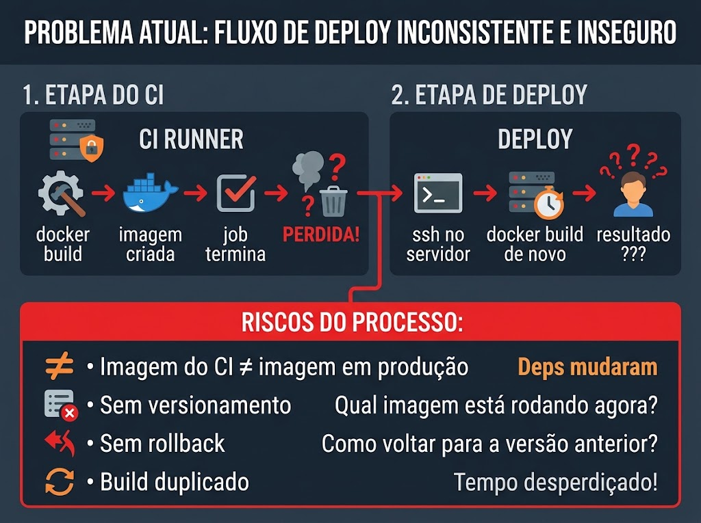
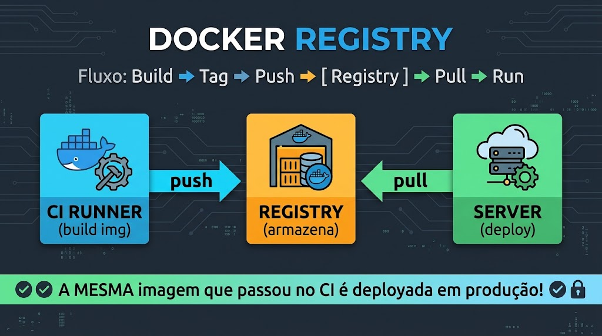
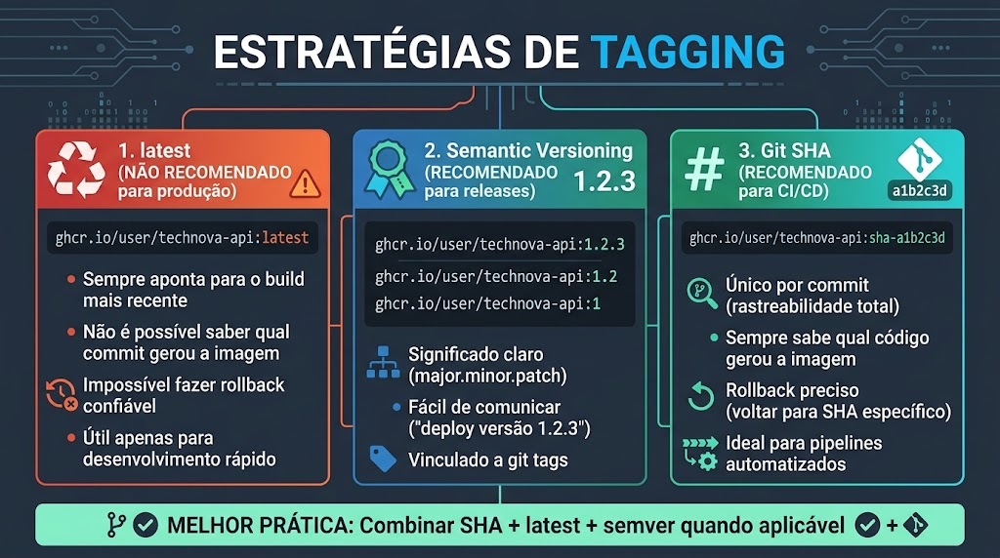
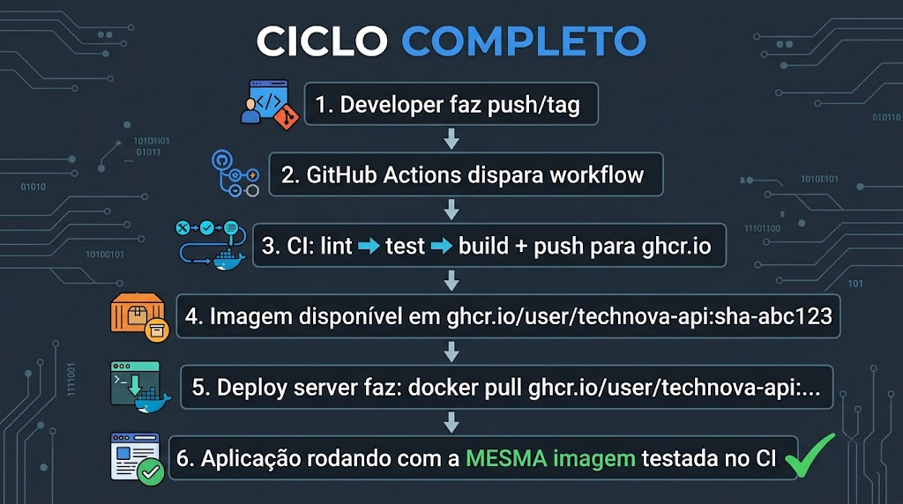
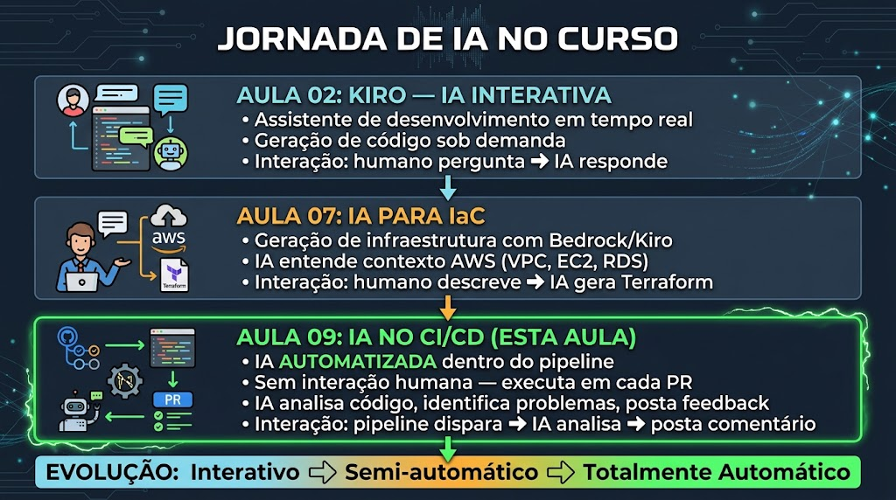
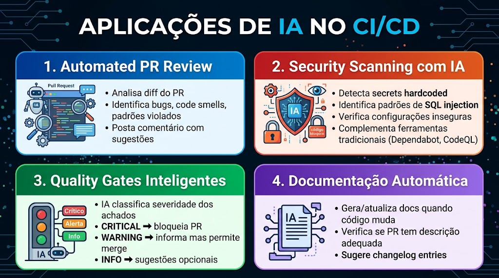
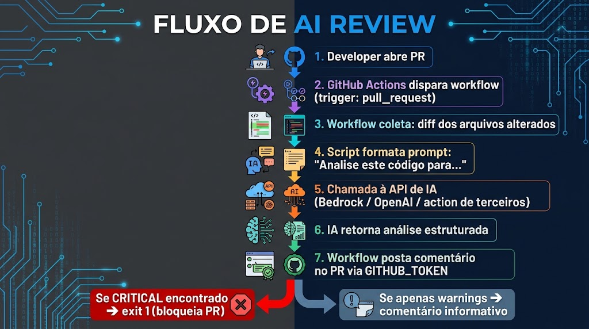
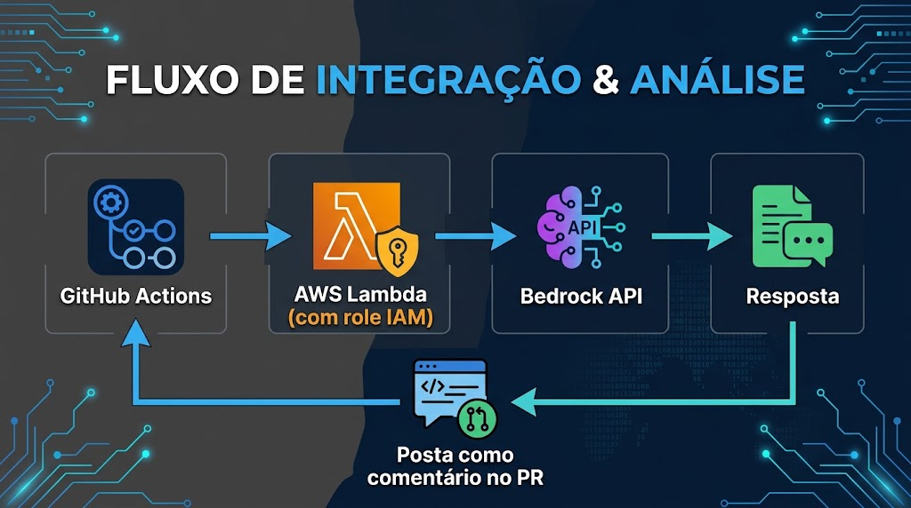

<!-- _class: title -->

# Aula 09 — Docker Registry + IA no CI/CD

**DevOps — Centro Universitário UniFAAT**
Prof. Alexandre Tavares | Semestre 2026-2

---

# O Problema da TechNova

Na Aula 08, o pipeline CI já builda a imagem Docker para verificar que o Dockerfile funciona. Mas Rafael percebeu algo:

> "A imagem é construída no runner do CI e **descartada** quando o job termina. Para subir em produção, alguém faz `docker build` de novo no servidor — e pode sair diferente."

Marina completou:

> "E quando o deploy quebra, não temos para onde voltar. Não existe 'a versão de ontem' em lugar nenhum."

**Três problemas a resolver hoje:**
1. Imagem presa no runner — não é compartilhável nem versionada
2. Sem rastreabilidade: qual commit gerou a imagem em produção?
3. Review de PR é gargalo — depende de humano disponível

> **Solução:** publicar imagens versionadas num **registry** + colocar **IA revisando cada PR** automaticamente.

---

# Objetivos de Aprendizagem

### Docker Registry
- Entender o papel de um registry (push/pull/tag) no fluxo DevOps
- Publicar imagens no **GitHub Container Registry (ghcr.io)**
- Aplicar estratégias de tagging: `latest`, SHA e Semantic Versioning
- Integrar build+push ao pipeline CI (lint → test → build+push)

### IA no CI/CD
- Compreender a evolução do uso de IA no curso (interativo → automático)
- Implementar **AI code review** disparado em cada Pull Request
- Configurar **quality gates**: CRITICAL bloqueia, WARNING/INFO informam
- Reconhecer limitações e o papel complementar da IA no review

---

# Imagens Presas no Laptop

Hoje a imagem existe só no runner do CI — e some quando o job acaba:



**Isso gera:**
- **Não reproduzível** — cada build pode sair diferente
- **Não versionável** — qual imagem está em produção agora?
- **Sem rollback** — não há "versão de ontem" para voltar

> A solução é um **Docker Registry**: repositório central de imagens versionadas, prontas para pull em qualquer servidor.

---

# O que é um Docker Registry?



Funciona como o **npm**, mas para imagens Docker:

- **Push** — envia a imagem buildada para o registry
- **Pull** — baixa a imagem para executar
- **Tag** — identifica versões da mesma imagem

Fluxo: `docker build` → `docker tag` → `docker push` → *(registry armazena)* → `docker pull` → `docker run`

---

# Opções de Registry

| Registry | Característica | URL |
|----------|---------------|-----|
| **Docker Hub** | Padrão, público grátis, privado limitado | `docker.io/user/img:tag` |
| **ghcr.io** | Integrado ao GitHub, grátis/ilimitado p/ repos públicos | `ghcr.io/user/img:tag` |
| **Amazon ECR** | Registry da AWS, integra ECS/EKS, ~$0.10/GB/mês | `<acct>.dkr.ecr.<region>.amazonaws.com/img:tag` |

**Por que ghcr.io neste curso?**
- Custo zero (tudo público)
- Mesmo ecossistema: código + Actions + Registry no GitHub
- `GITHUB_TOKEN` autentica automaticamente (sem criar PAT)
- Imagens visíveis na aba **Packages** do repositório

---

# Anatomia de uma Imagem


Exemplo real: `ghcr.io/joao-silva/technova-api:sha-abc1234`

- **`ghcr.io`** — o registry (host)
- **`joao-silva`** — o owner (usuário/organização)
- **`technova-api`** — o nome da imagem
- **`sha-abc1234`** — a tag (versão específica)

---

# Estratégias de Tagging



| Estratégia | Exemplo | Uso |
|-----------|---------|-----|
| **`latest`** | `:latest` | Dev rápido — **nunca** em produção |
| **Semver** | `:1.2.3` | Releases oficiais (vinculado a git tag) |
| **Git SHA** | `:sha-a1b2c3d` | CI/CD — rastreabilidade total e rollback |

**Melhor prática:** combine as três.

```
ghcr.io/user/app:sha-a1b2c3d   ← todo commit (rastreável)
ghcr.io/user/app:latest        ← branch main (conveniência)
ghcr.io/user/app:1.2.3         ← git tags (releases)
```

---

# Build e Push em GitHub Actions

Três actions oficiais do Docker, mais a permissão `packages: write`:

```yaml
jobs:
  build-and-push:
    runs-on: ubuntu-latest
    permissions:
      contents: read
      packages: write          # obrigatório para push no ghcr.io
    steps:
      - uses: actions/checkout@v4
      - uses: docker/login-action@v3           # 1. autentica
        with:
          registry: ghcr.io
          username: ${{ github.actor }}
          password: ${{ secrets.GITHUB_TOKEN }}
      - id: meta
        uses: docker/metadata-action@v5        # 2. gera tags
        with:
          images: ghcr.io/${{ github.repository_owner }}/technova-api
          tags: |
            type=sha,prefix=sha-,format=short
            type=raw,value=latest,enable={{is_default_branch}}
            type=semver,pattern={{version}}
      - uses: docker/build-push-action@v5      # 3. build + push
        with:
          context: aula-09/technova-api
          push: true
          tags: ${{ steps.meta.outputs.tags }}
```

---

# Multi-Stage: por que importa no registry

Separar **build** de **runtime** deixa a imagem final enxuta:

```dockerfile
FROM node:20-alpine AS builder
WORKDIR /app
COPY package*.json ./
RUN npm ci --only=production && npm cache clean --force

FROM node:20-alpine AS runtime
RUN addgroup -g 1001 -S nodejs && adduser -S technova -u 1001 -G nodejs
COPY --from=builder /app/node_modules ./node_modules
COPY . .
USER technova
EXPOSE 3000
HEALTHCHECK CMD wget -q --spider http://localhost:3000/health || exit 1
CMD ["node", "server.js"]
```

**No registry:** imagem 3-5x menor → push/pull mais rápido, menos superfície de ataque.

---

# Ciclo de Vida da Imagem + Packages



Após o push, a imagem aparece na aba **Packages** do repositório:
- URL: `https://github.com/USER/REPO/pkgs/container/technova-api`
- Mostra todas as tags, tamanho e data
- Qualquer um faz: `docker pull ghcr.io/user/technova-api:1.0.0`

> **Rollback vira trivial:** `docker run ghcr.io/user/technova-api:1.0.0` volta para a versão anterior em segundos.

---

# A Evolução da IA no Curso



| Aula | Modo | Controle |
|------|------|----------|
| **02 — Kiro** | Interativo | Humano no controle total |
| **07 — IaC** | Semi-automático | Humano supervisiona e valida |
| **09 — CI/CD** | Automático | Humano define regras, IA executa |

> A progressão: humano no controle → humano supervisiona → **humano define regras e IA executa sozinha** a cada PR.

---

# Por que IA no CI/CD?

Review humano tem limites:
- Reviewers cansam e perdem detalhes em PRs grandes
- PR aberto na sexta espera até segunda
- Critérios inconsistentes entre pessoas

A IA **complementa** o review humano:
- Responde em segundos, não em dias
- Mesmos critérios 24/7, sem cansar
- Verifica checklists extensos de segurança
- Escala para qualquer volume de PRs



---

# Arquitetura: IA no Pipeline



```
Developer abre PR → trigger pull_request → workflow ai-review.yml
   → coleta o diff dos arquivos alterados
   → script analisa (regras ou chamada a LLM)
   → posta comentário no PR com achados
   → se CRITICAL → exit 1 → PR bloqueado
```

> O workflow usa `GITHUB_TOKEN` com `pull-requests: write` para comentar.

---

# AI Review — Workflow e Script

```yaml
name: AI Code Review
on:
  pull_request:
    types: [opened, synchronize, reopened]
permissions:
  contents: read
  pull-requests: write
jobs:
  ai-review:
    runs-on: ubuntu-latest
    steps:
      - uses: actions/checkout@v4
        with: { fetch-depth: 0 }    # histórico completo p/ git diff
      - run: git diff origin/${{ github.base_ref }}...HEAD > /tmp/pr-diff.txt
      - run: node .github/scripts/ai-review.js
        env: { DIFF_FILE: /tmp/pr-diff.txt }
      - uses: actions/github-script@v7   # posta/atualiza comentário no PR
```

**Padrões detectados:** secrets hardcoded, `eval()`, SQL injection, `console.log`, catch vazio, bind em `0.0.0.0`, TODO/FIXME.

---

# Quality Gates — bloquear vs informar

| Severidade | Ação no pipeline | Ação do dev |
|:----------:|:----------------:|:-----------:|
| 🔴 **CRITICAL** | `exit 1` — bloqueia o PR | Obrigatório corrigir |
| 🟡 **WARNING** | Comenta, permite merge | Recomendado corrigir |
| 🔵 **INFO** | Comenta, permite merge | Opcional |

```javascript
const hasCritical = findings.some(f => f.severity === 'CRITICAL');
if (hasCritical) {
  console.log('⛔ PR BLOQUEADO: achados CRITICAL.');
  process.exit(1);   // reprova o check → branch protection impede o merge
}
```

> **Falso positivo?** O bloqueio é uma trava de segurança, não uma ditadura — o dev corrige ou justifica.

---

# AWS Bedrock no CI/CD



Na Aula 07 usamos o Bedrock para gerar IaC. No CI/CD, o fluxo é:

- GitHub Actions → assume role AWS via **OIDC** → invoca a API do Bedrock
- Ou: Actions → chama uma **Lambda** com permissão Bedrock → retorna a análise

**Sem acesso ao Bedrock?**
- Actions de terceiros que integram IA (grátis p/ repos públicos)
- Análise por regras (pattern matching) — o que faremos no laboratório

---

# Limitações da IA no Review

| Limitação | Impacto |
|-----------|---------|
| **Custo** | APIs cobram por token — PRs grandes custam mais |
| **Latência** | 10–60s por análise (ok em CI, não instantâneo) |
| **Falsos positivos** | Aponta problemas que não existem |
| **Falsos negativos** | Pode perder bugs sutis de lógica |
| **Contexto limitado** | Vê só o diff, não o sistema inteiro |

> **Complementa, não substitui.** Review humano continua obrigatório para decisões de arquitetura e regras de negócio.

---

# Resumo dos Conceitos

| Conceito | Descrição |
|----------|-----------|
| Docker Registry | Repositório central de imagens versionadas |
| ghcr.io | Registry do GitHub, grátis p/ repos públicos |
| Push / Pull | Enviar / baixar imagem do registry |
| Tag SHA | `sha-abc1234` — rastreabilidade commit↔imagem |
| Semver | `1.2.3` — releases vinculadas a git tags |
| `docker/build-push-action` | Build + push em um step |
| `packages: write` | Permissão para publicar no ghcr.io |
| AI Code Review | IA analisa o diff do PR e comenta |
| Quality Gate | CRITICAL bloqueia; WARNING/INFO informam |
| `GITHUB_TOKEN` | Autentica no ghcr.io e comenta no PR |

---

# Referências e Próximos Passos

**Referências:**
- GitHub Container Registry — [docs.github.com/packages](https://docs.github.com/en/packages/working-with-a-github-packages-registry/working-with-the-container-registry)
- docker/build-push-action — [github.com/docker/build-push-action](https://github.com/docker/build-push-action)
- Semantic Versioning — [semver.org](https://semver.org/lang/pt-BR/)
- AWS Bedrock — [docs.aws.amazon.com/bedrock](https://docs.aws.amazon.com/bedrock/latest/userguide/what-is-bedrock.html)

**Para a próxima aula:**
- Completar o TF desta aula (portfólio + PR): build+push + AI review
- Guardar o pipeline funcionando — será pré-requisito no Módulo 4

**Próxima aula:**
**Módulo 4 — Estratégias de Deploy**
Blue-Green e Canary fazendo pull das imagens que você publicou aqui.
