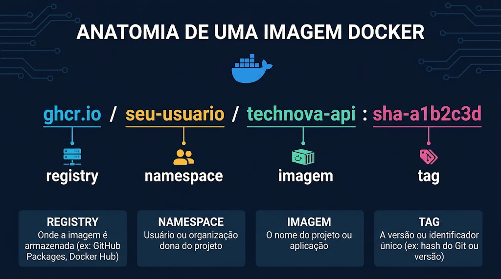

# Aula 09 — Laboratório Parte 1: Build e Push para ghcr.io

## Missão

Automatizar o build e publicação da imagem Docker da TechNova API no GitHub Container Registry (ghcr.io). Ao final deste laboratório, cada push para `main` vai automaticamente buildar, tagear e publicar a imagem, pronta para pull em qualquer servidor.

**Tempo estimado:** ~120 minutos

**Resultado final:**
- Dockerfile multi-stage otimizado para produção
- Workflow de build+push automatizado
- Imagens publicadas no ghcr.io com tags SHA + latest + semver
- Imagem visível na aba Packages do repositório
- Pipeline CI integrado (lint → test → build → push)

---

## Pré-requisitos

- [ ] Repositório `unifaat-devops-portfolio` (público) com o pipeline CI da Aula 08
- [ ] Pasta `aula-08/technova-api/` já no portfólio (a Aula 09 reaproveita essa API)
- [ ] Docker instalado localmente (`docker --version`)
- [ ] Node.js ≥ 18 (`node --version`)
- [ ] Git configurado com autenticação no GitHub

> **💡 ghcr.io é GRATUITO e ILIMITADO para repositórios públicos.**

> **📦 Reaproveitando a TechNova API.** A API usada aqui é a mesma da Aula 08
> (pasta `technova-api/`, disponível na raiz do repositório da disciplina). Nesta
> aula o trabalho fica em `aula-09/`. Copie a pasta para `aula-09/` para começar
> sem recriar os arquivos:
>
> ```bash
> # a partir da raiz do seu unifaat-devops-portfolio
> mkdir -p aula-09
> cp -r /caminho/para/devops_20262/technova-api aula-09/technova-api
> cd aula-09/technova-api
> npm install            # recria node_modules e mantém o package-lock.json
> ```
>
> Os comandos deste laboratório assumem que você está dentro de
> `aula-09/technova-api/` (onde ficam `Dockerfile`, `package.json`, `server.js`).

---

## Parte 1 — Entendendo o ghcr.io e Autenticação (15 min)

### 1.1 O que é o GitHub Container Registry?

O ghcr.io é o registry de containers integrado ao GitHub:
- **URL:** `ghcr.io/USUARIO/IMAGEM:TAG`
- **Gratuito:** armazenamento e transferência ilimitados para repos públicos
- **Integrado:** imagens aparecem na aba Packages do repositório
- **Auth:** usa GITHUB_TOKEN (já disponível nos workflows)

### 1.2 Testando autenticação local (opcional)

Para entender como funciona, teste o login localmente:

```bash
# Crie um Personal Access Token (PAT) em:
# GitHub → Settings → Developer settings → Personal access tokens → Tokens (classic)
# Permissões necessárias: write:packages, read:packages

echo "SEU_TOKEN" | docker login ghcr.io -u SEU_USUARIO --password-stdin
```

> **⚠️ No CI, usaremos GITHUB_TOKEN (automático) — não precisa de PAT.**

### 1.3 Entendendo a nomenclatura



Exemplo real: `ghcr.io/joao-silva/technova-api:sha-abc1234`

---

## Parte 2 — Dockerfile Multi-Stage para Produção (15 min)

### 2.1 Por que multi-stage?

Nosso Dockerfile atual pode ter problemas para produção:
- Inclui devDependencies (ESLint, Jest) — desnecessários em runtime
- Imagem grande (mais tempo de push/pull, mais superfície de ataque)
- Roda como root (risco de segurança)

### 2.2 Otimizar o Dockerfile

A pasta `technova-api/` que você copiou já tem um `Dockerfile` multi-stage funcional
(da Aula 08). Agora vamos **evoluí-lo** para produção: adicionar labels OCI (para a
imagem aparecer linkada ao repositório no ghcr.io), um usuário não-root nomeado e um
HEALTHCHECK. Substitua o conteúdo de `aula-09/technova-api/Dockerfile` por:

```dockerfile
# ============================================
# Estágio 1: Dependências (builder)
# ============================================
FROM node:20-alpine AS builder

WORKDIR /app

# Copiar apenas package files primeiro (aproveitar cache de layers)
COPY package*.json ./

# Instalar apenas dependências de produção
RUN npm ci --only=production && npm cache clean --force

# ============================================
# Estágio 2: Runtime (imagem final)
# ============================================
FROM node:20-alpine AS runtime

# Metadata da imagem (aponte para o SEU portfólio público)
LABEL org.opencontainers.image.source="https://github.com/SEU-USUARIO/unifaat-devops-portfolio"
LABEL org.opencontainers.image.description="TechNova API - Sistema de gestão de pedidos"

WORKDIR /app

# Criar usuário não-root
RUN addgroup -g 1001 -S nodejs && \
    adduser -S technova -u 1001 -G nodejs

# Copiar dependências do builder
COPY --from=builder /app/node_modules ./node_modules

# Copiar código da aplicação
COPY . .

# Usar usuário não-root
USER technova

# Expor porta
EXPOSE 3000

# Health check
HEALTHCHECK --interval=30s --timeout=3s --start-period=5s --retries=3 \
  CMD wget --no-verbose --tries=1 --spider http://localhost:3000/health || exit 1

# Comando de execução
CMD ["node", "server.js"]
```

### 2.3 Revisar o .dockerignore

A pasta copiada já traz um `.dockerignore`. Para a imagem de produção ficar enxuta,
confirme (ou ajuste) o conteúdo de `aula-09/technova-api/.dockerignore` para excluir
tudo que não precisa ir para a imagem:

```
node_modules
npm-debug.log*
.git
.gitignore
.env
.env.*
coverage
__tests__
*.test.js
.eslintrc*
jest.config*
.github
README.md
docker-compose*.yml
```

### 2.4 Testar o build localmente

```bash
# Build
docker build -t technova-api:local .

# Verificar tamanho
docker images technova-api:local

# Testar execução
docker run -p 3000:3000 technova-api:local

# Testar health check (em outro terminal)
curl http://localhost:3000/health
```

> **✅ Checkpoint:** imagem builda sem erros e responde no `/health`

---

## Parte 3 — Workflow de Build e Push (30 min)

### 3.1 Criar o workflow

Crie o arquivo `.github/workflows/build-push.yml`:

```yaml
name: Build and Push to ghcr.io

on:
  push:
    branches: [main]
    tags: ['v*.*.*']
  workflow_dispatch:

env:
  REGISTRY: ghcr.io
  # Nome da imagem = owner do repo + /technova-api (nao o repo inteiro,
  # pois a app vive em aula-09/technova-api/ dentro do portfolio)
  IMAGE_NAME: ${{ github.repository_owner }}/technova-api

jobs:
  build-and-push:
    runs-on: ubuntu-latest

    permissions:
      contents: read
      packages: write

    steps:
      - name: Checkout do código
        uses: actions/checkout@v4

      - name: Login no GitHub Container Registry
        uses: docker/login-action@v3
        with:
          registry: ${{ env.REGISTRY }}
          username: ${{ github.actor }}
          password: ${{ secrets.GITHUB_TOKEN }}

      - name: Extrair metadata (tags e labels)
        id: meta
        uses: docker/metadata-action@v5
        with:
          images: ${{ env.REGISTRY }}/${{ env.IMAGE_NAME }}
          tags: |
            # Tag com SHA curto em todo push
            type=sha,prefix=sha-,format=short
            # Tag 'latest' apenas na branch main
            type=raw,value=latest,enable={{is_default_branch}}
            # Tags semver quando houver git tag (v1.2.3 → 1.2.3, 1.2, 1)
            type=semver,pattern={{version}}
            type=semver,pattern={{major}}.{{minor}}
            type=semver,pattern={{major}}

      - name: Build e Push da imagem
        uses: docker/build-push-action@v5
        with:
          # A app esta em aula-09/technova-api/ dentro do portfolio
          context: aula-09/technova-api
          push: true
          tags: ${{ steps.meta.outputs.tags }}
          labels: ${{ steps.meta.outputs.labels }}
```

> **📁 `context: aula-09/technova-api`** — como a aplicação não está na raiz do
> portfólio, apontamos o build context para a subpasta. Se você estivesse num
> repositório dedicado só à API, usaria `context: .`.

### 3.2 Entendendo cada action

**`docker/login-action@v3`:**
- Autentica no registry especificado
- Usa `GITHUB_TOKEN` (automático, não precisa criar secret)
- `github.actor` = usuário que fez o push

**`docker/metadata-action@v5`:**
- Gera tags automaticamente baseado no contexto do git
- `type=sha` → gera tag com hash curto do commit
- `type=raw,value=latest` → gera tag `latest` (só na main)
- `type=semver` → extrai versão de git tags (v1.2.3)
- Output: lista de tags separadas por newline

**`docker/build-push-action@v5`:**
- Executa `docker build` + `docker push` em um step
- `context: .` → usa o diretório atual como build context
- `push: true` → pusha a imagem após o build
- `tags` → aplica todas as tags geradas pelo metadata-action

### 3.3 Permissões necessárias

```yaml
permissions:
  contents: read      # Ler o código do repositório (checkout)
  packages: write     # Publicar imagens no ghcr.io
```

> **⚠️ Sem `packages: write`, o push vai falhar com erro de permissão.**

---

## Parte 4 — Push e Verificação no GitHub Packages (15 min)

### 4.1 Fazer push e observar o workflow

```bash
# A partir da raiz do unifaat-devops-portfolio.
# Adicionar a app (com o Dockerfile otimizado) e o workflow
git add aula-09/technova-api .github/workflows/build-push.yml

# Commit
git commit -m "feat(aula-09): build e push da imagem para ghcr.io"

# Push
git push origin main
```

### 4.2 Acompanhar a execução

1. Vá para a aba **Actions** do repositório
2. Clique no workflow "Build and Push to ghcr.io"
3. Observe os steps executando: checkout → login → metadata → build+push

### 4.3 Verificar a imagem publicada

1. Vá para a aba **Code** do repositório
2. No sidebar direito, veja a seção **Packages**
3. Clique na imagem `technova-api`
4. Verifique as tags disponíveis (sha-XXXXXXX + latest)

**Ou via URL direta:**
```
https://github.com/SEU-USUARIO/technova-api/pkgs/container/technova-api
```

### 4.4 Verificar que a imagem é pullável

```bash
# Testar pull da imagem publicada
docker pull ghcr.io/SEU-USUARIO/technova-api:latest

# Verificar que funciona
docker run -p 3000:3000 ghcr.io/SEU-USUARIO/technova-api:latest
curl http://localhost:3000/health
```

> **✅ Checkpoint:** imagem aparece no GitHub Packages e é pullável

---

## Parte 5 — Tagging com Semantic Versioning (20 min)

### 5.1 Criar uma release com git tag

```bash
# Criar tag semver
git tag v1.0.0 -m "Release 1.0.0 - Primeira versão com CI/CD completo"

# Push da tag para o GitHub
git push origin v1.0.0
```

### 5.2 Observar as tags geradas

O push da tag dispara o workflow novamente (por causa de `tags: ['v*.*.*']`).

Vá para GitHub Packages e verifique que agora existem:
- `sha-XXXXXXX` (hash do commit)
- `latest` (branch main)
- `1.0.0` (versão completa)
- `1.0` (major.minor)
- `1` (major)

### 5.3 Simular um patch release

```bash
# Fazer uma pequena alteração
echo "// patch fix" >> server.js
git add server.js
git commit -m "fix: minor health check improvement"
git tag v1.0.1 -m "Patch 1.0.1"
git push origin main --tags
```

Verifique que agora temos `1.0.0` E `1.0.1` no registry. A tag `1.0` agora aponta para `1.0.1`.

> **✅ Checkpoint:** tags semver aparecem corretamente no Packages

---

## Parte 6 — Pull e Execução da Imagem Publicada (15 min)

### 6.1 Simular deploy em "outro servidor"

Para simular que estamos em um servidor diferente, remova as imagens locais:

```bash
# Remover imagens locais
docker rmi ghcr.io/SEU-USUARIO/technova-api:latest 2>/dev/null
docker rmi technova-api:local 2>/dev/null

# Fazer pull da imagem do registry (como um servidor faria)
docker pull ghcr.io/SEU-USUARIO/technova-api:1.0.1
```

### 6.2 Executar a imagem publicada

```bash
# Rodar com a tag semver
docker run -d --name technova-prod \
  -p 3000:3000 \
  ghcr.io/SEU-USUARIO/technova-api:1.0.1

# Testar
curl http://localhost:3000/health

# Ver logs
docker logs technova-prod
```

### 6.3 Simular rollback

```bash
# Algo deu errado! Voltar para 1.0.0
docker stop technova-prod
docker rm technova-prod

docker run -d --name technova-prod \
  -p 3000:3000 \
  ghcr.io/SEU-USUARIO/technova-api:1.0.0

# Verificar que está na versão anterior
curl http://localhost:3000/health
```

> **✅ Checkpoint:** conseguiu fazer pull, rodar e rollback usando tags do registry

---

## Parte 7 — Integrar com Pipeline CI Existente (10 min)

### 7.1 Pipeline unificado

Agora vamos unificar: o build+push só deve acontecer **depois** que lint e testes passarem.

Atualize `.github/workflows/ci-aula08.yml` (criado na Aula 08) — ou crie um
`ci-aula09.yml` — para incluir o build+push. Note o `working-directory` nos jobs de
lint/test (a app está em `aula-09/technova-api/`) e o `context` no build:

```yaml
name: CI Pipeline — Aula 09

on:
  push:
    branches: [main]
    tags: ['v*.*.*']
  pull_request:
    branches: [main]

env:
  REGISTRY: ghcr.io
  IMAGE_NAME: ${{ github.repository_owner }}/technova-api

defaults:
  run:
    working-directory: aula-09/technova-api

jobs:
  lint:
    runs-on: ubuntu-latest
    steps:
      - uses: actions/checkout@v4
      - uses: actions/setup-node@v4
        with:
          node-version: '20'
          cache: 'npm'
          cache-dependency-path: aula-09/technova-api/package-lock.json
      - run: npm ci
      - run: npm run lint

  test:
    needs: lint
    runs-on: ubuntu-latest
    steps:
      - uses: actions/checkout@v4
      - uses: actions/setup-node@v4
        with:
          node-version: '20'
          cache: 'npm'
          cache-dependency-path: aula-09/technova-api/package-lock.json
      - run: npm ci
      - run: npm test

  build-and-push:
    needs: [lint, test]
    runs-on: ubuntu-latest
    # Só faz push em push para main ou tags (não em PRs)
    if: github.event_name == 'push'

    permissions:
      contents: read
      packages: write

    steps:
      - uses: actions/checkout@v4

      - name: Login no ghcr.io
        uses: docker/login-action@v3
        with:
          registry: ${{ env.REGISTRY }}
          username: ${{ github.actor }}
          password: ${{ secrets.GITHUB_TOKEN }}

      - name: Metadata
        id: meta
        uses: docker/metadata-action@v5
        with:
          images: ${{ env.REGISTRY }}/${{ env.IMAGE_NAME }}
          tags: |
            type=sha,prefix=sha-,format=short
            type=raw,value=latest,enable={{is_default_branch}}
            type=semver,pattern={{version}}
            type=semver,pattern={{major}}.{{minor}}

      - name: Build e Push
        uses: docker/build-push-action@v5
        with:
          context: aula-09/technova-api
          push: true
          tags: ${{ steps.meta.outputs.tags }}
          labels: ${{ steps.meta.outputs.labels }}
```

> **Nota:** o job `build-and-push` usa `actions/checkout` sem `working-directory`
> relevante (o `docker/build-push-action` recebe o `context` explícito), então ele
> não é afetado pelo `defaults.run.working-directory`.

### 7.2 Resultado

O pipeline agora é:
```
lint → test → build-and-push (apenas em push/tags, não em PRs)
```

Em PRs, apenas lint e test rodam. Em push para main ou git tags, a imagem também é publicada.

> **✅ Checkpoint:** pipeline integrado lint → test → build+push funcionando

---

## Troubleshooting

| Problema | Causa Provável | Solução |
|----------|---------------|---------|
| `denied: permission_denied` | Falta `permissions: packages: write` | Adicionar bloco `permissions` no job |
| `unauthorized: unauthenticated` | Login falhou | Verificar que `docker/login-action` está antes do build |
| Build falha no CI mas funciona local | `.dockerignore` não exclui `node_modules` | Verificar `.dockerignore` |
| Tag semver não aparece | Git tag não tem formato `v*.*.*` | Usar `git tag v1.0.0` (com `v`) |
| Imagem muito grande (>500MB) | Multi-stage não aplicado | Verificar que Dockerfile tem dois estágios |
| Push demora muito | Imagem grande, layers não cacheadas | Implementar cache com `docker/build-push-action` |
| `manifest unknown` no pull | Tag não existe no registry | Verificar tags disponíveis no GitHub Packages |

---

## Checklist de Validação

Antes de seguir para o Laboratório Parte 2, confirme:

- [ ] Pasta `technova-api` copiada para `aula-09/` e `npm install` executado
- [ ] Dockerfile da pasta otimizado (labels OCI, usuário não-root, HEALTHCHECK) e funcionando localmente
- [ ] `.dockerignore` revisado (exclui node_modules, .git, testes)
- [ ] Workflow `build-push.yml` criado com as 3 actions Docker e `context: aula-09/technova-api`
- [ ] Push para main publica imagem no ghcr.io com tag SHA + latest
- [ ] Git tag v1.0.0 publica imagem com tags semver (1.0.0, 1.0, 1)
- [ ] Imagem visível na aba Packages do repositório
- [ ] Pull e execução da imagem publicada funciona
- [ ] Pipeline integrado: lint → test → build+push
- [ ] Push só acontece em push para main/tags (não em PRs)

> **🎯 Se todos os itens estão ✅, você completou a Parte 1!** Siga para o Laboratório Parte 2: PR Review Automatizado com IA.
