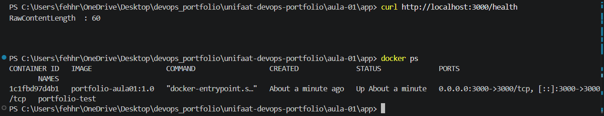
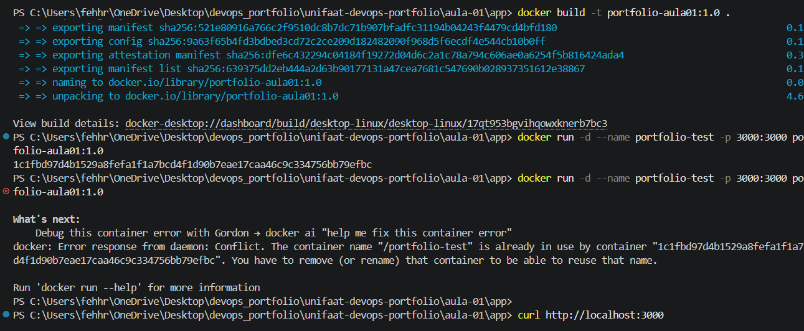

# Entrega — Aula 01: Fundamentos de Git e Docker

**Aluno:** [FERNANDA ROSA NOVAIS TAVARES]  
**RA:** [4025109]  
**Data:** [13/08/2026]

## Repositório

- URL: https://github.com/fehhnovais/unifaat-devops-portfolio.git

## Evidências

- [ ] Repositório público com estrutura completa
- [ ] Mínimo de 5 commits demonstrando workflow Git
- [ ] Dockerfile funcional
- [ ] Container rodando (evidência abaixo)

## Evidência de Container Rodando

[Cole aqui o output do `docker ps` ou screenshot]

