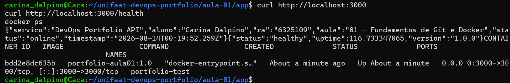

# Entrega — Aula 01: Fundamentos de Git e Docker

**Aluno:** [Carina Gonçalves dos Santos Dalpino]  
**RA:** [6325109]  
**Data:** [13/08/1986]

## Repositório

- URL: https://github.com/CarinaDalpinounifaat-devops-portfolio.git

## Evidências

- [ ] Repositório público com estrutura completa
- [ ] Mínimo de 5 commits demonstrando workflow Git
- [ ] Dockerfile funcional
- [ ] Container rodando (evidência abaixo)

## Evidência de Container Rodando

aula-01/evidencia.png

[Cole aqui o output do `docker ps` ou screenshot]

**Aluno:** Carina Gonçalves dos Santos Dalpino  
**RA:** 6325109  
**Data:** 18/08/2026

## Repositório

- URL: https://github.com/CarinaDalpino/unifaat-devops-portfolio

## Evidências

- [x] Repositório público com estrutura completa
- [x] Mínimo de 5 commits demonstrando workflow Git
- [x] Dockerfile funcional
- [x] Container rodando (evidência abaixo)

## Evidência de Container Rodando

