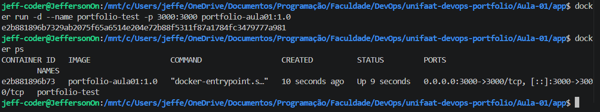

# Entrega — Aula 01: Fundamentos de Git e Docker

**Aluno:** Jefferson Camargo Coelho  
**RA:** 6325120  
**Data:** 20/08/2026 22:02

## Repositório

- URL: https://github.com/Jeff06-coder/unifaat-devops-portfolio

## Evidências

- [ ] Repositório público com estrutura completa
- [ ] Mínimo de 5 commits demonstrando workflow Git
- [ ] Dockerfile funcional
- [ ] Container rodando (evidência abaixo)

## Evidência de Container Rodando

