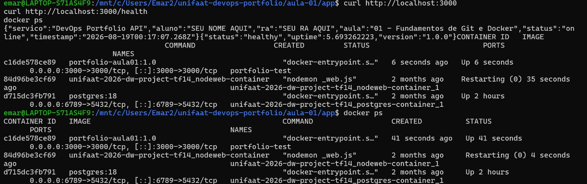
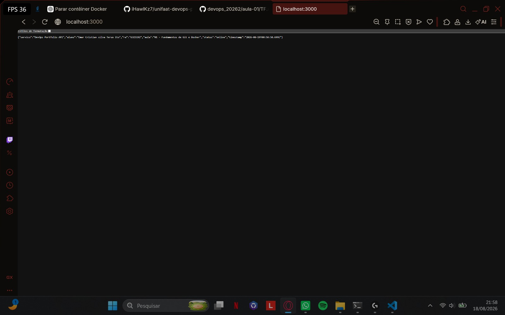

# Entrega — Aula 01: Fundamentos de Git e Docker

**Aluno:** Emar Cristian Silva Teruo Ito  
**RA:** 6325192  
**Data:** 18/08/2026

## Repositório

- URL: https://github.com/iHawlKz7/unifaat-devops-portfolio

## Evidências

- [x] Repositório público com estrutura completa
- [x] Mínimo de 5 commits demonstrando workflow Git
- [x] Dockerfile funcional
- [x] Container rodando (evidência abaixo)

## Evidência de Container Rodando

