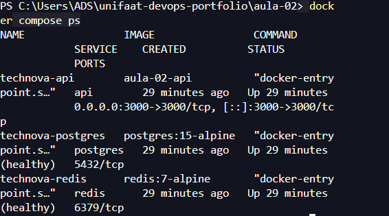
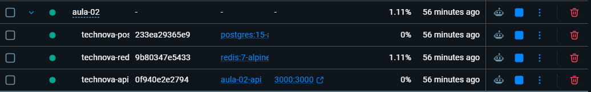

# Entrega — Aula 02: Docker Compose + IA como Copiloto

**Aluno:** Eloísa Brandão  
**RA:** 2325096  
**Data:** 20/08/2026

## Repositório

- URL: https://github.com/brandelas/unifaat-devops-portfolio

## Evidências dos Requisitos Obrigatórios

### Arquivos obrigatórios no portfólio

- [x] `app.js` com a aplicação Node.js e Express
- [x] `package.json` com as dependências da aplicação
- [x] `Dockerfile` para construir a imagem da API
- [x] `.dockerignore` configurado
- [x] `docker-compose.yml` para orquestrar os serviços
- [x] `.env.example` como template de variáveis
- [x] `.gitignore` configurado
- [x] `ia-analise.md` preenchido com reflexão crítica

### Requisitos do Docker Compose

- [x] Serviço `api` construído a partir do Dockerfile local
- [x] Serviço `postgres` usando `postgres:15-alpine`
- [x] Volume nomeado `pgdata` configurado para persistência do PostgreSQL
- [x] Serviço `redis` usando `redis:7-alpine`
- [x] Rede bridge customizada conectando os três serviços
- [x] Variáveis de ambiente interpoladas do `.env`
- [x] `depends_on` com condições `service_healthy`
- [x] Healthcheck no PostgreSQL
- [x] Healthcheck no Redis
- [x] Política de reinício `unless-stopped`
- [x] Comentários explicativos nas seções do Compose

### Critérios técnicos validados

- [x] `docker-compose.yml` válido com API, PostgreSQL e Redis
- [x] Ambiente funcional com `docker compose up -d --build`
- [x] PostgreSQL e Redis acessíveis pelos serviços da rede Compose
- [x] Arquivo `.env` não incluído no repositório
- [x] Imagens e portas configuradas conforme o TF

## Evidência do Ambiente Rodando

Comando utilizado:

```bash
docker compose ps
```

Resultado registrado no ambiente Docker:

```text
NAME                IMAGE                COMMAND                  SERVICE    CREATED          STATUS                    PORTS
technova-api        aula-02-api          "docker-entrypoint.s…"   api        29 minutes ago   Up 29 minutes             0.0.0.0:3000->3000/tcp, [::]:3000->3000/tcp
technova-postgres   postgres:15-alpine   "docker-entrypoint.s…"   postgres   29 minutes ago   Up 29 minutes (healthy)   5432/tcp
technova-redis      redis:7-alpine       "docker-entrypoint.s…"   redis      29 minutes ago   Up 29 minutes (healthy)   6379/tcp
```

Testes complementares realizados no projeto:

- `http://localhost:3000`: API respondeu com status `online`.
- `http://localhost:3000/health`: API respondeu com status `healthy`.
- PostgreSQL: `SELECT 1` executado com sucesso.
- Redis: resposta `PONG`.
- Rede customizada: os três containers conectados à mesma rede.

### Screenshot da infraestrutura



### Evidência visual da infraestrutura

