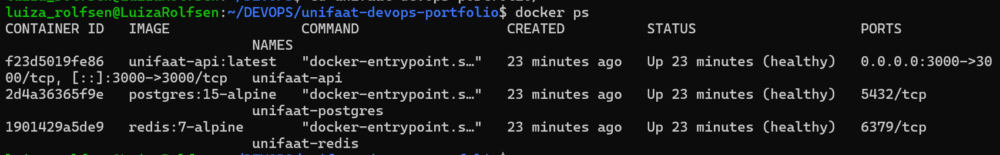

# Entrega — Aula 02: Docker Compose + IA como Copiloto

**Aluno:** Luiza Carneiro Rolfsen
**RA:** 6325257
**Data:** 27/08/2026

## Repositório

- URL: https://github.com/luizarolfsen/unifaat-devops-portfolio

## Evidências

- [x] `docker-compose.yml` com 3 serviços (API + PostgreSQL + Redis)
- [x] Volume nomeado configurado para PostgreSQL
- [x] Rede customizada conectando todos os serviços
- [x] Healthchecks configurados
- [x] Variáveis de ambiente via `.env` (não hardcoded)
- [x] `ia-analise.md` preenchido com reflexão crítica

## Evidência do Ambiente Rodando

luiza_rolfsen@LuizaRolfsen:~/DEVOPS/unifaat-devops-portfolio/aula-02$ docker compose ps
NAME               IMAGE                COMMAND                  SERVICE    CREATED          STATUS                    PORTS
unifaat-api        unifaat-api:latest   "docker-entrypoint.s…"   api        48 seconds ago   Up 42 seconds (healthy)   0.0.0.0:3000->3000/tcp, [::]:3000->3000/tcp
unifaat-postgres   postgres:15-alpine   "docker-entrypoint.s…"   postgres   49 seconds ago   Up 47 seconds (healthy)   5432/tcp
unifaat-redis      redis:7-alpine       "docker-entrypoint.s…"   redis      49 seconds ago   Up 47 seconds (healthy)   6379/tcp
