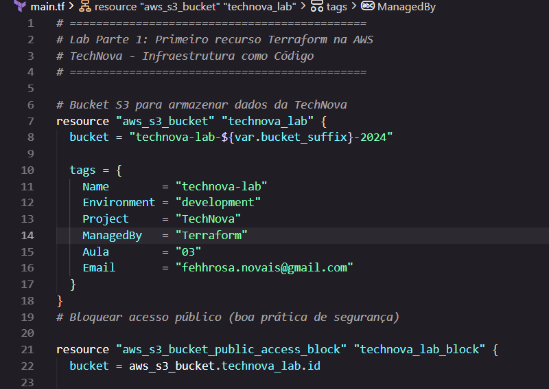
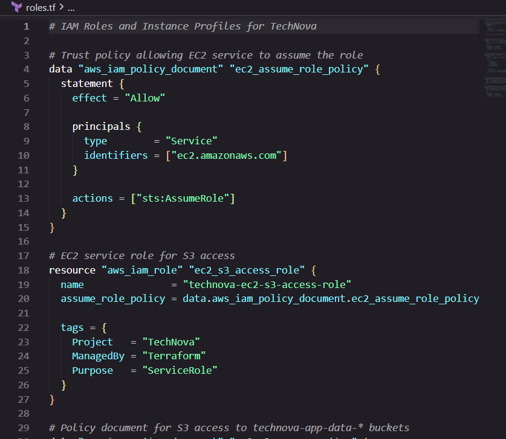
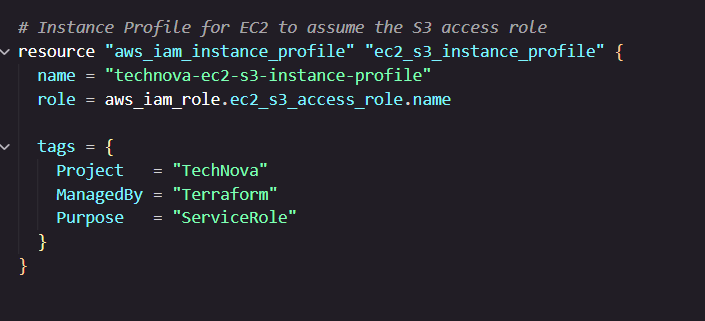
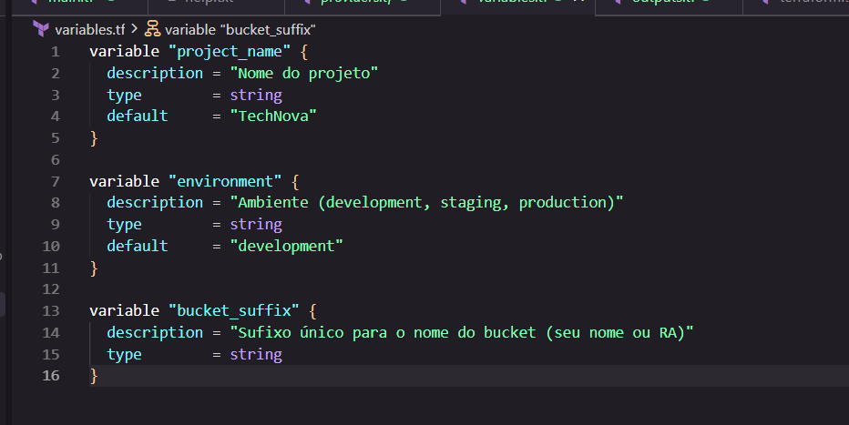
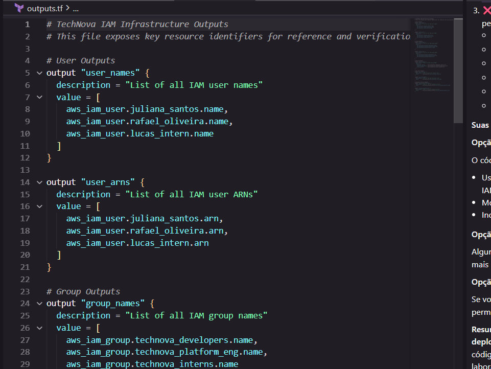
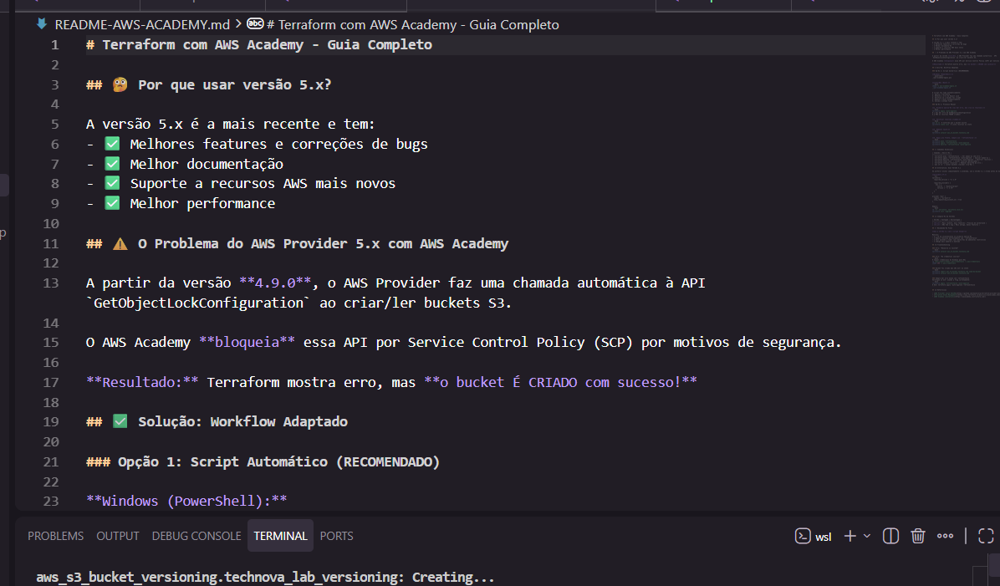
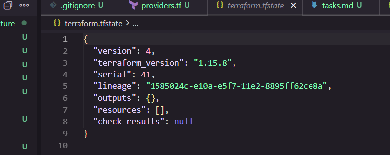
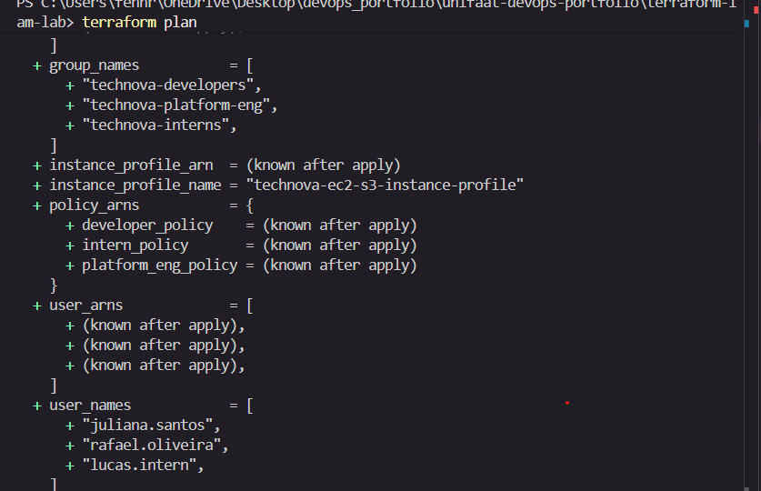

# Entrega — Aula 03: Terraform + IAM

**Aluno:** [FERNANDA TAVARES]  
**RA:** [4025109]  
**Data:** [03/09/2026]

## Repositório

- URL: https://github.com/fehhnovais/unifaat-devops-portfolio

## Evidências

- [ ] `providers.tf` com provider AWS configurado

- [ ] `main.tf` com users, groups e memberships

- [ ] `policies.tf` com mínimo 3 custom policies

- [ ] `roles.tf` com service role + instance profile

- [ ] `variables.tf` e `outputs.tf` configurados

- [ ] `terraform-plan-output.txt` com evidência do plano

- [ ] `README.md` com explicação do design e reflexão sobre menor privilégio

- [ ] Tags obrigatórias em todos os recursos
- [ ] `.gitignore` configurado (sem `.tfstate` no repositório)

## Evidência do Terraform Plan

[Cole aqui um trecho do output do `terraform plan` ou screenshot]

