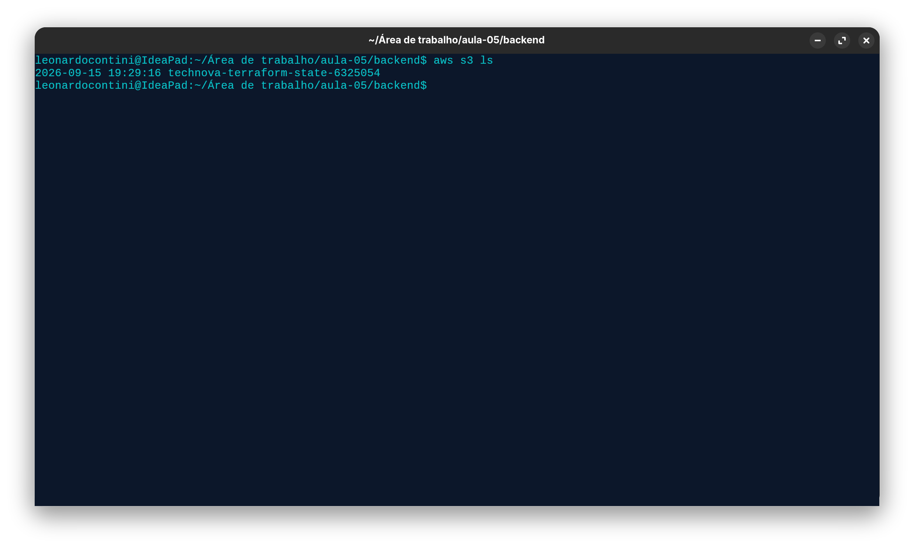
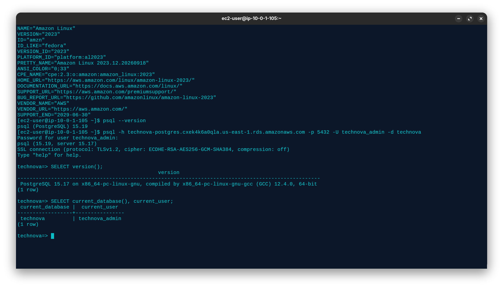

# Entrega — Aula 05: RDS e Remote State

**Aluno:** Leonardo Rafael Coniti Costa  
**RA:** 6325054 
**Data:** 20 de setembro

## Repositório

- URL: https://github.com/leonardocontini/unifaat-devops-portfolio

## Evidências

- [x] VPC com subnets públicas e privadas em 2 AZs
- [x] RDS PostgreSQL (db.t3.micro) nas subnets privadas
- [x] EC2 t2.micro na subnet pública, conectando ao RDS
- [x] Security Groups corretos (porta 5432 apenas da VPC)
- [x] Remote State configurado (S3 + DynamoDB)
- [x] State armazenado no S3 (evidência abaixo)
- [x] Conexão EC2 → RDS via psql (evidência abaixo)
- [x] `terraform destroy` executado após evidências

## Evidência do State no S3

## Evidência da Conexão EC2 → RDS

