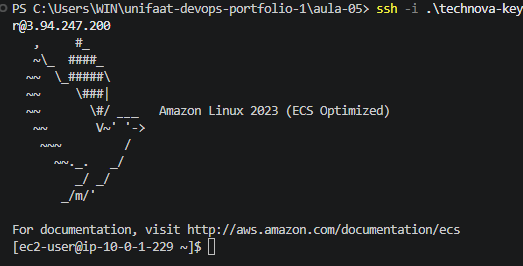
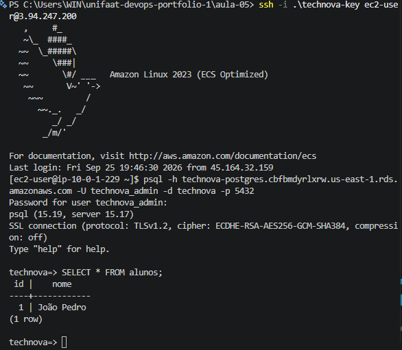

# Entrega — Aula 05: RDS e Remote State

**Aluno:** João Pedro Paulino Ferreira
**RA:** 6325175
**Data:** 25/09/2026

## Repositório

* URL: https://github.com/Joaoz007/unifaat-devops-portfolio

## Evidências

* [x] VPC com subnets públicas e privadas em 2 AZs
* [x] RDS PostgreSQL (`db.t3.micro`) nas subnets privadas
* [x] EC2 `t2.micro` na subnet pública, conectando ao RDS
* [x] Security Groups configurados para comunicação entre EC2 e RDS
* [x] Remote State configurado (S3 + DynamoDB)
* [x] State armazenado no S3 (evidência abaixo)
* [x] Conexão EC2 → RDS via `psql` (evidência abaixo)
* [x] Persistência de dados no PostgreSQL
* [x] `terraform plan` validado após o provisionamento
* [x] `terraform destroy` executado após a coleta das evidências

## Evidência do State no S3

A existência do Terraform State no Amazon S3 foi validada utilizando o comando:

```bash
aws s3 ls s3://technova-terraform-state-6325175-2026/aula-05/
```

Resultado:

```text
2026-09-25 16:43:03      37357 terraform.tfstate
```

Esse resultado comprova que o Terraform State está armazenado no bucket S3 configurado para o Remote State.


## Evidência da Conexão EC2 → RDS

Após acessar a instância EC2 por SSH, foi utilizado o cliente PostgreSQL para estabelecer uma conexão com o RDS:

```bash
psql -h technova-postgres.cbfbmdyrlxrw.us-east-1.rds.amazonaws.com \
     -U technova_admin \
     -d technova \
     -p 5432
```

A conexão foi estabelecida com sucesso:

```text
psql (15.19, server 15.17)
SSL connection (protocol: TLSv1.2, cipher: ECDHE-RSA-AES256-GCM-SHA384, compression: off)
Type "help" for help.

technova=>
```




A conexão comprova a comunicação entre a EC2, localizada na subnet pública, e o RDS PostgreSQL, localizado nas subnets privadas, utilizando a porta `5432`.

## Evidência da Persistência de Dados

Após estabelecer a conexão com o RDS, foi criada uma tabela e inserido um registro:

```sql
CREATE TABLE IF NOT EXISTS alunos (
    id SERIAL PRIMARY KEY,
    nome VARCHAR(100) NOT NULL
);
```

```sql
INSERT INTO alunos (nome)
VALUES ('João Pedro');
```

O registro foi inserido com sucesso:

```text
CREATE TABLE

INSERT 0 1

 id |    nome
----+------------
  1 | João Pedro
(1 row)
```


Após encerrar a conexão e estabelecer uma nova conexão com o banco, foi executada a consulta:

```sql
SELECT * FROM alunos;
```

O registro permaneceu disponível:

```text
 id |    nome
----+------------
  1 | João Pedro
(1 row)
```



Essa evidência comprova a persistência dos dados no RDS PostgreSQL.

## Evidência do Terraform Plan

Após o provisionamento da infraestrutura, foi executado:

```bash
terraform plan
```

Resultado:

```text
No changes. Your infrastructure matches the configuration.

Terraform has compared your real infrastructure against your configuration
and found no differences, so no changes are needed.
```


O resultado demonstra que a infraestrutura provisionada estava de acordo com a configuração declarada no Terraform.

## Recursos Implementados

A infraestrutura da Aula 05 foi composta por:

* VPC `10.0.0.0/16`;
* duas subnets públicas;
* duas subnets privadas;
* duas Availability Zones;
* Internet Gateway;
* EC2 `t2.micro`;
* RDS PostgreSQL 15 `db.t3.micro`;
* DB Subnet Group;
* Security Groups;
* Amazon S3 para Remote State;
* DynamoDB para State Locking.

## Remote State

O Terraform State foi configurado utilizando o bucket:

```text
technova-terraform-state-6325175-2026
```

Com o seguinte caminho:

```text
aula-05/terraform.tfstate
```

O backend utiliza:

```hcl
terraform {
  backend "s3" {
    bucket         = "technova-terraform-state-6325175-2026"
    key            = "aula-05/terraform.tfstate"
    region         = "us-east-1"
    encrypt        = true
    dynamodb_table = "technova-terraform-lock-6325175-2026"
  }
}
```

O locking do State utiliza a tabela DynamoDB:

```text
technova-terraform-lock-6325175-2026
```

## Conclusão

A atividade da Aula 05 foi concluída com a implementação de uma infraestrutura AWS utilizando Terraform, incluindo RDS PostgreSQL, EC2, VPC, subnets públicas e privadas, Security Groups e Remote State.

Foram realizadas as validações da comunicação entre EC2 e RDS, da persistência de dados no PostgreSQL, do armazenamento do Terraform State no S3 e da consistência da infraestrutura por meio do `terraform plan`.

Após a coleta das evidências, a infraestrutura principal foi removida utilizando `terraform destroy`.
