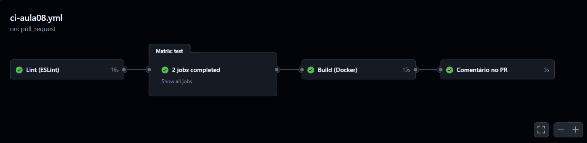
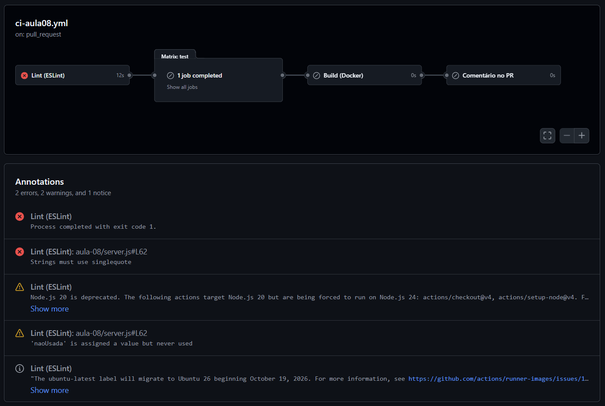
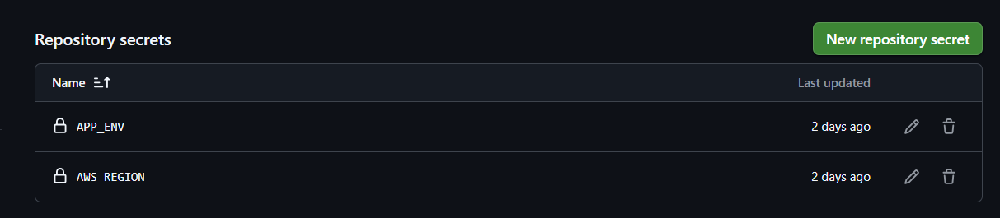

# Entrega — Aula 08: GitHub Actions e CI Pipelines

**Aluno:** Gabriel Reis Cunha
**RA:** 6325149
**Data:** 10/10/2026

## Repositório

- URL: https://github.com/gabrielreis354/unifaat-devops-portfolio
- Projeto: `aula-08/` · Workflow: `.github/workflows/ci-aula08.yml`

## Evidências

- [x] Workflow CI multi-stage funcional (lint → test → build)
- [x] ESLint configurado e passando
- [x] Mínimo 3 testes Jest passando com coverage (9 testes, `/health` e `/api/orders`)
- [x] Docker build no CI sem erros
- [x] Secret referenciado no workflow (`AWS_REGION`, log mascarado como `***`)
- [x] Badge de status no README
- [x] Screenshots do pipeline verde

Bônus: matrix Node 18/20 (B1), cache do npm (B2), comentário automático no PR (B3), `concurrency` com cancelamento (B4) e smoke test no Docker (B5).

## Evidência do Pipeline Rodando

| Evidência | Link |
|-----------|------|
| Run verde na `main` | https://github.com/gabrielreis354/unifaat-devops-portfolio/actions/runs/38052653675 |
| Run verde no PR #1 (com comentário do bot, B3) | https://github.com/gabrielreis354/unifaat-devops-portfolio/actions/runs/37866153127 |
| Run vermelho (erro de lint intencional, PR #2 fechado sem merge) | https://github.com/gabrielreis354/unifaat-devops-portfolio/actions/runs/38053050760 |
| PR #1 | https://github.com/gabrielreis354/unifaat-devops-portfolio/pull/1 |

### Screenshots

